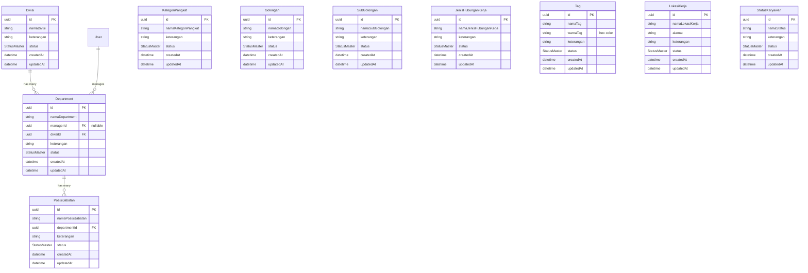

# HR Module - Database Schema Documentation

## Overview

Dokumentasi ini menjelaskan struktur database untuk modul HR (Human Resources) pada Bebang Sistem Informasi. Database menggunakan PostgreSQL dengan Prisma ORM.

## Entity Relationship Diagram



## Deskripsi Tabel

### 1. Divisi
Menyimpan data divisi perusahaan sebagai level tertinggi struktur organisasi.

| Field | Type | Description |
|-------|------|-------------|
| id | UUID | Primary key |
| namaDivisi | String | Nama divisi |
| keterangan | String? | Keterangan tambahan |
| status | StatusMaster | AKTIF / TIDAK_AKTIF |

### 2. Department
Menyimpan data department yang berada di bawah divisi.

| Field | Type | Description |
|-------|------|-------------|
| id | UUID | Primary key |
| namaDepartment | String | Nama department |
| managerId | UUID? | FK ke User (manager) |
| divisiId | UUID | FK ke Divisi |
| keterangan | String? | Keterangan tambahan |
| status | StatusMaster | AKTIF / TIDAK_AKTIF |

### 3. PosisiJabatan
Menyimpan data posisi jabatan dalam department.

| Field | Type | Description |
|-------|------|-------------|
| id | UUID | Primary key |
| namaPosisiJabatan | String | Nama posisi |
| departmentId | UUID | FK ke Department |
| keterangan | String? | Keterangan tambahan |
| status | StatusMaster | AKTIF / TIDAK_AKTIF |

### 4. KategoriPangkat
Level kepangkatan karyawan (Staff, Supervisor, Manager).

### 5. Golongan
Pengelompokan golongan gaji karyawan.

### 6. SubGolongan
Sub-level dari golongan.

### 7. JenisHubunganKerja
Tipe hubungan kerja (Tetap, Kontrak, Magang).

### 8. Tag
Label/tag untuk kategorisasi karyawan dengan warna.

| Field | Type | Description |
|-------|------|-------------|
| warnaTag | String | Hex color code (#RRGGBB) |

### 9. LokasiKerja
Lokasi kerja/kantor perusahaan.

### 10. StatusKaryawan
Status kepegawaian (Aktif, Cuti, Resign, Pensiun).

## Enum: StatusMaster

```typescript
enum StatusMaster {
  AKTIF        // Data aktif dan dapat digunakan
  TIDAK_AKTIF  // Data non-aktif (soft delete)
}
```

## Business Rules

1. **Divisi harus unik** - Tidak boleh ada duplikasi nama divisi (enforced at DB level via `@@unique([namaDivisi])`)
2. **Department wajib punya Divisi** - Foreign key divisiId required
3. **Manager opsional** - Department bisa belum punya manager
4. **Soft Delete** - Gunakan status TIDAK_AKTIF, bukan hard delete
5. **Tag warna hex** - Format harus #RRGGBB (contoh: #FF0000)

## Index Strategy

- Primary keys: UUID dengan auto-generate
- Foreign keys: Auto-indexed oleh Prisma
- Search fields: Perlu index manual untuk search performance (jika data besar)

## Common Queries

### Get all active departments with divisi
```typescript
const departments = await prisma.department.findMany({
  where: { status: 'AKTIF' },
  include: { divisi: true, manager: true }
});
```

### Get posisi jabatan by department
```typescript
const positions = await prisma.posisiJabatan.findMany({
  where: { 
    departmentId: 'dept-001',
    status: 'AKTIF' 
  }
});
```

### Search divisi by name
```typescript
const divisi = await prisma.divisi.findMany({
  where: {
    namaDivisi: { contains: 'IT', mode: 'insensitive' },
    status: 'AKTIF'
  }
});
```
