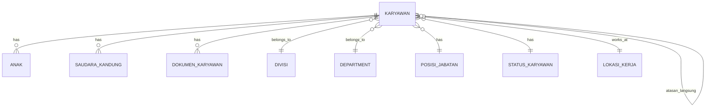

# Employee Schema Documentation

## Overview
Dokumentasi skema database untuk modul Employee Management, berdasarkan [02_modul_hr_v2.md](file:///c:/project-it/bebang-information-system-fix/planning/02_modul_hr_v2.md).

---

## Tables

### 1. karyawan (Main Employee Table)

Tabel utama yang menyimpan data profil karyawan lengkap dengan 80+ fields.

| Column | Type | Constraints | Description |
|--------|------|-------------|-------------|
| id | UUID | PK, auto-gen | Primary key |
| nomorIndukKaryawan | String | UNIQUE, NOT NULL | Nomor Induk Karyawan |
| namaLengkap | String | NOT NULL | Nama lengkap karyawan |
| nomorHandphone | String | NOT NULL | Nomor handphone utama |
| fotoKaryawan | String | NULL | Path foto karyawan |
| divisiId | UUID | FK → divisi | Referensi ke divisi |
| departmentId | UUID | FK → department | Referensi ke department |
| managerId | UUID | FK → karyawan (self) | Manager karyawan |
| atasanLangsungId | UUID | FK → karyawan (self) | Atasan langsung |
| posisiJabatanId | UUID | FK → posisi_jabatan | Posisi jabatan |
| statusKaryawanId | UUID | FK → status_karyawan | Status karyawan |
| lokasiKerjaId | UUID | FK → lokasi_kerja | Lokasi kerja |
| tagId | UUID | FK → tag | Tag karyawan |
| jenisHubunganKerjaId | UUID | FK → jenis_hubungan_kerja | Jenis hubungan kerja |
| kategoriPangkatId | UUID | FK → kategori_pangkat | Kategori pangkat |
| golonganPangkatId | UUID | FK → golongan | Golongan pangkat |
| subGolonganPangkatId | UUID | FK → sub_golongan | Sub golongan |
| lokasiSebelumnyaId | UUID | FK → lokasi_kerja | Lokasi kerja sebelumnya |

**Additional Columns:** Personal info (jenisKelamin, tempatLahir, tanggalLahir, agama, golonganDarah, alamat, dll), HR info (tanggalMasuk, tanggalKontrak, pendidikan, dll), Family info (namaPasangan, jumlahAnak, dll).

---

### 2. anak (Child Data - Repeatable)

Data anak karyawan yang dapat diulang sesuai jumlah anak.

| Column | Type | Constraints | Description |
|--------|------|-------------|-------------|
| id | UUID | PK, auto-gen | Primary key |
| karyawanId | UUID | FK → karyawan, NOT NULL | Parent karyawan |
| urutanAnak | Int | NOT NULL | Urutan anak (1, 2, 3...) |
| namaAnak | String | NOT NULL | Nama anak |
| jenisKelamin | Enum | NOT NULL | LAKI_LAKI / PEREMPUAN |
| tanggalLahir | DateTime | NOT NULL | Tanggal lahir anak |
| keterangan | String | NULL | Keterangan tambahan |

**Constraints:**
- `@@unique([karyawanId, urutanAnak])` - Kombinasi karyawan + urutan harus unik
- `onDelete: Cascade` - Hapus otomatis saat karyawan dihapus

---

### 3. saudara_kandung (Sibling Data - Max 5)

Data saudara kandung karyawan, maksimal 5 record per karyawan.

| Column | Type | Constraints | Description |
|--------|------|-------------|-------------|
| id | UUID | PK, auto-gen | Primary key |
| karyawanId | UUID | FK → karyawan, NOT NULL | Parent karyawan |
| urutanSaudara | Int | NOT NULL, max 5 | Urutan saudara (1-5) |
| namaSaudaraKandung | String | NOT NULL | Nama saudara |
| jenisKelamin | Enum | NOT NULL | LAKI_LAKI / PEREMPUAN |
| tanggalLahir | DateTime | NULL | Tanggal lahir |
| pendidikanTerakhir | String | NULL | Pendidikan terakhir |
| pekerjaan | String | NULL | Pekerjaan saat ini |
| keterangan | String | NULL | Keterangan tambahan |

**Business Rules:**
- Maksimal 5 saudara kandung per karyawan
- Validasi di Zod schema: `max(5, 'Maksimal 5 saudara kandung')`

---

### 4. dokumen_karyawan (Employee Documents)

Tracking dokumen yang diupload untuk karyawan.

| Column | Type | Constraints | Description |
|--------|------|-------------|-------------|
| id | UUID | PK, auto-gen | Primary key |
| karyawanId | UUID | FK → karyawan, NOT NULL | Parent karyawan |
| jenisDokumen | String | NOT NULL | Jenis dokumen (KTP, NPWP, dll) |
| namaFile | String | NOT NULL | Nama file asli |
| pathFile | String | NOT NULL | Path file di server |
| ukuranFile | Int | NOT NULL | Ukuran file dalam bytes |
| mimeType | String | NOT NULL | MIME type file |
| keterangan | String | NULL | Keterangan tambahan |

---

## Enums

| Enum | Values |
|------|--------|
| JenisKelamin | LAKI_LAKI, PEREMPUAN |
| Agama | ISLAM, KRISTEN, KATOLIK, HINDU, BUDDHA, KONGHUCU |
| GolonganDarah | A, B, AB, O |
| StatusPernikahan | BELUM_MENIKAH, MENIKAH, CERAI_HIDUP, CERAI_MATI |
| StatusKelulusan | LULUS, TIDAK_LULUS, SEDANG_BELAJAR |
| TingkatPendidikan | SD, SMP, SMA, D3, S1, S2, S3 |

---

## Relationships

---

## Validation Rules

### Phone Number Validation
Pattern: `/^(\+62|62|0)[0-9]{9,12}$/`
- Harus dimulai dengan +62, 62, atau 0
- Diikuti 9-12 digit angka
- Berlaku untuk: nomorHandphone, nomorHandphone2, nomorTeleponRumah1/2, nomorTeleponKontakDarurat1/2

### NIK (KTP) Validation
Pattern: `/^\d{16}$/` - Tepat 16 digit angka

### NPWP Validation
Pattern: `/^\d{15}$/` - Tepat 15 digit angka

### File Upload
- Max size: 5MB (configurable via MAX_FILE_SIZE)
- Image types: JPEG, PNG, JPG
- Document types: PDF, DOC, DOCX

---

## Related Files

- **Prisma Schema:** [schema.prisma](file:///c:/project-it/bebang-information-system-fix/backend/prisma/schema.prisma)
- **TypeScript Types:** [employee.ts](file:///c:/project-it/bebang-information-system-fix/backend/src/types/employee.ts)
- **Validators:** [employee.validator.ts](file:///c:/project-it/bebang-information-system-fix/backend/src/validators/employee.validator.ts)
- **Upload Config:** [upload.ts](file:///c:/project-it/bebang-information-system-fix/backend/src/config/upload.ts)
