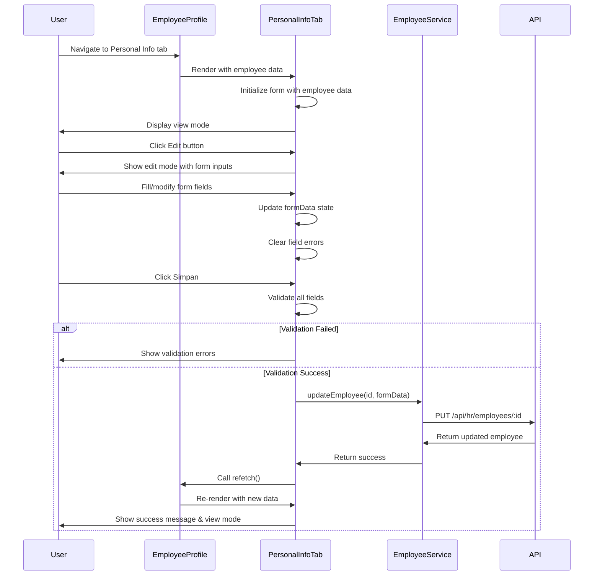

I have created the following plan after thorough exploration and analysis of the codebase. Follow the below plan verbatim. Trust the files and references. Do not re-verify what's written in the plan. Explore only when absolutely necessary. First implement all the proposed file changes and then I'll review all the changes together at the end.

## Observasi Kode

Berdasarkan eksplorasi codebase, sistem menggunakan **React + TypeScript + Vite** untuk frontend dengan **Tailwind CSS** untuk styling. Backend menggunakan **Node.js + Express + Prisma + PostgreSQL**. Struktur employee profile sudah ada dengan header dan tab navigation yang telah diimplementasi. Form components reusable (TextInput, Select, TextArea) sudah tersedia. Database schema Karyawan di Prisma sudah lengkap dengan semua field Personal Information. API endpoint `PUT /api/hr/employees/:id` sudah tersedia untuk update data karyawan.

## Pendekatan Implementasi

Implementasi akan fokus pada pembuatan komponen **PersonalInformationTab** yang menampilkan dan mengedit data pribadi karyawan sesuai spesifikasi di `file:planning/02_modul_hr_v2.md`. Menggunakan pola form handling yang sudah ada (useState untuk form data, validation, error handling). Membuat komponen DatePicker baru karena belum tersedia. Form akan dibagi menjadi 7 section groups sesuai desain UI. Integrasi dengan `employeeService.updateEmployee()` untuk menyimpan data. Auto-fill beberapa field dari head section untuk konsistensi data.

## Langkah Implementasi

### 1. Buat DatePicker Component

**File**: `file:frontend/src/components/common/form/DatePicker.tsx`

Buat reusable DatePicker component dengan pattern yang sama seperti TextInput, Select, dan TextArea:
- Props: `label`, `value`, `onChange`, `error`, `helperText`, `required`, `disabled`
- Styling konsisten dengan form components lainnya (Tailwind CSS)
- Support dark mode
- Input type="date" dengan format ISO (YYYY-MM-DD)
- Error handling dan validation display
- Label dengan required indicator (*)

**File**: `file:frontend/src/components/common/form/index.ts`

Export DatePicker component agar bisa diimport bersama form components lainnya.

---

### 2. Extend Employee Types untuk Personal Information

**File**: `file:frontend/src/types/employee.types.ts`

Tambahkan interface untuk Personal Information form data:
- `PersonalInformationFormData` interface dengan semua fields dari 7 groups
- Mapping dari database fields ke form fields
- Validation types untuk email, phone, NIK, NPWP, BPJS

Tidak perlu mengubah interface `Employee` karena sudah lengkap sesuai Prisma schema.

---

### 3. Buat PersonalInformationTab Component

**File**: `file:frontend/src/components/employee/tabs/PersonalInformationTab.tsx`

Komponen utama untuk tab Personal Information dengan struktur:

#### State Management
- `formData`: State untuk semua form fields (gunakan useState)
- `errors`: State untuk validation errors
- `isEditing`: Boolean untuk toggle antara view/edit mode
- `isSaving`: Boolean untuk loading state saat save
- `saveError`: String untuk error message saat save gagal

#### Form Groups (7 Sections)

**Group 1: Biodata Karyawan**
- Fields: `namaLengkap` (auto-fill dari head), `jenisKelamin`, `tempatLahir`, `tanggalLahir`, `emailPribadi`
- Components: TextInput (nama, tempat lahir, email), Select (jenis kelamin), DatePicker (tanggal lahir)
- Validation: nama required, email format validation

**Group 2: Identifikasi**
- Fields: `agama`, `golonganDarah`, `nomorKartuKeluarga`, `nomorKtp`, `nomorNpwp`, `nomorBpjs`, `noNikKk`, `statusPajak`
- Components: Select (agama, golongan darah), TextInput (nomor-nomor)
- Validation: Format validation untuk NIK (16 digit), NPWP (15 digit + format), BPJS (11 digit)

**Group 3: Alamat Domisili**
- Fields: `alamatDomisili`, `kotaDomisili`, `provinsiDomisili`
- Components: TextArea (alamat), TextInput (kota, provinsi)

**Group 4: Alamat KTP**
- Fields: `alamatKtp`, `kotaKtp`, `provinsiKtp`
- Components: TextArea (alamat), TextInput (kota, provinsi)
- Feature: Button "Sama dengan Domisili" untuk copy data dari alamat domisili

**Group 5: Informasi Kontak**
- Fields: `nomorHandphone` (auto-fill dari head), `nomorHandphone2`, `nomorTeleponRumah1`, `nomorTeleponRumah2`
- Components: TextInput dengan type="tel"
- Validation: Phone number format (min 10 digit, max 15 digit)

**Group 6: Status Pernikahan dan Anak**
- Fields: `statusPernikahan`, `namaPasangan`, `tanggalMenikah`, `tanggalCerai`, `tanggalWafatPasangan`, `pekerjaanPasangan`, `jumlahAnak`
- Components: Select (status pernikahan), TextInput (nama, pekerjaan, jumlah), DatePicker (tanggal-tanggal)
- Conditional rendering: Tampilkan field pasangan hanya jika status = MENIKAH/CERAI_HIDUP/CERAI_MATI
- Validation: Tanggal cerai harus setelah tanggal menikah, jumlah anak harus angka >= 0

**Group 7: Rekening Bank**
- Fields: `nomorRekening`, `namaPemegangRekening`, `namaBank`, `cabangBank`
- Components: TextInput untuk semua fields
- Validation: Nomor rekening numeric only

#### UI Layout
- Setiap group dalam card dengan header (icon + title) seperti desain `file:desain-ui-ux/employee_profile_-_personal_info_tab/code.html`
- Grid layout: 1 column mobile, 2 columns tablet, 3 columns desktop untuk fields
- Responsive design dengan Tailwind CSS
- Dark mode support

#### View Mode vs Edit Mode
- **View Mode**: Display data dengan styling read-only (seperti di desain HTML)
- **Edit Mode**: Form inputs dengan validation
- Toggle button "Edit" di top-right untuk switch mode
- Buttons: "Simpan" dan "Batal" saat edit mode

#### Functions
- `handleChange(field, value)`: Update form data dan clear error untuk field tersebut
- `handleCopyDomisiliToKTP()`: Copy alamat domisili ke alamat KTP
- `validateForm()`: Validate semua fields sebelum submit
- `handleSave()`: Call `employeeService.updateEmployee()` dengan form data
- `handleCancel()`: Reset form ke data awal dan exit edit mode
- `initializeFormData()`: Load data dari employee prop ke form state

#### Auto-fill Logic
- `namaLengkap`: Auto-fill dari `employee.namaLengkap` (head section)
- `nomorHandphone`: Auto-fill dari `employee.nomorHandphone` (head section)
- Fields ini disabled di edit mode karena sudah diisi dari head

---

### 4. Update EmployeeProfile Page

**File**: `file:frontend/src/pages/hr/employees/EmployeeProfile.tsx`

Replace placeholder content untuk tab `personal-info`:
- Import `PersonalInformationTab` component
- Pass `employee` data sebagai prop
- Pass `refetch` function untuk refresh data setelah update
- Conditional rendering: Tampilkan PersonalInformationTab jika `tab === 'personal-info'`

Remove placeholder div dengan icon dan text "Tab content akan diimplementasikan di fase berikutnya".

---

### 5. Validation Utilities

**File**: `file:frontend/src/utils/validation.ts` (create new)

Buat helper functions untuk validation:
- `validateEmail(email: string): boolean` - Email format validation
- `validatePhone(phone: string): boolean` - Phone number validation (10-15 digit)
- `validateNIK(nik: string): boolean` - NIK validation (16 digit numeric)
- `validateNPWP(npwp: string): boolean` - NPWP validation (format XX.XXX.XXX.X-XXX.XXX)
- `validateBPJS(bpjs: string): boolean` - BPJS validation (11 digit numeric)
- `validateDateRange(startDate: string, endDate: string): boolean` - Validate end date after start date

Export semua functions untuk digunakan di PersonalInformationTab.

---

### 6. Update Employee Service (Optional Enhancement)

**File**: `file:frontend/src/services/employee.service.ts`

Jika diperlukan, tambahkan method khusus untuk update personal information:
- `updatePersonalInformation(id: string, data: PersonalInformationFormData): Promise<Employee>`
- Method ini wrapper dari `updateEmployee()` dengan type safety untuk personal info fields

Ini optional karena `updateEmployee()` sudah bisa handle partial update.

---

### 7. Styling & Responsiveness

Gunakan Tailwind CSS classes sesuai desain `file:desain-ui-ux/employee_profile_-_personal_info_tab/code.html`:
- Card sections: `bg-white dark:bg-gray-800 rounded-xl border border-gray-200 dark:border-gray-700 shadow-sm`
- Headers: `px-6 py-4 border-b border-gray-200 dark:border-gray-700 bg-gray-50/50 dark:bg-gray-800/30`
- Grid: `grid grid-cols-1 md:grid-cols-2 lg:grid-cols-3 gap-6`
- Icons: Material Symbols Outlined dengan `text-primary`
- Buttons: Primary button dengan `bg-primary hover:bg-primary-dark`, secondary dengan `bg-gray-100 dark:bg-gray-700`

---

### 8. Error Handling & User Feedback

Implementasi error handling:
- Toast notification untuk success/error saat save (gunakan existing toast system jika ada, atau buat simple alert)
- Inline error messages di bawah setiap field yang invalid
- Loading state dengan spinner saat menyimpan data
- Disable form saat loading untuk prevent double submit
- Error boundary untuk catch unexpected errors

---

### 9. Testing Checklist

Manual testing yang perlu dilakukan:
- Form validation untuk semua fields
- Auto-fill dari head section berfungsi
- Copy alamat domisili ke KTP berfungsi
- Conditional rendering status pernikahan berfungsi
- Save data berhasil dan refresh employee data
- Cancel edit mode reset form ke data awal
- Responsive di mobile, tablet, desktop
- Dark mode styling correct
- Error handling untuk network errors
- Date picker format correct (ISO date)

---

## Diagram Alur Komponen



---

## File Structure Summary

```
frontend/src/
├── components/
│   ├── common/
│   │   └── form/
│   │       ├── DatePicker.tsx          [NEW]
│   │       └── index.ts                [UPDATE - export DatePicker]
│   └── employee/
│       └── tabs/
│           └── PersonalInformationTab.tsx  [NEW]
├── pages/
│   └── hr/
│       └── employees/
│           └── EmployeeProfile.tsx     [UPDATE - integrate tab]
├── services/
│   └── employee.service.ts             [OPTIONAL UPDATE]
├── types/
│   └── employee.types.ts               [UPDATE - add form types]
└── utils/
    └── validation.ts                   [NEW]
```

---

## Catatan Penting

1. **Auto-fill Fields**: `namaLengkap` dan `nomorHandphone` harus auto-fill dari head section dan disabled di edit mode untuk konsistensi data
2. **Conditional Fields**: Field pasangan (nama, tanggal menikah, dll) hanya tampil jika status pernikahan bukan BELUM_MENIKAH
3. **Date Format**: Gunakan ISO format (YYYY-MM-DD) untuk semua date fields, convert dari/ke display format jika perlu
4. **Validation**: Implementasi validation di frontend, backend sudah ada validation di Zod schema
5. **Responsive**: Pastikan form responsive di semua screen sizes (mobile-first approach)
6. **Dark Mode**: Semua styling harus support dark mode dengan Tailwind dark: prefix
7. **Accessibility**: Tambahkan proper labels, aria-labels, dan keyboard navigation support