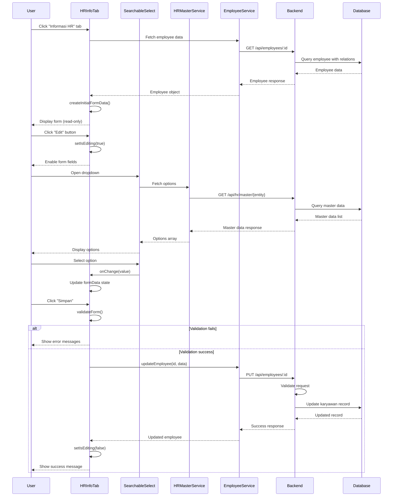

I have created the following plan after thorough exploration and analysis of the codebase. Follow the below plan verbatim. Trust the files and references. Do not re-verify what's written in the plan. Explore only when absolutely necessary. First implement all the proposed file changes and then I'll review all the changes together at the end.

## Observasi Kode

Berdasarkan eksplorasi codebase, sistem telah memiliki struktur yang solid dengan pola implementasi yang konsisten. Frontend menggunakan React + TypeScript dengan komponen form reusable (`TextInput`, `Select`, `DatePicker`, `TextArea`). Backend menggunakan Prisma ORM dengan PostgreSQL. Tab Personal Information sudah diimplementasi dengan pola edit/save yang baik, menggunakan state management lokal dan validasi form. Master data HR sudah memiliki service layer yang lengkap dengan CRUD operations. Database schema sudah mencakup semua field yang dibutuhkan untuk HR Information tab sesuai spesifikasi di `file:planning/02_modul_hr_v2.md`.

## Pendekatan Implementasi

Implementasi akan mengikuti pola yang sama dengan Personal Information Tab yang sudah ada, dengan menambahkan komponen `SearchableSelect` untuk master data yang memerlukan pencarian. Tab HR Information akan dibagi menjadi 9 section groups sesuai desain UI: Kepegawaian, Kontrak, Education, Pangkat dan Golongan, Kontak Darurat, POO/POH, Seragam dan Sepatu Kerja, Pergerakan Karyawan, dan Costing. Setiap section akan menggunakan komponen form reusable yang sudah ada, dengan integrasi ke master data APIs untuk dropdown fields. Auto-fill functionality akan mengambil data dari employee profile header untuk field-field yang sudah terisi.

## Langkah Implementasi

### 1. Buat SearchableSelect Component (Frontend)

**File**: `file:frontend/src/components/common/form/SearchableSelect.tsx`

Buat komponen searchable select dengan fitur:
- Dropdown dengan search/filter functionality
- Debounced search untuk performa optimal
- Loading state saat fetch data dari API
- Support untuk async data loading dari master data services
- Error handling dan empty state
- Styling konsisten dengan komponen Select yang sudah ada
- Props interface: `label`, `value`, `onChange`, `fetchOptions` (async function), `error`, `helperText`, `disabled`, `required`, `placeholder`

Export komponen di `file:frontend/src/components/common/form/index.ts`

---

### 2. Buat HR Information Form Data Types (Frontend)

**File**: `file:frontend/src/types/employee.types.ts`

Tambahkan interface `HRInformationFormData` dengan fields:
- **Kepegawaian**: `nomorIndukKaryawan`, `posisiJabatanId`, `divisiId`, `departmentId`, `emailPerusahaan`, `managerId`, `atasanLangsungId`
- **Kontrak**: `jenisHubunganKerjaId`, `tanggalMasukGroup`, `tanggalMasuk`, `tanggalPermanent`, `tanggalKontrak`, `tanggalAkhirKontrak`, `tanggalBerhenti`
- **Education**: `tingkatPendidikan`, `bidangStudi`, `namaSekolah`, `kotaSekolah`, `statusKelulusan`, `keteranganPendidikan`
- **Pangkat dan Golongan**: `kategoriPangkatId`, `golonganPangkatId`, `subGolonganPangkatId`, `noDanaPensiun`
- **Kontak Darurat**: `namaKontakDarurat1`, `nomorTeleponKontakDarurat1`, `hubunganKontakDarurat1`, `alamatKontakDarurat1`, `namaKontakDarurat2`, `nomorTeleponKontakDarurat2`, `hubunganKontakDarurat2`, `alamatKontakDarurat2`
- **POO/POH**: `pointOfOriginal`, `pointOfHire`
- **Seragam**: `ukuranSeragamKerja`, `ukuranSepatuKerja`
- **Pergerakan**: `lokasiSebelumnyaId`, `tanggalMutasi`
- **Costing**: `siklusPembayaranGaji`, `costing`, `assign`, `actual`

Tambahkan enum untuk `TingkatPendidikan` dan `StatusKelulusan` sesuai Prisma schema

---

### 3. Buat Custom Hook untuk Master Data (Frontend)

**File**: `file:frontend/src/hooks/useHRMasterData.ts`

Tambahkan atau update hook dengan functions:
- `useDivisiOptions()` - fetch active divisi untuk dropdown
- `useDepartmentOptions(divisiId?)` - fetch departments, optional filter by divisi
- `usePosisiJabatanOptions(departmentId?)` - fetch posisi jabatan, optional filter by department
- `useKategoriPangkatOptions()` - fetch kategori pangkat
- `useGolonganOptions()` - fetch golongan
- `useSubGolonganOptions()` - fetch sub golongan
- `useJenisHubunganKerjaOptions()` - fetch jenis hubungan kerja
- `useLokasiKerjaOptions()` - fetch lokasi kerja
- `useKaryawanOptions(filters?)` - fetch karyawan untuk manager/atasan langsung selection

Setiap function return: `{ options, loading, error, refetch }`

---

### 4. Implementasi HRInformationTab Component (Frontend)

**File**: `file:frontend/src/components/employee/tabs/HRInformationTab.tsx`

Struktur komponen:
- Import dependencies: React hooks, form components (TextInput, Select, DatePicker, TextArea, SearchableSelect), types, services, validation utilities
- Props interface: `{ employee: Employee, onUpdate?: () => void }`
- State management: `formData`, `errors`, `isEditing`, `isSaving`, `saveError`, `saveSuccess`
- Helper function `createInitialFormData(employee)` untuk populate form dari employee data
- `useEffect` untuk reset form saat employee berubah
- `handleChange` callback untuk update field values
- `validateForm` function dengan business rules:
  - Validasi tanggal kontrak (tanggal akhir harus setelah tanggal mulai)
  - Validasi email perusahaan format
  - Validasi nomor telepon kontak darurat
  - Required fields sesuai business logic
- `handleSave` async function untuk update employee via API
- `handleCancel` untuk reset form ke initial state

Layout struktur (mengikuti pola PersonalInformationTab):
- Header dengan Edit/Save/Cancel buttons
- Success/Error message alerts
- 9 Section groups dengan card styling

**Section 1: Kepegawaian**
- Icon: `badge`
- Grid layout: 3 columns
- Fields (read-only, auto-filled dari head):
  - NIK (TextInput, disabled, value dari employee.nomorIndukKaryawan)
  - Posisi Jabatan (SearchableSelect, disabled, value dari employee.posisiJabatanId)
  - Divisi (SearchableSelect, disabled, value dari employee.divisiId)
  - Department (SearchableSelect, disabled, value dari employee.departmentId)
  - Email Perusahaan (TextInput, disabled, value dari employee.emailPerusahaan)
  - Manager (SearchableSelect, disabled, value dari employee.managerId)
  - Atasan Langsung (SearchableSelect, disabled, value dari employee.atasanLangsungId)

**Section 2: Kontrak**
- Icon: `history_edu`
- Grid layout: 4 columns untuk dates
- Fields:
  - Jenis Hubungan Kerja (SearchableSelect, fetch dari useJenisHubunganKerjaOptions)
  - Tanggal Masuk Group (DatePicker)
  - Tanggal Masuk (DatePicker)
  - Tanggal Permanent (DatePicker)
  - Tanggal Kontrak (DatePicker)
  - Tanggal Akhir Kontrak (DatePicker)
  - Tanggal Berhenti (DatePicker)

**Section 3: Education**
- Icon: `school`
- Grid layout: 2 columns
- Fields:
  - Tingkat Pendidikan (Select dengan options dari enum TingkatPendidikan)
  - Bidang Studi (TextInput)
  - Nama Sekolah (TextInput)
  - Kota Sekolah (TextInput)
  - Status Kelulusan (Select dengan options dari enum StatusKelulusan)
  - Keterangan (TextArea, full width)

**Section 4: Pangkat dan Golongan**
- Icon: `military_tech`
- Grid layout: 2 columns
- Fields:
  - Kategori Pangkat (SearchableSelect, fetch dari useKategoriPangkatOptions)
  - Golongan Pangkat (SearchableSelect, fetch dari useGolonganOptions)
  - Sub Golongan Pangkat (SearchableSelect, fetch dari useSubGolonganOptions)
  - No Dana Pensiun (TextInput)

**Section 5: Kontak Darurat**
- Icon: `contact_emergency`
- Layout: 2 card columns (Emergency Contact 1 & 2)
- Each card contains:
  - Nama Kontak Darurat (TextInput)
  - Nomor Telepon (TextInput dengan validasi phone)
  - Hubungan (TextInput)
  - Alamat (TextArea)

**Section 6: POO/POH & Seragam**
- Icon: `apparel`
- Grid layout: 2 columns
- Fields:
  - Point of Original (TextInput)
  - Point of Hire (TextInput)
  - Ukuran Seragam Kerja (TextInput)
  - Ukuran Sepatu Kerja (TextInput)

**Section 7: Pergerakan Karyawan**
- Icon: `swap_horiz`
- Grid layout: 2 columns
- Fields:
  - Lokasi Sebelumnya (SearchableSelect, fetch dari useLokasiKerjaOptions)
  - Tanggal Mutasi (DatePicker)

**Section 8: Costing**
- Icon: `payments`
- Grid layout: 2 columns
- Fields:
  - Siklus Pembayaran Gaji (TextInput)
  - Costing (TextInput)
  - Assign (TextInput)
  - Actual (TextInput)

Footer dengan Save/Discard buttons (hanya muncul saat isEditing)

---

### 5. Update Employee Profile Tabs Navigation (Frontend)

**File**: `file:frontend/src/components/employee/EmployeeProfileTabs.tsx`

Update tabs array untuk mengubah label tab kedua:
- Dari: `{ id: 'hr-info', label: 'Informasi Kepegawaian', icon: 'badge' }`
- Menjadi: `{ id: 'hr-info', label: 'Informasi HR', icon: 'badge' }`

---

### 6. Update Employee Profile Page Routing (Frontend)

**File**: `file:frontend/src/pages/hr/employees/EmployeeProfile.tsx`

Tambahkan import `HRInformationTab` component

Update routing logic untuk render HRInformationTab saat activeTab === 'hr-info':
```typescript
{activeTab === 'hr-info' && (
  <HRInformationTab employee={employee} onUpdate={refetchEmployee} />
)}
```

---

### 7. Update Employee Service (Frontend)

**File**: `file:frontend/src/services/employee.service.ts`

Pastikan `updateEmployee` function sudah support semua HR Information fields. Jika belum, update DTO mapping untuk include:
- All Kepegawaian fields
- All Kontrak fields
- All Education fields
- All Pangkat dan Golongan fields
- All Kontak Darurat fields
- All POO/POH fields
- All Seragam fields
- All Pergerakan fields
- All Costing fields

---

### 8. Update Backend Employee Controller (Backend)

**File**: `file:backend/src/controllers/employee.controller.ts`

Pastikan `updateEmployee` endpoint handler sudah:
- Accept semua HR Information fields dari request body
- Validate required fields dan business rules
- Update Karyawan record dengan Prisma
- Return updated employee data dengan relations (divisi, department, posisiJabatan, jenisHubunganKerja, kategoriPangkat, golonganPangkat, subGolonganPangkat, lokasiSebelumnya, manager, atasanLangsung)

---

### 9. Update Employee Validator (Backend)

**File**: `file:backend/src/validators/employee.validator.ts`

Tambahkan validation rules untuk HR Information fields:
- Email perusahaan format validation
- Phone number validation untuk kontak darurat
- Date range validation (tanggal akhir kontrak > tanggal mulai kontrak)
- UUID validation untuk foreign key fields (divisiId, departmentId, etc.)
- Enum validation untuk tingkatPendidikan dan statusKelulusan

---

### 10. Testing & Integration

**Manual Testing Checklist**:
1. Navigate ke employee profile page
2. Click tab "Informasi HR"
3. Verify semua fields ter-populate dengan data employee yang benar
4. Click "Edit" button
5. Test SearchableSelect components:
   - Verify dropdown opens dan menampilkan options
   - Test search functionality
   - Verify selection updates form state
6. Update beberapa fields
7. Click "Simpan" dan verify:
   - Loading state muncul
   - Success message ditampilkan
   - Data ter-update di database
   - Form kembali ke read-only mode
8. Click "Edit" lagi, lalu "Batal"
   - Verify form reset ke data original
9. Test validation:
   - Input invalid email format
   - Input invalid phone number
   - Input tanggal akhir kontrak sebelum tanggal mulai
   - Verify error messages muncul
10. Test auto-fill dari head section (NIK, Posisi, Divisi, Department, Email, Manager, Atasan)

**API Testing**:
- Test PUT `/api/employees/:id` dengan HR Information fields
- Verify response includes updated data dengan relations
- Verify database record updated correctly

---

### 11. Styling & Responsiveness

Pastikan styling konsisten dengan:
- Personal Information Tab yang sudah ada
- Design reference di `file:desain-ui-ux/employee_profile_-_hr_information_tab/code.html`
- Tailwind CSS classes untuk dark mode support
- Responsive grid layouts (mobile: 1 column, tablet: 2 columns, desktop: 3-4 columns)
- Card styling dengan border, shadow, dan rounded corners
- Icon colors menggunakan `text-primary`
- Proper spacing dengan gap utilities

---

## Diagram Alur Implementasi

