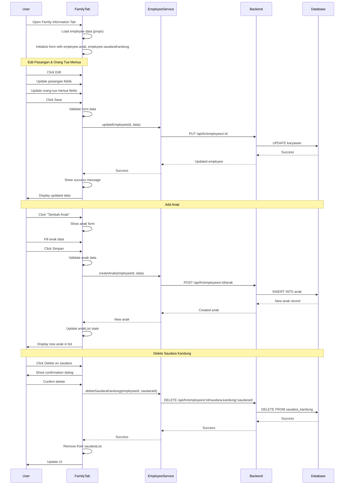

I have created the following plan after thorough exploration and analysis of the codebase. Follow the below plan verbatim. Trust the files and references. Do not re-verify what's written in the plan. Explore only when absolutely necessary. First implement all the proposed file changes and then I'll review all the changes together at the end.

## Observasi Kode

Berdasarkan analisis codebase, sistem sudah memiliki:
- Database schema lengkap untuk family information (tabel `Karyawan`, `Anak`, `SaudaraKandung`) dengan relasi cascade delete
- Backend API endpoints untuk CRUD operations anak dan saudara kandung
- Frontend service methods (`createAnak`, `updateAnak`, `deleteAnak`, `createSaudaraKandung`, dll)
- Pattern implementasi tab yang konsisten (PersonalInformationTab, HRInformationTab) dengan edit/save/cancel flow
- Reusable form components (TextInput, DatePicker, Select, TextArea, SearchableSelect)
- Validation utilities dan error handling yang terstruktur

## Pendekatan Implementasi

Implementasi Family Information Tab akan mengikuti pattern yang sama dengan tab sebelumnya, dengan penambahan fitur dynamic repeatable forms untuk anak dan saudara kandung. Tab ini akan dibagi menjadi 4 section utama: Pasangan dan Anak, Identitas Anak (dynamic), Saudara Kandung, dan Orang Tua Mertua. Menggunakan state management lokal untuk form data dan API calls untuk child data (anak, saudara kandung) yang terpisah dari main employee update.

---

## Implementasi Detail

### 1. Buat Family Information Tab Component

**File**: `file:frontend/src/components/employee/tabs/FamilyInformationTab.tsx`

Buat component baru dengan struktur:

**Imports dan Types**:
- Import form components dari `file:frontend/src/components/common/form`
- Import types: `Employee`, `Anak`, `SaudaraKandung`, `JenisKelamin`, `CreateAnakDTO`, `CreateSaudaraKandungDTO`
- Import service: `employeeService` dari `file:frontend/src/services/employee.service.ts`
- Import validation utilities dari `file:frontend/src/utils/validation`

**Interface untuk Form Data**:
```typescript
interface FamilyInformationFormData {
  // Pasangan
  namaPasangan: string;
  tanggalLahirPasangan: string;
  pendidikanTerakhirPasangan: string;
  pekerjaanPasangan: string;
  jumlahAnak: number | '';
  keteranganPasangan: string;
  
  // Saudara Kandung
  anakKe: number | '';
  jumlahSaudaraKandung: number | '';
  
  // Orang Tua Mertua
  namaAyahMertua: string;
  tanggalLahirAyahMertua: string;
  pendidikanTerakhirAyahMertua: string;
  keteranganAyahMertua: string;
  namaIbuMertua: string;
  tanggalLahirIbuMertua: string;
  pendidikanTerakhirIbuMertua: string;
  keteranganIbuMertua: string;
}
```

**State Management**:
- `isEditing`: boolean untuk mode edit
- `isSaving`: boolean untuk loading state
- `formData`: FamilyInformationFormData
- `anakList`: Anak[] untuk daftar anak (dari employee.anak)
- `saudaraList`: SaudaraKandung[] untuk daftar saudara (dari employee.saudaraKandung)
- `errors`: untuk validation errors
- `saveError` dan `saveSuccess`: untuk feedback messages

**Helper Functions**:
- `createInitialFormData(employee: Employee)`: factory function untuk initial state
- `formatDateForInput(dateString)`: format date untuk input field
- `validateForm()`: validasi form data
- `handleChange(field, value)`: handle field changes
- `handleSave()`: save main family data ke employee
- `handleCancel()`: reset form

---

### 2. Implementasi Section: Pasangan dan Anak

**Layout**: Card dengan informasi pasangan dan summary jumlah anak

**Fields** (auto-fill dari Personal Information Tab):
- `namaPasangan`: TextInput (referensi dari `employee.namaPasangan`)
- `tanggalLahirPasangan`: DatePicker
- `pendidikanTerakhirPasangan`: TextInput
- `pekerjaanPasangan`: TextInput (referensi dari `employee.pekerjaanPasangan`)
- `jumlahAnak`: Number input (referensi dari `employee.jumlahAnak`)
- `keteranganPasangan`: TextArea

**Auto-fill Logic**:
- Saat component mount, populate fields dari `employee` object
- Display badge untuk status pernikahan (dari Personal Info)
- Show helper text: "Data pasangan diambil dari tab Personal Information"

**Validation**:
- `tanggalLahirPasangan`: tidak boleh di masa depan
- `jumlahAnak`: harus >= 0, integer

---

### 3. Implementasi Section: Identitas Anak (Dynamic Repeatable)

**State untuk Anak**:
- `anakList`: array dari `employee.anak` atau empty array
- `editingAnakId`: string | null untuk track anak yang sedang diedit
- `anakFormData`: CreateAnakDTO untuk form add/edit anak

**UI Components**:

**A. Anak List Display** (ketika tidak editing):
- Grid layout (2 columns pada desktop) untuk child cards
- Setiap card menampilkan:
  - Icon berdasarkan jenis kelamin (boy/girl icon)
  - Nama anak dengan urutan (Anak Pertama, Kedua, dst)
  - TTL (Tempat Tanggal Lahir)
  - Jenis kelamin
  - Keterangan (jika ada)
  - Action buttons: Edit, Delete
- Button "Tambah Anak" di header section

**B. Anak Form** (modal atau inline form):
- `urutanAnak`: Auto-increment berdasarkan `anakList.length + 1`
- `namaAnak`: TextInput (required)
- `jenisKelamin`: Select dengan options LAKI_LAKI, PEREMPUAN (required)
- `tanggalLahir`: DatePicker (required)
- `keterangan`: TextArea (optional)
- Buttons: Simpan, Batal

**CRUD Operations untuk Anak**:

**Create Anak**:
```typescript
const handleCreateAnak = async (data: CreateAnakDTO) => {
  try {
    const newAnak = await employeeService.createAnak(employee.id, data);
    setAnakList([...anakList, newAnak]);
    // Update jumlahAnak di formData
    setFormData(prev => ({ ...prev, jumlahAnak: anakList.length + 1 }));
  } catch (error) {
    // Handle error
  }
};
```

**Update Anak**:
```typescript
const handleUpdateAnak = async (anakId: string, data: Partial<CreateAnakDTO>) => {
  try {
    const updatedAnak = await employeeService.updateAnak(employee.id, anakId, data);
    setAnakList(anakList.map(a => a.id === anakId ? updatedAnak : a));
  } catch (error) {
    // Handle error
  }
};
```

**Delete Anak**:
```typescript
const handleDeleteAnak = async (anakId: string) => {
  if (!confirm('Yakin ingin menghapus data anak ini?')) return;
  try {
    await employeeService.deleteAnak(employee.id, anakId);
    setAnakList(anakList.filter(a => a.id !== anakId));
    // Update jumlahAnak
    setFormData(prev => ({ ...prev, jumlahAnak: anakList.length - 1 }));
  } catch (error) {
    // Handle error
  }
};
```

**Validation**:
- `namaAnak`: required, min 2 characters
- `jenisKelamin`: required
- `tanggalLahir`: required, tidak boleh di masa depan
- `urutanAnak`: unique per karyawan (handled by backend)

---

### 4. Implementasi Section: Saudara Kandung

**State untuk Saudara Kandung**:
- `saudaraList`: array dari `employee.saudaraKandung` atau empty array
- `editingSaudaraId`: string | null
- `saudaraFormData`: CreateSaudaraKandungDTO

**UI Components**:

**A. Summary Cards**:
- 3 cards dalam grid:
  - Total Saudara: display `jumlahSaudaraKandung`
  - Urutan Ke-: display `anakKe` dari total saudara
  - Tanggungan: count saudara yang masih tanggungan (optional logic)

**B. Saudara Kandung Table**:
- Table dengan columns:
  - Nama Saudara
  - Status (Kakak/Adik + Jenis Kelamin)
  - Pekerjaan
  - Aksi (Detail/Edit, Delete)
- Button "Tambah Saudara" (max 5 saudara)

**C. Saudara Form** (modal atau inline):
- `urutanSaudara`: Auto-increment
- `namaSaudaraKandung`: TextInput (required)
- `jenisKelamin`: Select (required)
- `tanggalLahir`: DatePicker (optional)
- `pendidikanTerakhir`: TextInput (optional)
- `pekerjaan`: TextInput (optional)
- `keterangan`: TextArea (optional)

**CRUD Operations untuk Saudara Kandung**:

**Create Saudara**:
```typescript
const handleCreateSaudara = async (data: CreateSaudaraKandungDTO) => {
  if (saudaraList.length >= 5) {
    alert('Maksimal 5 saudara kandung');
    return;
  }
  try {
    const newSaudara = await employeeService.createSaudaraKandung(employee.id, data);
    setSaudaraList([...saudaraList, newSaudara]);
    setFormData(prev => ({ ...prev, jumlahSaudaraKandung: saudaraList.length + 1 }));
  } catch (error) {
    // Handle error
  }
};
```

**Update Saudara**:
```typescript
const handleUpdateSaudara = async (saudaraId: string, data: Partial<CreateSaudaraKandungDTO>) => {
  try {
    const updated = await employeeService.updateSaudaraKandung(employee.id, saudaraId, data);
    setSaudaraList(saudaraList.map(s => s.id === saudaraId ? updated : s));
  } catch (error) {
    // Handle error
  }
};
```

**Delete Saudara**:
```typescript
const handleDeleteSaudara = async (saudaraId: string) => {
  if (!confirm('Yakin ingin menghapus data saudara kandung ini?')) return;
  try {
    await employeeService.deleteSaudaraKandung(employee.id, saudaraId);
    setSaudaraList(saudaraList.filter(s => s.id !== saudaraId));
    setFormData(prev => ({ ...prev, jumlahSaudaraKandung: saudaraList.length - 1 }));
  } catch (error) {
    // Handle error
  }
};
```

**Validation**:
- Max 5 saudara kandung (enforced di UI dan backend)
- `namaSaudaraKandung`: required
- `jenisKelamin`: required
- `tanggalLahir`: optional, tidak boleh di masa depan jika diisi

---

### 5. Implementasi Section: Orang Tua Mertua

**Layout**: 2 cards side-by-side (Ayah Mertua, Ibu Mertua)

**Fields untuk Ayah Mertua**:
- `namaAyahMertua`: TextInput
- `tanggalLahirAyahMertua`: DatePicker
- `pendidikanTerakhirAyahMertua`: TextInput
- `keteranganAyahMertua`: TextArea

**Fields untuk Ibu Mertua**:
- `namaIbuMertua`: TextInput
- `tanggalLahirIbuMertua`: DatePicker
- `pendidikanTerakhirIbuMertua`: TextInput
- `keteranganIbuMertua`: TextArea

**Display Elements**:
- Icon person untuk avatar placeholder
- Status badge (Hidup/Wafat) - optional, bisa ditambahkan field di schema
- Alamat domisili (jika sama dengan pasangan, bisa auto-fill)
- Kontak telepon (optional field untuk future enhancement)

**Validation**:
- Tanggal lahir tidak boleh di masa depan
- Tanggal lahir harus sebelum tanggal lahir pasangan (logical validation)

---

### 6. Implementasi Save/Update Logic

**Main Save Function**:
```typescript
const handleSave = async () => {
  if (!validateForm()) return;
  
  setIsSaving(true);
  setSaveError(null);
  
  try {
    // Update main employee family data
    const updateData: UpdateEmployeeDTO = {
      // Pasangan
      tanggalLahirPasangan: formData.tanggalLahirPasangan || undefined,
      pendidikanTerakhirPasangan: formData.pendidikanTerakhirPasangan || undefined,
      keteranganPasangan: formData.keteranganPasangan || undefined,
      
      // Saudara Kandung summary
      anakKe: formData.anakKe || undefined,
      jumlahSaudaraKandung: formData.jumlahSaudaraKandung || undefined,
      
      // Orang Tua Mertua
      namaAyahMertua: formData.namaAyahMertua || undefined,
      tanggalLahirAyahMertua: formData.tanggalLahirAyahMertua || undefined,
      pendidikanTerakhirAyahMertua: formData.pendidikanTerakhirAyahMertua || undefined,
      keteranganAyahMertua: formData.keteranganAyahMertua || undefined,
      namaIbuMertua: formData.namaIbuMertua || undefined,
      tanggalLahirIbuMertua: formData.tanggalLahirIbuMertua || undefined,
      pendidikanTerakhirIbuMertua: formData.pendidikanTerakhirIbuMertua || undefined,
      keteranganIbuMertua: formData.keteranganIbuMertua || undefined,
    };
    
    await employeeService.updateEmployee(employee.id, updateData);
    setSaveSuccess(true);
    setIsEditing(false);
    onUpdate?.(); // Trigger parent refresh
  } catch (error) {
    setSaveError('Gagal menyimpan data. Silakan coba lagi.');
  } finally {
    setIsSaving(false);
  }
};
```

**Note**: Data anak dan saudara kandung disimpan secara terpisah melalui dedicated endpoints, tidak melalui main employee update.

---

### 7. Styling dan UI/UX Enhancements

**Mengikuti Design Reference** (`file:desain-ui-ux/employee_profile_-_family_information_tab/code.html`):

**Color Scheme**:
- Primary color: `#135bec`
- Background light: `#f6f6f8`
- Card background: white dengan border `#f0f2f4`
- Dark mode support dengan `dark:` variants

**Icons** (Material Symbols):
- `family_history`: untuk section Pasangan dan Anak
- `boy` / `child_care`: untuk anak laki-laki / perempuan
- `groups`: untuk Saudara Kandung
- `home_mini`: untuk Orang Tua Mertua
- `person` / `person_3`: untuk avatar placeholder

**Card Layouts**:
- Spouse card: flex layout dengan foto placeholder dan info
- Children cards: grid 2 columns dengan hover shadow effect
- Sibling table: responsive table dengan sticky header
- In-laws cards: 2 column grid dengan consistent spacing

**Responsive Design**:
- Mobile: single column layout
- Tablet: 2 column grid untuk children/siblings
- Desktop: full grid layout dengan proper spacing

**Interactive Elements**:
- Hover effects pada cards
- Loading spinners saat save/delete
- Confirmation dialogs untuk delete actions
- Success/error toast messages
- Disabled state untuk fields saat tidak editing

---

### 8. Integration dengan Employee Profile

**File**: `file:frontend/src/components/employee/EmployeeProfileTabs.tsx`

**Update Tab Navigation**:
- Tambahkan tab "Informasi Keluarga" / "Family Information"
- Import `FamilyInformationTab` component
- Add routing untuk tab (jika menggunakan URL-based tabs)

**Tab Order**:
1. Personal Information
2. HR Information
3. **Family Information** (new)
4. Documents
5. Settings

**Props Passing**:
```typescript
<FamilyInformationTab 
  employee={employee} 
  onUpdate={handleEmployeeUpdate}
/>
```

---

### 9. Error Handling dan Validation

**Client-side Validation**:
- Required fields validation
- Date format validation
- Date range validation (tidak boleh masa depan)
- Logical validation (tanggal lahir orang tua < tanggal lahir pasangan)
- Max length validation untuk text fields
- Max count validation (5 saudara kandung)

**Server-side Error Handling**:
- Handle 404 (employee/anak/saudara not found)
- Handle 400 (validation errors)
- Handle 409 (unique constraint violations)
- Handle 500 (server errors)
- Display user-friendly error messages dalam Bahasa Indonesia

**Error Display**:
- Inline field errors (red text below input)
- Section-level errors (alert box)
- Toast notifications untuk CRUD operations
- Confirmation dialogs untuk destructive actions

---

### 10. Testing Considerations

**Manual Testing Checklist**:
- [ ] Load employee dengan existing family data
- [ ] Load employee tanpa family data (empty state)
- [ ] Add new anak (1st, 2nd, 3rd child)
- [ ] Edit existing anak data
- [ ] Delete anak (dengan confirmation)
- [ ] Add saudara kandung (up to 5)
- [ ] Attempt to add 6th saudara (should show error)
- [ ] Edit saudara kandung
- [ ] Delete saudara kandung
- [ ] Update pasangan information
- [ ] Update orang tua mertua information
- [ ] Save all changes (success scenario)
- [ ] Cancel changes (reset form)
- [ ] Validation errors display correctly
- [ ] Auto-fill dari Personal Info tab works
- [ ] Responsive layout pada mobile/tablet/desktop
- [ ] Dark mode styling

**Edge Cases**:
- Employee dengan status "Belum Menikah" (hide/disable spouse fields)
- Employee dengan jumlahAnak = 0 (show empty state)
- Delete anak saat jumlahAnak > actual anak count
- Network errors saat save/delete
- Concurrent edits (multiple users)

---

### 11. Performance Optimization

**Lazy Loading**:
- Load anak dan saudara data only when tab is active
- Use React.lazy untuk tab component jika belum diimplementasi

**Memoization**:
- Memoize expensive calculations (age calculation, status determination)
- Use `useMemo` untuk derived state
- Use `useCallback` untuk event handlers

**API Optimization**:
- Batch updates jika memungkinkan
- Debounce auto-save (jika implement auto-save feature)
- Cache employee data di parent component
- Optimistic UI updates untuk better UX

---

### 12. Accessibility (A11y)

**Keyboard Navigation**:
- Tab order yang logical
- Enter untuk submit forms
- Escape untuk cancel/close modals
- Arrow keys untuk navigate table

**Screen Reader Support**:
- Proper ARIA labels untuk form fields
- ARIA live regions untuk success/error messages
- Semantic HTML (section, article, table)
- Alt text untuk icons

**Visual Accessibility**:
- Sufficient color contrast (WCAG AA)
- Focus indicators untuk interactive elements
- Error messages dengan icons dan text
- Loading states dengan visual feedback

---

## Diagram Alur Implementasi



---

## Checklist Implementasi

### Frontend Components
- [ ] Buat `FamilyInformationTab.tsx` component
- [ ] Implementasi form state management
- [ ] Implementasi Section: Pasangan dan Anak
- [ ] Implementasi Section: Identitas Anak (dynamic list)
- [ ] Implementasi CRUD operations untuk Anak
- [ ] Implementasi Section: Saudara Kandung (table)
- [ ] Implementasi CRUD operations untuk Saudara Kandung
- [ ] Implementasi Section: Orang Tua Mertua
- [ ] Implementasi validation logic
- [ ] Implementasi save/cancel handlers
- [ ] Styling sesuai design reference
- [ ] Responsive layout
- [ ] Dark mode support

### Integration
- [ ] Update `EmployeeProfileTabs.tsx` untuk include Family tab
- [ ] Update routing (jika diperlukan)
- [ ] Test integration dengan existing tabs
- [ ] Test auto-fill dari Personal Information tab

### Testing & Polish
- [ ] Manual testing semua CRUD operations
- [ ] Test validation scenarios
- [ ] Test error handling
- [ ] Test responsive design
- [ ] Test dark mode
- [ ] Test accessibility (keyboard navigation)
- [ ] Performance optimization
- [ ] Code review dan refactoring