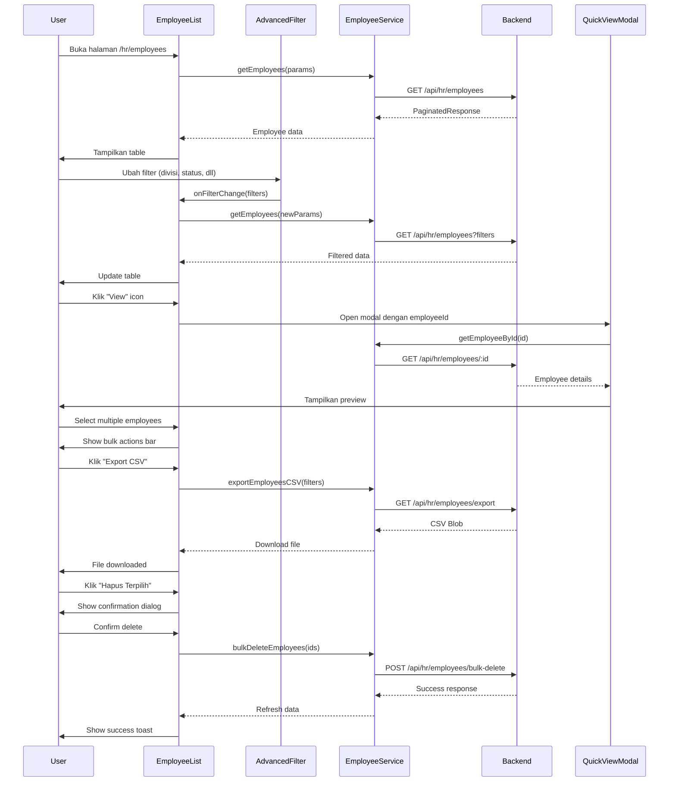

I have created the following plan after thorough exploration and analysis of the codebase. Follow the below plan verbatim. Trust the files and references. Do not re-verify what's written in the plan. Explore only when absolutely necessary. First implement all the proposed file changes and then I'll review all the changes together at the end.

## Observasi Kode

Struktur project sudah lengkap dengan backend (NestJS/Express + Prisma) dan frontend (React + TypeScript + Tailwind). Employee service API sudah tersedia dengan endpoint `getEmployees` yang mendukung search, filtering (divisi, department, status, tag, lokasi kerja), pagination, dan sorting. Common components seperti `DataTable`, `Pagination`, `SearchFilter`, `Modal`, dan `DeleteConfirmDialog` sudah diimplementasikan dan siap digunakan. Master data services untuk filter options juga sudah tersedia. Namun, belum ada halaman employee list, bulk actions (backend & frontend), advanced filter component, dan quick view modal.

## Pendekatan

Implementasi akan mengikuti pola yang sudah ada di master data list pages (seperti `DivisiList.tsx`). Buat halaman `EmployeeList.tsx` dengan advanced filtering menggunakan multiple master data selects, table dengan foto karyawan, dan pagination. Tambahkan backend endpoints untuk bulk delete dan export CSV/Excel. Implementasi quick view modal untuk preview employee details tanpa navigasi ke profile page. Gunakan reusable components yang sudah ada dan tambahkan komponen baru untuk advanced filters dan bulk actions.

## Implementasi

### 1. Backend - Bulk Actions Endpoints

**File: `file:backend/src/controllers/employee.controller.ts`**

Tambahkan controller functions untuk bulk actions:

```typescript
/**
 * POST /api/hr/employees/bulk-delete
 * Bulk delete employees
 */
export async function bulkDeleteKaryawan(req, res, next)
```
- Validate array of employee IDs dari request body
- Loop delete atau gunakan Prisma deleteMany
- Return success response dengan jumlah deleted records

```typescript
/**
 * GET /api/hr/employees/export
 * Export employees to CSV/Excel
 */
export async function exportKaryawan(req, res, next)
```
- Parse query params (sama seperti getAllKaryawan untuk filtering)
- Fetch all matching employees tanpa pagination
- Generate CSV menggunakan library seperti `csv-writer` atau `json2csv`
- Set response headers untuk file download
- Stream CSV data ke response

**File: `file:backend/src/routes/employee.routes.ts`**

Tambahkan routes:
- `POST /bulk-delete` → `bulkDeleteKaryawan`
- `GET /export` → `exportKaryawan`

**File: `file:backend/src/services/employee.service.ts`**

Tambahkan service methods:
- `bulkDelete(ids: string[]): Promise<number>` - return count deleted
- `exportData(params: QueryParams): Promise<Employee[]>` - return all matching records

### 2. Frontend - Advanced Filter Component

**File: `file:frontend/src/components/employee/EmployeeAdvancedFilter.tsx`** (NEW)

Buat component dengan props:
- `onFilterChange: (filters: EmployeeFilterState) => void`
- `initialFilters?: EmployeeFilterState`

Implementasi:
- Search input (nama atau NIK) dengan debounce
- Select dropdown untuk Divisi (fetch dari `divisiService.getAll()`)
- Select dropdown untuk Department (fetch dari `departmentService.getAll()`)
- Select dropdown untuk Status Karyawan (fetch dari `statusKaryawanService.getAll()`)
- Select dropdown untuk Tag (fetch dari `tagService.getAll()`)
- Select dropdown untuk Lokasi Kerja (fetch dari `lokasiKerjaService.getAll()`)
- Button "Reset Filter" untuk clear semua filters
- Button "Terapkan Filter" (optional, atau auto-apply on change)

Layout: Grid 2-3 columns responsive, dengan search bar full width di atas

**File: `file:frontend/src/types/employee.types.ts`**

Tambahkan interface:
```typescript
export interface EmployeeFilterState {
  search: string;
  divisiId: string;
  departmentId: string;
  statusKaryawanId: string;
  tagId: string;
  lokasiKerjaId: string;
}
```

### 3. Frontend - Quick View Modal

**File: `file:frontend/src/components/employee/EmployeeQuickViewModal.tsx`** (NEW)

Props:
- `isOpen: boolean`
- `onClose: () => void`
- `employeeId: string`
- `onViewFullProfile: (id: string) => void`

Implementasi:
- Gunakan `Modal` component dari common
- Fetch employee data dengan `getEmployeeById(employeeId)`
- Display foto karyawan (circular avatar)
- Display informasi ringkas:
  - Nama Lengkap, NIK
  - Divisi, Department, Posisi Jabatan
  - Status Karyawan (badge)
  - Email, No. Handphone
  - Tanggal Masuk
  - Tag (jika ada)
- Footer dengan buttons:
  - "Lihat Profile Lengkap" → navigate ke `/hr/employees/:id`
  - "Tutup"
- Loading state saat fetch data
- Error handling

### 4. Frontend - Employee List Service Extensions

**File: `file:frontend/src/services/employee.service.ts`**

Tambahkan functions:

```typescript
/**
 * Bulk delete employees
 */
export const bulkDeleteEmployees = async (ids: string[]): Promise<void>
```
- POST ke `/hr/employees/bulk-delete` dengan body `{ ids }`

```typescript
/**
 * Export employees to CSV
 */
export const exportEmployeesCSV = async (params: EmployeeQueryParams): Promise<Blob>
```
- GET ke `/hr/employees/export` dengan query params
- Return blob untuk download

Tambahkan ke export object `employeeService`

### 5. Frontend - Employee List Page

**File: `file:frontend/src/pages/hr/employees/EmployeeList.tsx`** (NEW)

State management:
- `filters: EmployeeFilterState` - current filter values
- `currentPage: number` - pagination
- `limit: number` - items per page
- `sortState: SortState` - sorting column & direction
- `selectedEmployees: Set<string>` - untuk bulk actions
- `isQuickViewOpen: boolean`
- `quickViewEmployeeId: string | null`
- `isDeleteDialogOpen: boolean`
- `isBulkDeleteDialogOpen: boolean`

Data fetching:
- Gunakan `getEmployees(params)` dari employee service
- Trigger fetch saat filters, page, limit, atau sort berubah
- Loading state dari API call

Layout structure:
1. **Breadcrumb**: HR Module > Daftar Karyawan
2. **Page Header**: 
   - Title: "Daftar Karyawan"
   - Description: "Kelola data karyawan perusahaan"
   - Button: "Tambah Karyawan" (navigate ke create form - future phase)
3. **Advanced Filter Section**: 
   - Gunakan `EmployeeAdvancedFilter` component
4. **Bulk Actions Bar** (conditional, show jika ada selected):
   - Text: "X karyawan dipilih"
   - Button: "Export CSV"
   - Button: "Hapus Terpilih" (danger style)
   - Button: "Batal Pilihan"
5. **Data Table**:
   - Gunakan `DataTable` component dengan custom columns
   - Checkbox column untuk bulk selection
   - Foto column (circular avatar, fallback ke initial)
   - Nama Lengkap (sortable)
   - NIK (sortable)
   - Divisi
   - Department
   - Status (badge)
   - Actions: View (eye icon) → quick view, Edit, Delete
6. **Pagination**: Gunakan `Pagination` component

Table columns definition:
```typescript
const columns: TableColumn<EmployeeListItem>[] = [
  {
    header: 'Foto',
    accessor: 'fotoKaryawan',
    render: (item) => <Avatar src={item.fotoKaryawan} name={item.namaLengkap} />
  },
  {
    header: 'Nama Lengkap',
    accessor: 'namaLengkap',
    sortable: true
  },
  {
    header: 'NIK',
    accessor: 'nomorIndukKaryawan',
    sortable: true
  },
  {
    header: 'Divisi',
    accessor: 'divisi.namaDivisi',
    render: (item) => item.divisi?.namaDivisi || '-'
  },
  {
    header: 'Department',
    accessor: 'department.namaDepartment',
    render: (item) => item.department?.namaDepartment || '-'
  },
  {
    header: 'Status',
    accessor: 'statusKaryawan',
    render: (item) => <EmployeeStatusBadge status={item.statusKaryawan} />
  }
]
```

Event handlers:
- `handleFilterChange(filters)` - update filters state, reset page to 1
- `handlePageChange(page)` - update currentPage
- `handleLimitChange(limit)` - update limit, reset page to 1
- `handleSort(sortState)` - update sortState
- `handleSelectEmployee(id)` - toggle selection
- `handleSelectAll()` - select/deselect all on current page
- `handleQuickView(id)` - open quick view modal
- `handleEdit(id)` - navigate to edit page (future)
- `handleDelete(id)` - open delete confirmation dialog
- `handleBulkDelete()` - open bulk delete confirmation
- `handleExport()` - trigger CSV export dengan current filters
- `handleConfirmDelete()` - call deleteEmployee API
- `handleConfirmBulkDelete()` - call bulkDeleteEmployees API

Export functionality:
- Call `exportEmployeesCSV(currentFilters)`
- Create blob URL dan trigger download
- Filename: `karyawan-export-${timestamp}.csv`
- Show toast notification

**File: `file:frontend/src/pages/hr/employees/index.ts`**

Tambahkan export:
```typescript
export { default as EmployeeList } from './EmployeeList';
```

### 6. Frontend - Avatar Component

**File: `file:frontend/src/components/common/Avatar.tsx`** (NEW)

Props:
- `src?: string | null` - photo URL
- `name: string` - untuk fallback initials
- `size?: 'sm' | 'md' | 'lg'` - default 'md'

Implementasi:
- Jika src ada dan valid, tampilkan image
- Jika tidak, tampilkan initials (2 huruf pertama dari nama)
- Circular shape dengan border
- Background color random based on name hash
- Responsive sizes: sm=8, md=10, lg=12 (Tailwind classes)

Export di `file:frontend/src/components/common/index.ts`

### 7. Frontend - Routing Integration

**File: `file:frontend/src/pages/modules/HRModule.tsx`**

Tambahkan route:
```typescript
<Route path="employees" element={<EmployeeList />} />
```

Posisi: sebelum route `employees/:id`

Import `EmployeeList` dari `'../hr/employees'`

### 8. Frontend - Navigation Link

**File: `file:frontend/src/pages/hr/HRDashboard.tsx`** (atau sidebar navigation)

Tambahkan link/button untuk navigasi ke employee list:
- Label: "Daftar Karyawan"
- Icon: Users icon
- Navigate to: `/hr/employees`

### 9. Backend - CSV Export Dependencies

**File: `file:backend/package.json`**

Tambahkan dependency:
```json
"json2csv": "^6.0.0"
```

Install dengan `npm install json2csv`

**File: `file:backend/src/utils/csv-export.ts`** (NEW)

Buat utility function:
```typescript
export function generateEmployeeCSV(employees: Employee[]): string
```
- Map employee data ke flat structure
- Define CSV columns (nama, NIK, divisi, department, dll)
- Convert to CSV string menggunakan json2csv
- Return CSV string

### 10. Testing & Error Handling

Implementasi error handling:
- Network errors → show toast notification
- Empty results → show empty state dengan ilustrasi
- Bulk delete errors → show which IDs failed
- Export errors → show error toast

Loading states:
- Table skeleton saat fetch data
- Disabled buttons saat submitting
- Loading spinner di modal

Validation:
- Bulk delete: minimal 1 employee selected
- Export: handle large datasets (show progress jika perlu)

### 11. Documentation

**File: `file:frontend/src/pages/hr/employees/README.md`** (NEW)

Dokumentasi:
- Cara menggunakan employee list page
- Filter options explanation
- Bulk actions workflow
- Quick view vs full profile

## Diagram Alur

