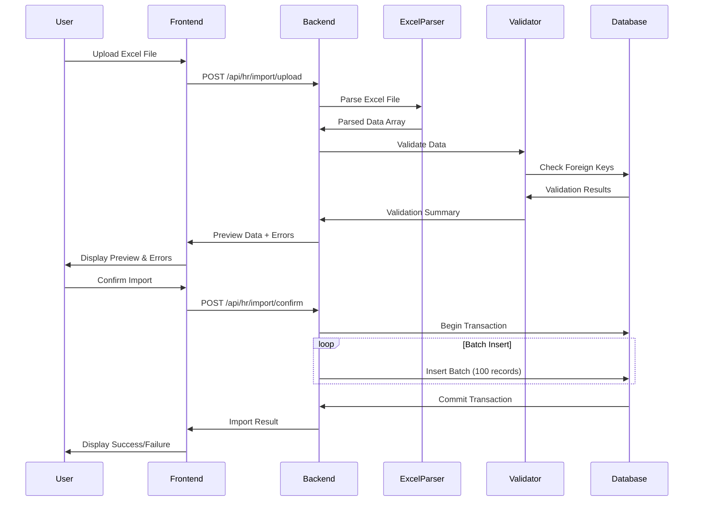

I have created the following plan after thorough exploration and analysis of the codebase. Follow the below plan verbatim. Trust the files and references. Do not re-verify what's written in the plan. Explore only when absolutely necessary. First implement all the proposed file changes and then I'll review all the changes together at the end.

## Observasi Kode

Proyek menggunakan arsitektur Controller-Service dengan Express.js dan TypeScript di backend, serta React dengan TypeScript di frontend. Backend sudah memiliki konfigurasi upload file menggunakan Multer untuk foto dan dokumen karyawan. Database menggunakan PostgreSQL dengan Prisma ORM. Struktur employee schema sangat lengkap dengan 100+ fields mencakup Personal Information, HR Information, dan Family Information. Sudah ada pattern untuk file upload, validation menggunakan Zod, dan error handling yang konsisten.

## Pendekatan Implementasi

Implementasi akan menggunakan library `xlsx` (SheetJS) untuk parsing Excel file di backend. Akan dibuat endpoint khusus untuk upload dan preview Excel sebelum import final. Frontend akan menggunakan FormData untuk upload file Excel, dengan UI untuk preview data dan validasi error sebelum konfirmasi import. Proses import akan dilakukan secara batch dengan transaction untuk memastikan data integrity. Progress indicator akan menggunakan streaming atau polling untuk large datasets.

## Langkah Implementasi

### 1. Backend - Install Dependencies & Setup

**File: `file:backend/package.json`**
- Install library `xlsx` untuk parsing Excel files
- Install `@types/xlsx` untuk TypeScript support
- Jalankan `npm install xlsx @types/xlsx`

### 2. Backend - Buat Excel Parser Utility

**File: `file:backend/src/utils/excel-parser.ts` (NEW)**
- Buat interface `ExcelEmployeeRow` untuk mapping kolom Excel ke database fields
- Implementasi function `parseEmployeeExcel(filePath: string)` untuk membaca dan parse Excel file
- Mapping kolom Excel dari template `file:planning/BMI-kosong.xlsx` ke struktur `CreateKaryawanDTO`
- Implementasi validation untuk setiap row (NIK unique, required fields, format validation)
- Return array of parsed data dengan error details per row
- Handle date parsing dari Excel serial number ke JavaScript Date
- Handle enum mapping (JenisKelamin, Agama, GolonganDarah, StatusPernikahan, dll)

**Struktur mapping Excel columns:**
```typescript
interface ExcelEmployeeRow {
  // Mapping dari kolom Excel ke field database
  // Contoh: "Nama Lengkap" -> namaLengkap
  // "NIK" -> nomorIndukKaryawan
  // "Jenis Kelamin" -> jenisKelamin (convert ke enum)
  // dst...
}

interface ParsedEmployeeData {
  data: CreateKaryawanDTO;
  rowNumber: number;
  errors: string[];
  warnings: string[];
}
```

### 3. Backend - Buat Validation Utility untuk Import

**File: `file:backend/src/utils/import-validator.ts` (NEW)**
- Buat function `validateImportData(data: ParsedEmployeeData[])` untuk validasi batch
- Check duplicate NIK dalam file Excel
- Validate foreign key references (divisiId, departmentId, dll) dengan query ke database
- Validate enum values sesuai Prisma schema
- Validate date formats dan ranges
- Return validation summary dengan detail errors per row

### 4. Backend - Extend Upload Configuration

**File: `file:backend/src/config/upload.ts`**
- Tambahkan storage configuration untuk Excel files
- Buat `EXCEL_IMPORT_DIR` directory untuk temporary Excel uploads
- Implementasi file filter untuk Excel files (.xlsx, .xls)
- Set file size limit untuk Excel (misal 10MB)

```typescript
const excelStorage = multer.diskStorage({
  destination: (_req, _file, cb) => {
    cb(null, EXCEL_IMPORT_DIR);
  },
  filename: (_req, file, cb) => {
    const uniqueSuffix = Date.now() + '-' + Math.round(Math.random() * 1E9);
    const ext = path.extname(file.originalname);
    cb(null, `import-${uniqueSuffix}${ext}`);
  }
});

export const uploadExcelFile = multer({
  storage: excelStorage,
  fileFilter: excelFileFilter,
  limits: { fileSize: 10485760 } // 10MB
});
```

### 5. Backend - Buat Import Service

**File: `file:backend/src/services/import.service.ts` (NEW)**
- Implementasi `previewImport(filePath: string)` untuk preview data sebelum import
  - Parse Excel file menggunakan `excel-parser.ts`
  - Validate data menggunakan `import-validator.ts`
  - Return preview data dengan statistics (total rows, valid rows, invalid rows)
- Implementasi `executeImport(filePath: string, options)` untuk bulk insert
  - Use Prisma transaction untuk atomic operation
  - Batch insert employees (misal 100 records per batch)
  - Handle errors dan rollback jika ada failure
  - Return import result dengan success/failure count
- Implementasi `getMasterDataMapping()` untuk mapping nama master data ke ID
  - Query semua master data (divisi, department, posisi jabatan, dll)
  - Return Map<string, string> untuk quick lookup saat parsing

### 6. Backend - Buat Import Controller

**File: `file:backend/src/controllers/import.controller.ts` (NEW)**
- Implementasi `uploadAndPreviewExcel(req, res)` endpoint
  - Handle file upload menggunakan multer
  - Call `importService.previewImport()`
  - Return preview data dengan validation errors
- Implementasi `confirmImport(req, res)` endpoint
  - Receive file path dari preview step
  - Call `importService.executeImport()`
  - Return import result
- Implementasi `downloadTemplate(req, res)` endpoint
  - Serve template Excel file `file:planning/BMI-kosong.xlsx`
  - Set proper headers untuk download

### 7. Backend - Buat Import Routes

**File: `file:backend/src/routes/import.routes.ts` (NEW)**
- Setup routes untuk import functionality:
  - `POST /api/hr/import/upload` - Upload dan preview Excel
  - `POST /api/hr/import/confirm` - Confirm dan execute import
  - `GET /api/hr/import/template` - Download template Excel
- Apply authentication middleware
- Apply multer middleware untuk upload endpoint

### 8. Backend - Register Import Routes

**File: `file:backend/src/index.ts`**
- Import dan register import routes
- Mount di `/api/hr/import` path

### 9. Backend - Update Swagger Documentation

**File: `file:backend/src/config/swagger.ts`**
- Tambahkan API documentation untuk import endpoints
- Document request/response schemas
- Document multipart/form-data untuk file upload

### 10. Frontend - Buat Import Types

**File: `file:frontend/src/types/import.types.ts` (NEW)**
- Definisikan interfaces untuk import functionality:
  - `ImportPreviewResponse` - Response dari preview endpoint
  - `ImportResult` - Result dari import execution
  - `ImportError` - Error details per row
  - `ImportStatistics` - Summary statistics

```typescript
interface ImportPreviewResponse {
  success: boolean;
  data: {
    totalRows: number;
    validRows: number;
    invalidRows: number;
    preview: ParsedEmployeeData[];
    errors: ImportError[];
  };
}

interface ImportResult {
  success: boolean;
  data: {
    successCount: number;
    failureCount: number;
    errors: ImportError[];
  };
}
```

### 11. Frontend - Buat Import Service

**File: `file:frontend/src/services/import.service.ts` (NEW)**
- Implementasi `uploadExcelForPreview(file: File)` untuk upload dan preview
  - Create FormData dengan Excel file
  - POST ke `/api/hr/import/upload`
  - Return preview data
- Implementasi `confirmImport(filePath: string)` untuk execute import
  - POST ke `/api/hr/import/confirm`
  - Return import result
- Implementasi `downloadTemplate()` untuk download template Excel
  - GET `/api/hr/import/template`
  - Trigger browser download

### 12. Frontend - Buat Import UI Component

**File: `file:frontend/src/pages/hr/employees/EmployeeImport.tsx` (NEW)**
- Implementasi multi-step import wizard:
  
**Step 1: Upload File**
- File upload dropzone atau file input
- Button untuk download template Excel
- Validation untuk file type dan size
- Loading state saat upload

**Step 2: Preview & Validation**
- Table untuk preview imported data (first 50 rows)
- Display validation errors dengan row numbers
- Statistics summary (total, valid, invalid rows)
- Filter untuk show only errors
- Button untuk cancel atau proceed

**Step 3: Import Progress**
- Progress bar atau spinner
- Real-time status updates
- Cancel import option (jika memungkinkan)

**Step 4: Import Result**
- Success/failure summary
- List of errors (jika ada)
- Button untuk download error report
- Button untuk import more atau close

### 13. Frontend - Buat Import Error Display Component

**File: `file:frontend/src/components/employee/ImportErrorDisplay.tsx` (NEW)**
- Component untuk display validation errors
- Group errors by row number
- Color-coded severity (error vs warning)
- Expandable/collapsible error details
- Export errors to CSV functionality

### 14. Frontend - Buat Import Progress Component

**File: `file:frontend/src/components/employee/ImportProgress.tsx` (NEW)**
- Progress bar component dengan percentage
- Status messages (Uploading, Validating, Importing, Complete)
- Estimated time remaining (optional)
- Cancel button dengan confirmation dialog

### 15. Frontend - Update Employee List Page

**File: `file:frontend/src/pages/hr/employees/EmployeeList.tsx`**
- Tambahkan "Import Excel" button di toolbar
- Button akan navigate ke `/hr/employees/import` route
- Icon menggunakan upload atau file-import icon

### 16. Frontend - Setup Import Route

**File: `file:frontend/src/App.tsx`**
- Tambahkan route untuk import page:
  - `/hr/employees/import` -> `<EmployeeImport />`
- Apply ProtectedRoute wrapper untuk authentication

### 17. Backend - Implementasi Cleanup Utility

**File: `file:backend/src/utils/cleanup.ts` (NEW)**
- Buat function untuk cleanup temporary Excel files
- Schedule cleanup untuk files older than 24 hours
- Implement dalam cron job atau manual trigger

### 18. Backend - Add Import Logging

**File: `file:backend/src/services/import.service.ts`**
- Log import activities (who, when, how many records)
- Log errors untuk debugging
- Store import history dalam database (optional table `import_history`)

### 19. Testing - Backend Unit Tests

**File: `file:backend/src/__tests__/services/import.service.test.ts` (NEW)**
- Test Excel parsing dengan sample data
- Test validation logic
- Test batch insert dengan mock data
- Test error handling scenarios

### 20. Testing - Frontend Integration

- Test file upload functionality
- Test preview display
- Test error handling dan display
- Test import confirmation flow

## Diagram Alur Import



## Struktur Mapping Excel Template

Berdasarkan schema Prisma, mapping kolom Excel ke database fields:

| Kolom Excel | Field Database | Validasi |
|-------------|----------------|----------|
| NIK | nomorIndukKaryawan | Required, Unique |
| Nama Lengkap | namaLengkap | Required |
| Jenis Kelamin | jenisKelamin | Enum: LAKI_LAKI/PEREMPUAN |
| Tempat Lahir | tempatLahir | Optional |
| Tanggal Lahir | tanggalLahir | Date format |
| Email Pribadi | emailPribadi | Email format |
| Email Perusahaan | emailPerusahaan | Email format |
| No. Handphone | nomorHandphone | Required |
| Divisi | divisiId | Lookup from master |
| Department | departmentId | Lookup from master |
| Posisi Jabatan | posisiJabatanId | Lookup from master |
| Status Karyawan | statusKaryawanId | Lookup from master |
| Lokasi Kerja | lokasiKerjaId | Lookup from master |
| ... | ... | ... |

## Catatan Penting

1. **Transaction Safety**: Gunakan Prisma transaction untuk memastikan atomicity saat bulk insert
2. **Memory Management**: Untuk file Excel besar (>1000 rows), gunakan streaming atau batch processing
3. **Error Recovery**: Simpan temporary file path untuk retry jika import gagal
4. **Validation Priority**: Validate critical fields (NIK, nama) terlebih dahulu sebelum foreign keys
5. **Master Data Lookup**: Cache master data mapping di memory untuk performance
6. **Date Handling**: Excel menyimpan date sebagai serial number, convert dengan benar
7. **Enum Mapping**: Buat mapping table untuk convert string Excel ke Prisma enum values
8. **File Cleanup**: Hapus temporary Excel files setelah import selesai atau gagal
9. **Progress Tracking**: Untuk large imports, consider WebSocket atau Server-Sent Events untuk real-time progress
10. **Template Versioning**: Tambahkan version check pada Excel template untuk backward compatibility