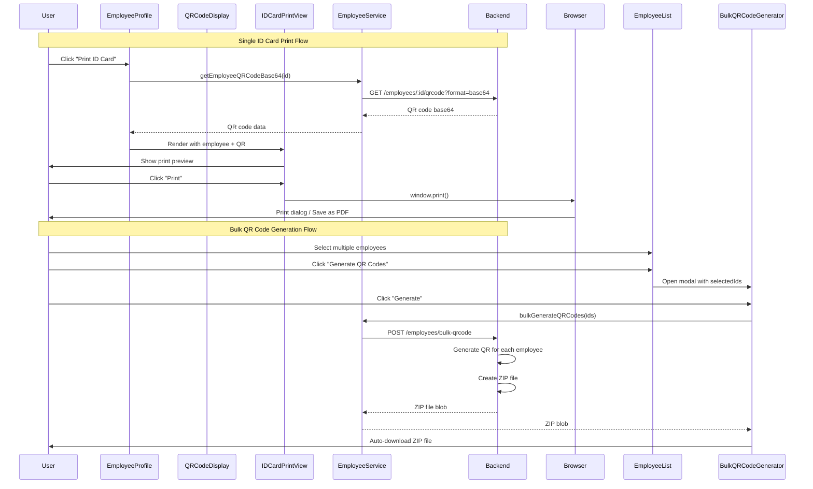

I have created the following plan after thorough exploration and analysis of the codebase. Follow the below plan verbatim. Trust the files and references. Do not re-verify what's written in the plan. Explore only when absolutely necessary. First implement all the proposed file changes and then I'll review all the changes together at the end.

## Observasi Kode

Sistem QR code generation sudah terimplementasi dengan baik di backend menggunakan library `qrcode`, dengan endpoint `GET /api/hr/employees/:id/qrcode` yang mendukung format image (PNG) dan base64. Frontend sudah memiliki komponen `QRCodeDisplay` yang menampilkan QR code dengan fungsi download untuk single employee. Employee profile sudah terstruktur dengan baik dengan data lengkap (foto, NIK, nama, divisi, department, posisi jabatan) yang siap digunakan untuk ID card. Belum ada implementasi print layout, bulk QR generation, atau PDF export untuk ID card.

## Pendekatan Implementasi

Implementasi akan fokus pada pembuatan ID card print layout menggunakan CSS `@media print` untuk browser-native printing, bulk QR code generation untuk multiple employees, dan komponen print preview. Pendekatan ini dipilih karena lebih ringan (tidak memerlukan library PDF tambahan), memanfaatkan QR code API yang sudah ada, dan memberikan fleksibilitas untuk print langsung dari browser atau save as PDF. Untuk bulk generation, akan dibuat endpoint baru yang mengembalikan ZIP file berisi QR code images untuk multiple employees.

## Instruksi Implementasi

### 1. Backend - Bulk QR Code Generation API

**File: `file:backend/src/controllers/employee.controller.ts`**

Tambahkan controller function baru untuk bulk QR code generation:

```typescript
/**
 * POST /api/hr/employees/bulk-qrcode
 * Generate QR codes for multiple employees
 * Request body: { employeeIds: string[] }
 * Returns: ZIP file containing QR code images
 */
export async function bulkGenerateQRCodes(req, res, next)
```

- Validasi array `employeeIds` dari request body
- Loop through employee IDs, fetch employee data untuk mendapatkan NIK
- Generate QR code untuk setiap NIK menggunakan `employeeService.generateQRCodeBuffer`
- Gunakan library `archiver` atau `jszip` untuk create ZIP file (perlu install: `npm install archiver @types/archiver`)
- Add setiap QR code image ke ZIP dengan naming: `qrcode-{NIK}.png`
- Set response headers: `Content-Type: application/zip`, `Content-Disposition: attachment; filename="qrcodes-{timestamp}.zip"`
- Stream ZIP file ke response

**File: `file:backend/src/routes/employee.routes.ts`**

Tambahkan route untuk bulk QR code generation:

```typescript
router.post('/bulk-qrcode', bulkGenerateQRCodes);
```

**File: `file:backend/package.json`**

Install dependency untuk ZIP file creation:

```bash
npm install archiver
npm install --save-dev @types/archiver
```

### 2. Backend - ID Card PDF Export API (Optional Enhancement)

**File: `file:backend/src/controllers/employee.controller.ts`**

Implementasi controller untuk PDF export yang sudah ada placeholder-nya:

```typescript
/**
 * GET /api/hr/employees/:id/export-pdf
 * Export employee ID card as PDF
 */
export async function exportEmployeeIDCardPDF(req, res, next)
```

- Install library `puppeteer` atau `pdfkit` (pilih salah satu)
- Jika menggunakan `puppeteer`: render HTML template ID card, convert to PDF
- Jika menggunakan `pdfkit`: programmatically create PDF dengan employee data dan QR code
- Include employee photo, NIK, nama, divisi, department, posisi jabatan, QR code
- Set response headers untuk PDF download
- Return PDF buffer

**File: `file:backend/src/routes/employee.routes.ts`**

Tambahkan route (jika belum ada):

```typescript
router.get('/:id/export-pdf', exportEmployeeIDCardPDF);
```

### 3. Frontend - ID Card Print Component

**File: `file:frontend/src/components/employee/EmployeeIDCard.tsx`** (NEW)

Buat komponen baru untuk ID card layout:

```typescript
interface EmployeeIDCardProps {
  employee: Employee;
  qrCodeDataUrl: string;
  showBothSides?: boolean; // true untuk print front & back
}
```

**Layout ID Card (Front Side):**
- Container dengan ukuran standar ID card (85.6mm x 53.98mm atau 3.375" x 2.125")
- Header: Logo perusahaan (jika ada) dan nama perusahaan
- Photo section: Employee photo (kiri atas)
- Info section (kanan photo):
  - Nama lengkap (bold, larger font)
  - NIK (dengan label)
  - Divisi
  - Department
  - Posisi Jabatan
- QR code section (kanan bawah, size 80x80px)
- Footer: Tanggal berlaku (jika ada)

**Layout ID Card (Back Side - Optional):**
- Emergency contact information
- Company address
- Barcode atau informasi tambahan

**Styling:**
- Gunakan Tailwind CSS untuk layout
- Border dan shadow untuk visual card
- Typography yang jelas dan readable
- Background gradient atau solid color sesuai brand

**File: `file:frontend/src/components/employee/EmployeeIDCardPrintView.tsx`** (NEW)

Buat komponen wrapper untuk print view:

```typescript
interface EmployeeIDCardPrintViewProps {
  employee: Employee;
  onClose: () => void;
}
```

- Fetch QR code base64 dari API saat component mount
- Render `EmployeeIDCard` component
- Tambahkan print button yang trigger `window.print()`
- Tambahkan close button untuk keluar dari print preview
- Hide print/close buttons saat printing menggunakan CSS `@media print`

### 4. Frontend - Print Stylesheet

**File: `file:frontend/src/styles/print.css`** (NEW)

Buat stylesheet khusus untuk printing:

```css
@media print {
  /* Hide semua elemen kecuali ID card */
  body * {
    visibility: hidden;
  }
  
  .printable-id-card, .printable-id-card * {
    visibility: visible;
  }
  
  .printable-id-card {
    position: absolute;
    left: 0;
    top: 0;
  }
  
  /* Hide navigation, buttons, headers */
  .no-print {
    display: none !important;
  }
  
  /* ID card sizing untuk print */
  .id-card-container {
    width: 85.6mm;
    height: 53.98mm;
    page-break-after: always;
  }
  
  /* Remove shadows dan effects untuk print */
  .id-card-container {
    box-shadow: none !important;
    border: 1px solid #000;
  }
}
```

Import di `file:frontend/src/main.tsx` atau `file:frontend/src/index.css`:

```typescript
import './styles/print.css';
```

### 5. Frontend - Bulk QR Code Generation UI

**File: `file:frontend/src/components/employee/BulkQRCodeGenerator.tsx`** (NEW)

Buat komponen untuk bulk QR code generation:

```typescript
interface BulkQRCodeGeneratorProps {
  selectedEmployeeIds: string[];
  onClose: () => void;
}
```

- Display jumlah employees yang dipilih
- Button "Generate QR Codes" yang trigger API call
- Loading state dengan progress indicator
- Success state dengan download link
- Error handling dan display error message
- Call API `POST /api/hr/employees/bulk-qrcode` dengan array employee IDs
- Download ZIP file hasil generation

**File: `file:frontend/src/services/employee.service.ts`**

Tambahkan service method untuk bulk QR code generation:

```typescript
export const bulkGenerateQRCodes = async (employeeIds: string[]): Promise<Blob> => {
  const response = await api.post(`${BASE_URL}/bulk-qrcode`, 
    { employeeIds },
    { responseType: 'blob' }
  );
  return response.data;
};
```

Update export object `employeeService` untuk include method baru.

### 6. Frontend - Integration dengan Employee List

**File: `file:frontend/src/pages/hr/employees/EmployeeList.tsx`**

Tambahkan fitur untuk bulk QR code generation:

- Tambahkan checkbox selection untuk multiple employees
- State untuk track selected employee IDs: `const [selectedIds, setSelectedIds] = useState<string[]>([])`
- Bulk action button "Generate QR Codes" yang muncul ketika ada employees terpilih
- Modal/dialog untuk `BulkQRCodeGenerator` component
- Handle download ZIP file dari API response

### 7. Frontend - Integration dengan Employee Profile

**File: `file:frontend/src/pages/hr/employees/EmployeeProfile.tsx`**

Tambahkan fitur print ID card:

- State untuk print preview: `const [showPrintPreview, setShowPrintPreview] = useState(false)`
- Button "Print ID Card" di header atau sidebar
- Conditional render `EmployeeIDCardPrintView` component ketika `showPrintPreview === true`
- Pass employee data dan handle close callback

**File: `file:frontend/src/components/employee/EmployeeProfileHeader.tsx`**

Tambahkan button "Print ID Card" di action buttons section:

```typescript
<button onClick={onPrintIDCard} className="...">
  <span className="material-symbols-rounded">print</span>
  Print ID Card
</button>
```

Tambahkan prop `onPrintIDCard?: () => void` ke interface `EmployeeProfileHeaderProps`.

### 8. Frontend - QR Code Display Enhancement

**File: `file:frontend/src/components/employee/QRCodeDisplay.tsx`**

Tambahkan button untuk print ID card:

```typescript
<button onClick={onPrintIDCard} className="...">
  <span className="material-symbols-rounded">print</span>
  Print ID Card
</button>
```

Tambahkan prop `onPrintIDCard?: () => void` ke interface `QRCodeDisplayProps`.

### 9. Testing & Validation

**Backend Testing:**
- Test single QR code generation endpoint dengan format image dan base64
- Test bulk QR code generation dengan berbagai jumlah employees (1, 10, 50, 100)
- Validate ZIP file structure dan content
- Test error handling untuk invalid employee IDs
- Test PDF export endpoint (jika diimplementasi)

**Frontend Testing:**
- Test print preview display dengan berbagai ukuran browser
- Test actual printing ke PDF (browser Save as PDF)
- Test QR code readability setelah print
- Test bulk QR code generation UI flow
- Test download ZIP file dan extract contents
- Test responsive layout untuk ID card preview
- Cross-browser testing (Chrome, Firefox, Edge)

**Print Quality Testing:**
- Print ID card ke physical printer, verify readability
- Scan QR code dari printed ID card, verify NIK data
- Check photo quality dan text clarity
- Verify ID card dimensions (85.6mm x 53.98mm)

### 10. Documentation

**File: `file:backend/README.md`** atau API documentation

Dokumentasikan endpoints baru:
- `POST /api/hr/employees/bulk-qrcode` - Bulk QR code generation
- `GET /api/hr/employees/:id/export-pdf` - Export ID card as PDF (jika diimplementasi)

Include request/response examples, error codes, dan usage notes.

**File: `file:frontend/README.md`** atau user guide

Dokumentasikan fitur baru:
- Cara print ID card untuk single employee
- Cara generate bulk QR codes untuk multiple employees
- Cara download dan extract QR code ZIP file
- Browser compatibility notes
- Print settings recommendations (paper size, orientation, margins)

## Diagram Alur Implementasi



## Struktur File Baru

```
backend/
├── src/
│   ├── controllers/
│   │   └── employee.controller.ts (UPDATE - add bulkGenerateQRCodes, exportEmployeeIDCardPDF)
│   └── routes/
│       └── employee.routes.ts (UPDATE - add bulk-qrcode route)

frontend/
├── src/
│   ├── components/
│   │   └── employee/
│   │       ├── EmployeeIDCard.tsx (NEW)
│   │       ├── EmployeeIDCardPrintView.tsx (NEW)
│   │       ├── BulkQRCodeGenerator.tsx (NEW)
│   │       ├── QRCodeDisplay.tsx (UPDATE - add print button)
│   │       └── EmployeeProfileHeader.tsx (UPDATE - add print button)
│   ├── pages/
│   │   └── hr/
│   │       └── employees/
│   │           ├── EmployeeProfile.tsx (UPDATE - add print preview state)
│   │           └── EmployeeList.tsx (UPDATE - add bulk QR generation)
│   ├── services/
│   │   └── employee.service.ts (UPDATE - add bulkGenerateQRCodes)
│   └── styles/
│       └── print.css (NEW)
```

## Catatan Penting

1. **ID Card Design**: Sesuaikan layout ID card dengan brand guidelines perusahaan (warna, logo, typography)
2. **QR Code Size**: Pastikan QR code size minimal 80x80px untuk readability saat di-print
3. **Print Settings**: Recommend users untuk set margins ke "None" atau "Minimum" saat print
4. **Paper Size**: ID card standard size adalah 85.6mm x 53.98mm (CR80), tapi untuk print preview bisa gunakan A4 dengan multiple cards per page
5. **Browser Compatibility**: `window.print()` dan `@media print` supported di semua modern browsers
6. **ZIP File Size**: Untuk bulk generation dengan banyak employees, consider implementing pagination atau limit maksimal (e.g., 100 employees per request)
7. **Security**: Validate employee IDs di backend untuk prevent unauthorized access
8. **Performance**: QR code generation cukup cepat, tapi untuk bulk generation 100+ employees, consider implementing queue system atau background job