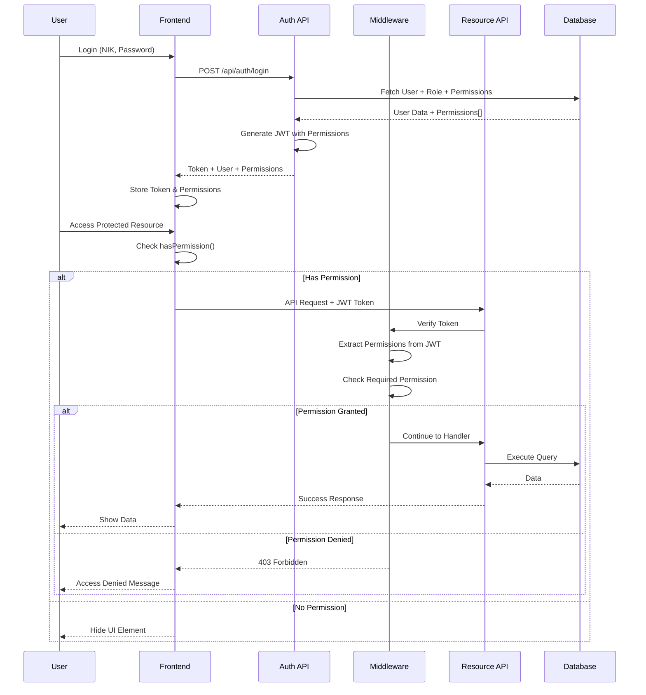

I have created the following plan after thorough exploration and analysis of the codebase. Follow the below plan verbatim. Trust the files and references. Do not re-verify what's written in the plan. Explore only when absolutely necessary. First implement all the proposed file changes and then I'll review all the changes together at the end.

## Observasi Kode

Sistem saat ini menggunakan autentikasi JWT dengan Role enum sederhana (ADMIN, USER, HR_MANAGER, VIEWER) di Prisma schema. Middleware `authorize` sudah tersedia di `file:backend/src/middleware/auth.middleware.ts` namun belum diterapkan pada endpoint HR. Frontend hanya memiliki `ProtectedRoute` untuk autentikasi dasar tanpa pengecekan role/permission. Struktur backend menggunakan pola routes → controllers → services dengan Prisma ORM.

## Pendekatan

Implementasi RBAC akan menggunakan pendekatan hybrid role-permission dengan memperluas Role enum yang ada dan menambahkan tabel Permission dan RolePermission untuk granular access control. Middleware `authorize` yang sudah ada akan digunakan untuk role-based checks, sementara middleware baru `checkPermission` akan dibuat untuk permission-based checks. Frontend akan diperluas dengan permission context dan komponen untuk conditional rendering berdasarkan role/permission.

## Implementasi

### 1. Database Schema - Roles & Permissions

**File: `file:backend/prisma/schema.prisma`**

Tambahkan model baru setelah model User (sekitar line 30):

```prisma
// Permission model untuk granular access control
model Permission {
  id          String   @id @default(uuid())
  name        String   @unique // e.g., "employee.create", "employee.read"
  description String?
  module      String   // e.g., "HR", "INVENTORY"
  createdAt   DateTime @default(now())
  updatedAt   DateTime @updatedAt

  // Relations
  rolePermissions RolePermission[]

  @@map("permissions")
}

// Role-Permission mapping (many-to-many)
model RolePermission {
  id           String   @id @default(uuid())
  roleId       String
  permissionId String
  createdAt    DateTime @default(now())

  // Relations
  role       Role       @relation(fields: [roleId], references: [id])
  permission Permission @relation(fields: [permissionId], references: [id])

  @@unique([roleId, permissionId])
  @@map("role_permissions")
}

// Role model untuk RBAC
model Role {
  id          String   @id @default(uuid())
  name        String   @unique // e.g., "Admin", "HR Manager"
  code        String   @unique // e.g., "ADMIN", "HR_MANAGER"
  description String?
  isActive    Boolean  @default(true)
  createdAt   DateTime @default(now())
  updatedAt   DateTime @updatedAt

  // Relations
  users           User[]
  rolePermissions RolePermission[]

  @@map("roles")
}
```

Update model User (sekitar line 14-29):

```prisma
model User {
  id        String   @id @default(uuid())
  nik       String   @unique
  email     String?  @unique
  password  String
  fullName  String
  roleId    String?  // FK ke Role table
  isActive  Boolean  @default(true)
  createdAt DateTime @default(now())
  updatedAt DateTime @updatedAt

  // Relations
  role               Role?       @relation(fields: [roleId], references: [id])
  managedDepartments Department[]

  @@map("users")
}
```

Hapus enum Role yang lama (line 31-36) karena sudah diganti dengan tabel Role.

**File: `file:backend/prisma/migrations/[timestamp]_add_rbac_schema/migration.sql`**

Buat migration baru dengan perintah:
```bash
npx prisma migrate dev --name add_rbac_schema
```

### 2. Seed Data - Default Roles & Permissions

**File: `file:backend/prisma/seed.ts`**

Tambahkan setelah seeding users (sekitar line 72), sebelum HR Master Data seeding:

```typescript
// ==========================================
// RBAC SEEDING - Roles & Permissions
// ==========================================

console.log('');
console.log('🔐 Seeding RBAC Data...');

// Seed Roles
const rolesData = [
  { id: randomUUID(), name: 'Administrator', code: 'ADMIN', description: 'Full system access' },
  { id: randomUUID(), name: 'HR Manager', code: 'HR_MANAGER', description: 'Manage HR module with full access' },
  { id: randomUUID(), name: 'HR Staff', code: 'HR_STAFF', description: 'HR operations with limited access' },
  { id: randomUUID(), name: 'Employee', code: 'EMPLOYEE', description: 'Basic employee access' },
];

const createdRoles: Record<string, any> = {};

for (const role of rolesData) {
  const existing = await prisma.role.findFirst({ where: { code: role.code } });
  if (!existing) {
    createdRoles[role.code] = await prisma.role.create({ data: role });
  } else {
    createdRoles[role.code] = existing;
  }
}
console.log('  ✅ Roles: 4 records');

// Seed Permissions untuk HR Module
const permissionsData = [
  // Employee Management
  { name: 'employee.create', description: 'Create new employee', module: 'HR' },
  { name: 'employee.read', description: 'View employee data', module: 'HR' },
  { name: 'employee.update', description: 'Update employee data', module: 'HR' },
  { name: 'employee.delete', description: 'Delete employee', module: 'HR' },
  { name: 'employee.export', description: 'Export employee data', module: 'HR' },
  { name: 'employee.import', description: 'Import employee data', module: 'HR' },
  
  // HR Master Data
  { name: 'hr_master.create', description: 'Create HR master data', module: 'HR' },
  { name: 'hr_master.read', description: 'View HR master data', module: 'HR' },
  { name: 'hr_master.update', description: 'Update HR master data', module: 'HR' },
  { name: 'hr_master.delete', description: 'Delete HR master data', module: 'HR' },
  
  // Resignation Management
  { name: 'resignation.create', description: 'Create resignation request', module: 'HR' },
  { name: 'resignation.read', description: 'View resignation data', module: 'HR' },
  { name: 'resignation.approve', description: 'Approve/reject resignation', module: 'HR' },
  { name: 'resignation.delete', description: 'Delete resignation', module: 'HR' },
  
  // User Management
  { name: 'user.create', description: 'Create new user', module: 'SYSTEM' },
  { name: 'user.read', description: 'View user data', module: 'SYSTEM' },
  { name: 'user.update', description: 'Update user data', module: 'SYSTEM' },
  { name: 'user.delete', description: 'Delete user', module: 'SYSTEM' },
  
  // Role Management
  { name: 'role.create', description: 'Create new role', module: 'SYSTEM' },
  { name: 'role.read', description: 'View role data', module: 'SYSTEM' },
  { name: 'role.update', description: 'Update role', module: 'SYSTEM' },
  { name: 'role.delete', description: 'Delete role', module: 'SYSTEM' },
  { name: 'role.assign_permissions', description: 'Assign permissions to role', module: 'SYSTEM' },
];

const createdPermissions: Record<string, any> = {};

for (const perm of permissionsData) {
  const existing = await prisma.permission.findFirst({ where: { name: perm.name } });
  if (!existing) {
    createdPermissions[perm.name] = await prisma.permission.create({ data: { id: randomUUID(), ...perm } });
  } else {
    createdPermissions[perm.name] = existing;
  }
}
console.log('  ✅ Permissions: 23 records');

// Assign Permissions to Roles
const rolePermissionMappings = [
  // ADMIN - Full access
  { roleCode: 'ADMIN', permissions: Object.keys(createdPermissions) },
  
  // HR_MANAGER - Full HR access + limited system access
  { 
    roleCode: 'HR_MANAGER', 
    permissions: [
      'employee.create', 'employee.read', 'employee.update', 'employee.delete', 'employee.export', 'employee.import',
      'hr_master.create', 'hr_master.read', 'hr_master.update', 'hr_master.delete',
      'resignation.create', 'resignation.read', 'resignation.approve', 'resignation.delete',
      'user.read',
    ]
  },
  
  // HR_STAFF - Limited HR access
  { 
    roleCode: 'HR_STAFF', 
    permissions: [
      'employee.create', 'employee.read', 'employee.update', 'employee.export',
      'hr_master.read',
      'resignation.create', 'resignation.read',
    ]
  },
  
  // EMPLOYEE - View only
  { 
    roleCode: 'EMPLOYEE', 
    permissions: [
      'employee.read',
      'hr_master.read',
      'resignation.create', 'resignation.read',
    ]
  },
];

for (const mapping of rolePermissionMappings) {
  const role = createdRoles[mapping.roleCode];
  if (!role) continue;
  
  for (const permName of mapping.permissions) {
    const permission = createdPermissions[permName];
    if (!permission) continue;
    
    const existing = await prisma.rolePermission.findFirst({
      where: { roleId: role.id, permissionId: permission.id }
    });
    
    if (!existing) {
      await prisma.rolePermission.create({
        data: {
          id: randomUUID(),
          roleId: role.id,
          permissionId: permission.id,
        }
      });
    }
  }
}
console.log('  ✅ Role-Permission Mappings: Created');

// Update existing users dengan roleId
const adminRole = createdRoles['ADMIN'];
const employeeRole = createdRoles['EMPLOYEE'];

await prisma.user.update({
  where: { nik: DEV_CREDENTIALS.admin.nik },
  data: { roleId: adminRole.id }
});

await prisma.user.update({
  where: { nik: DEV_CREDENTIALS.user.nik },
  data: { roleId: employeeRole.id }
});

console.log('  ✅ Users updated with roles');
```

### 3. Backend Types - Update Auth Types

**File: `file:backend/src/types/auth.ts`**

Update interface JwtPayload (line 37-43):

```typescript
export interface JwtPayload {
    userId: string;
    nik: string;
    roleId: string;
    roleCode: string;
    permissions: string[]; // Array of permission names
    iat?: number;
    exp?: number;
}
```

Update interface SafeUser (line 15-24):

```typescript
export interface SafeUser {
    id: string;
    nik: string;
    email: string | null;
    fullName: string;
    roleId: string | null;
    role: {
        id: string;
        name: string;
        code: string;
        description: string | null;
    } | null;
    isActive: boolean;
    createdAt: Date;
    updatedAt: Date;
}
```

### 4. Backend Middleware - Permission Checking

**File: `file:backend/src/middleware/auth.middleware.ts`**

Update imports (line 1-6):

```typescript
import { Response, NextFunction } from 'express';
import { prisma } from '../config/database';
import { verifyToken } from '../utils/jwt';
import { ApiError } from './errorHandler';
import { AuthenticatedRequest } from '../types/auth';
```

Hapus fungsi `authorize` yang lama (line 108-122) dan ganti dengan yang baru:

```typescript
/**
 * Authorization middleware factory - Role-based
 * Checks if user has one of the allowed role codes
 */
export function authorizeRoles(...allowedRoleCodes: string[]) {
    return (req: AuthenticatedRequest, res: Response, next: NextFunction): void => {
        if (!req.user) {
            next(new ApiError('User tidak terautentikasi', 401));
            return;
        }

        if (!allowedRoleCodes.includes(req.user.roleCode)) {
            next(new ApiError('Akses ditolak. Anda tidak memiliki role yang sesuai.', 403));
            return;
        }

        next();
    };
}

/**
 * Authorization middleware factory - Permission-based
 * Checks if user has ALL required permissions
 */
export function requirePermissions(...requiredPermissions: string[]) {
    return (req: AuthenticatedRequest, res: Response, next: NextFunction): void => {
        if (!req.user) {
            next(new ApiError('User tidak terautentikasi', 401));
            return;
        }

        const userPermissions = req.user.permissions || [];
        
        // Check if user has all required permissions
        const hasAllPermissions = requiredPermissions.every(perm => 
            userPermissions.includes(perm)
        );

        if (!hasAllPermissions) {
            next(new ApiError('Akses ditolak. Anda tidak memiliki izin yang diperlukan.', 403));
            return;
        }

        next();
    };
}

/**
 * Authorization middleware factory - Permission-based (ANY)
 * Checks if user has ANY of the required permissions
 */
export function requireAnyPermission(...requiredPermissions: string[]) {
    return (req: AuthenticatedRequest, res: Response, next: NextFunction): void => {
        if (!req.user) {
            next(new ApiError('User tidak terautentikasi', 401));
            return;
        }

        const userPermissions = req.user.permissions || [];
        
        // Check if user has at least one required permission
        const hasAnyPermission = requiredPermissions.some(perm => 
            userPermissions.includes(perm)
        );

        if (!hasAnyPermission) {
            next(new ApiError('Akses ditolak. Anda tidak memiliki izin yang diperlukan.', 403));
            return;
        }

        next();
    };
}
```

### 5. Backend Utils - Update JWT Generation

**File: `file:backend/src/utils/jwt.ts`**

Update fungsi `generateToken` untuk include permissions (line 10-14):

```typescript
/**
 * Generate a JWT token for the given payload
 * Note: Payload should include permissions array
 */
export function generateToken(payload: Omit<JwtPayload, 'iat' | 'exp'>): string {
    return jwt.sign(payload, JWT_SECRET, {
        expiresIn: JWT_EXPIRES_IN,
    } as jwt.SignOptions);
}
```

### 6. Backend Controller - Update Auth Controller

**File: `file:backend/src/controllers/auth.controller.ts`**

Update fungsi login untuk fetch role dan permissions (cari bagian yang generate token):

```typescript
// Fetch user dengan role dan permissions
const user = await prisma.user.findUnique({
    where: { nik },
    include: {
        role: {
            include: {
                rolePermissions: {
                    include: {
                        permission: true
                    }
                }
            }
        }
    }
});

// ... validasi password ...

// Extract permissions dari role
const permissions = user.role?.rolePermissions.map(rp => rp.permission.name) || [];

// Generate JWT token dengan permissions
const token = generateToken({
    userId: user.id,
    nik: user.nik,
    roleId: user.roleId || '',
    roleCode: user.role?.code || 'EMPLOYEE',
    permissions,
});

// Return user tanpa password
const { password: _, ...safeUser } = user;
```

Tambahkan endpoint baru untuk get current user permissions:

```typescript
export async function getPermissions(req: AuthenticatedRequest, res: Response, next: NextFunction): Promise<void> {
    try {
        if (!req.user) {
            throw new ApiError('User tidak terautentikasi', 401);
        }

        res.json({
            success: true,
            data: {
                permissions: req.user.permissions,
                roleCode: req.user.roleCode,
            }
        });
    } catch (error) {
        next(error);
    }
}
```

### 7. Backend Routes - Role Management API

**File: `file:backend/src/routes/role.routes.ts`** (buat baru)

```typescript
import { Router } from 'express';
import { authenticate, authorizeRoles, requirePermissions } from '../middleware/auth.middleware';
import {
    getAllRoles,
    getRoleById,
    createRole,
    updateRole,
    deleteRole,
    assignPermissionsToRole,
    getRolePermissions,
} from '../controllers/role.controller';

const router = Router();

// All routes require authentication
router.use(authenticate);

// Get all roles (requires role.read permission)
router.get('/', requirePermissions('role.read'), getAllRoles);

// Get role by ID
router.get('/:id', requirePermissions('role.read'), getRoleById);

// Get role permissions
router.get('/:id/permissions', requirePermissions('role.read'), getRolePermissions);

// Create new role (Admin only)
router.post('/', requirePermissions('role.create'), createRole);

// Update role
router.put('/:id', requirePermissions('role.update'), updateRole);

// Delete role
router.delete('/:id', requirePermissions('role.delete'), deleteRole);

// Assign permissions to role
router.post('/:id/permissions', requirePermissions('role.assign_permissions'), assignPermissionsToRole);

export default router;
```

### 8. Backend Controller - Role Management

**File: `file:backend/src/controllers/role.controller.ts`** (buat baru)

```typescript
import { Response, NextFunction } from 'express';
import { AuthenticatedRequest } from '../types/auth';
import { ApiError } from '../middleware/errorHandler';
import { prisma } from '../config/database';

export async function getAllRoles(req: AuthenticatedRequest, res: Response, next: NextFunction): Promise<void> {
    try {
        const roles = await prisma.role.findMany({
            include: {
                _count: {
                    select: { users: true, rolePermissions: true }
                }
            },
            orderBy: { name: 'asc' }
        });

        res.json({
            success: true,
            data: roles
        });
    } catch (error) {
        next(error);
    }
}

export async function getRoleById(req: AuthenticatedRequest, res: Response, next: NextFunction): Promise<void> {
    try {
        const { id } = req.params;

        const role = await prisma.role.findUnique({
            where: { id },
            include: {
                rolePermissions: {
                    include: {
                        permission: true
                    }
                },
                _count: {
                    select: { users: true }
                }
            }
        });

        if (!role) {
            throw new ApiError('Role tidak ditemukan', 404);
        }

        res.json({
            success: true,
            data: role
        });
    } catch (error) {
        next(error);
    }
}

export async function createRole(req: AuthenticatedRequest, res: Response, next: NextFunction): Promise<void> {
    try {
        const { name, code, description } = req.body;

        // Validate required fields
        if (!name || !code) {
            throw new ApiError('Nama dan kode role wajib diisi', 400);
        }

        // Check if code already exists
        const existing = await prisma.role.findUnique({ where: { code } });
        if (existing) {
            throw new ApiError('Kode role sudah digunakan', 400);
        }

        const role = await prisma.role.create({
            data: { name, code, description }
        });

        res.status(201).json({
            success: true,
            message: 'Role berhasil dibuat',
            data: role
        });
    } catch (error) {
        next(error);
    }
}

export async function updateRole(req: AuthenticatedRequest, res: Response, next: NextFunction): Promise<void> {
    try {
        const { id } = req.params;
        const { name, description, isActive } = req.body;

        const role = await prisma.role.update({
            where: { id },
            data: { name, description, isActive }
        });

        res.json({
            success: true,
            message: 'Role berhasil diupdate',
            data: role
        });
    } catch (error) {
        next(error);
    }
}

export async function deleteRole(req: AuthenticatedRequest, res: Response, next: NextFunction): Promise<void> {
    try {
        const { id } = req.params;

        // Check if role has users
        const usersCount = await prisma.user.count({ where: { roleId: id } });
        if (usersCount > 0) {
            throw new ApiError('Tidak dapat menghapus role yang masih digunakan oleh user', 400);
        }

        await prisma.role.delete({ where: { id } });

        res.json({
            success: true,
            message: 'Role berhasil dihapus'
        });
    } catch (error) {
        next(error);
    }
}

export async function getRolePermissions(req: AuthenticatedRequest, res: Response, next: NextFunction): Promise<void> {
    try {
        const { id } = req.params;

        const rolePermissions = await prisma.rolePermission.findMany({
            where: { roleId: id },
            include: { permission: true }
        });

        res.json({
            success: true,
            data: rolePermissions.map(rp => rp.permission)
        });
    } catch (error) {
        next(error);
    }
}

export async function assignPermissionsToRole(req: AuthenticatedRequest, res: Response, next: NextFunction): Promise<void> {
    try {
        const { id } = req.params;
        const { permissionIds } = req.body;

        if (!Array.isArray(permissionIds)) {
            throw new ApiError('permissionIds harus berupa array', 400);
        }

        // Delete existing permissions
        await prisma.rolePermission.deleteMany({ where: { roleId: id } });

        // Create new permissions
        const rolePermissions = permissionIds.map(permissionId => ({
            roleId: id,
            permissionId
        }));

        await prisma.rolePermission.createMany({ data: rolePermissions });

        res.json({
            success: true,
            message: 'Permissions berhasil diassign ke role'
        });
    } catch (error) {
        next(error);
    }
}
```

### 9. Backend Routes - Permission Management API

**File: `file:backend/src/routes/permission.routes.ts`** (buat baru)

```typescript
import { Router } from 'express';
import { authenticate, requirePermissions } from '../middleware/auth.middleware';
import { getAllPermissions, getPermissionsByModule } from '../controllers/permission.controller';

const router = Router();

router.use(authenticate);

// Get all permissions
router.get('/', requirePermissions('role.read'), getAllPermissions);

// Get permissions by module
router.get('/module/:module', requirePermissions('role.read'), getPermissionsByModule);

export default router;
```

### 10. Backend Controller - Permission Management

**File: `file:backend/src/controllers/permission.controller.ts`** (buat baru)

```typescript
import { Response, NextFunction } from 'express';
import { AuthenticatedRequest } from '../types/auth';
import { prisma } from '../config/database';

export async function getAllPermissions(req: AuthenticatedRequest, res: Response, next: NextFunction): Promise<void> {
    try {
        const permissions = await prisma.permission.findMany({
            orderBy: [{ module: 'asc' }, { name: 'asc' }]
        });

        res.json({
            success: true,
            data: permissions
        });
    } catch (error) {
        next(error);
    }
}

export async function getPermissionsByModule(req: AuthenticatedRequest, res: Response, next: NextFunction): Promise<void> {
    try {
        const { module } = req.params;

        const permissions = await prisma.permission.findMany({
            where: { module },
            orderBy: { name: 'asc' }
        });

        res.json({
            success: true,
            data: permissions
        });
    } catch (error) {
        next(error);
    }
}
```

### 11. Backend Routes - User Management API

**File: `file:backend/src/routes/user.routes.ts`** (buat baru)

```typescript
import { Router } from 'express';
import { authenticate, requirePermissions } from '../middleware/auth.middleware';
import {
    getAllUsers,
    getUserById,
    createUser,
    updateUser,
    deleteUser,
    assignRoleToUser,
} from '../controllers/user.controller';

const router = Router();

router.use(authenticate);

// Get all users
router.get('/', requirePermissions('user.read'), getAllUsers);

// Get user by ID
router.get('/:id', requirePermissions('user.read'), getUserById);

// Create new user
router.post('/', requirePermissions('user.create'), createUser);

// Update user
router.put('/:id', requirePermissions('user.update'), updateUser);

// Delete user
router.delete('/:id', requirePermissions('user.delete'), deleteUser);

// Assign role to user
router.post('/:id/role', requirePermissions('user.update'), assignRoleToUser);

export default router;
```

### 12. Backend Controller - User Management

**File: `file:backend/src/controllers/user.controller.ts`** (buat baru)

```typescript
import { Response, NextFunction } from 'express';
import { AuthenticatedRequest } from '../types/auth';
import { ApiError } from '../middleware/errorHandler';
import { prisma } from '../config/database';
import bcrypt from 'bcrypt';

const SALT_ROUNDS = 10;

export async function getAllUsers(req: AuthenticatedRequest, res: Response, next: NextFunction): Promise<void> {
    try {
        const { page = 1, limit = 10, search } = req.query;
        const skip = (Number(page) - 1) * Number(limit);

        const where = search ? {
            OR: [
                { nik: { contains: String(search), mode: 'insensitive' as const } },
                { fullName: { contains: String(search), mode: 'insensitive' as const } },
                { email: { contains: String(search), mode: 'insensitive' as const } },
            ]
        } : {};

        const [users, total] = await Promise.all([
            prisma.user.findMany({
                where,
                include: { role: true },
                skip,
                take: Number(limit),
                orderBy: { createdAt: 'desc' }
            }),
            prisma.user.count({ where })
        ]);

        // Remove passwords
        const safeUsers = users.map(({ password, ...user }) => user);

        res.json({
            success: true,
            data: safeUsers,
            meta: {
                page: Number(page),
                limit: Number(limit),
                total,
                totalPages: Math.ceil(total / Number(limit))
            }
        });
    } catch (error) {
        next(error);
    }
}

export async function getUserById(req: AuthenticatedRequest, res: Response, next: NextFunction): Promise<void> {
    try {
        const { id } = req.params;

        const user = await prisma.user.findUnique({
            where: { id },
            include: { role: true }
        });

        if (!user) {
            throw new ApiError('User tidak ditemukan', 404);
        }

        const { password, ...safeUser } = user;

        res.json({
            success: true,
            data: safeUser
        });
    } catch (error) {
        next(error);
    }
}

export async function createUser(req: AuthenticatedRequest, res: Response, next: NextFunction): Promise<void> {
    try {
        const { nik, email, password, fullName, roleId } = req.body;

        if (!nik || !password || !fullName) {
            throw new ApiError('NIK, password, dan nama lengkap wajib diisi', 400);
        }

        // Check if NIK already exists
        const existing = await prisma.user.findUnique({ where: { nik } });
        if (existing) {
            throw new ApiError('NIK sudah terdaftar', 400);
        }

        // Hash password
        const hashedPassword = await bcrypt.hash(password, SALT_ROUNDS);

        const user = await prisma.user.create({
            data: {
                nik,
                email,
                password: hashedPassword,
                fullName,
                roleId
            },
            include: { role: true }
        });

        const { password: _, ...safeUser } = user;

        res.status(201).json({
            success: true,
            message: 'User berhasil dibuat',
            data: safeUser
        });
    } catch (error) {
        next(error);
    }
}

export async function updateUser(req: AuthenticatedRequest, res: Response, next: NextFunction): Promise<void> {
    try {
        const { id } = req.params;
        const { email, fullName, isActive, roleId } = req.body;

        const user = await prisma.user.update({
            where: { id },
            data: { email, fullName, isActive, roleId },
            include: { role: true }
        });

        const { password, ...safeUser } = user;

        res.json({
            success: true,
            message: 'User berhasil diupdate',
            data: safeUser
        });
    } catch (error) {
        next(error);
    }
}

export async function deleteUser(req: AuthenticatedRequest, res: Response, next: NextFunction): Promise<void> {
    try {
        const { id } = req.params;

        // Prevent deleting own account
        if (req.user?.userId === id) {
            throw new ApiError('Tidak dapat menghapus akun sendiri', 400);
        }

        await prisma.user.delete({ where: { id } });

        res.json({
            success: true,
            message: 'User berhasil dihapus'
        });
    } catch (error) {
        next(error);
    }
}

export async function assignRoleToUser(req: AuthenticatedRequest, res: Response, next: NextFunction): Promise<void> {
    try {
        const { id } = req.params;
        const { roleId } = req.body;

        if (!roleId) {
            throw new ApiError('roleId wajib diisi', 400);
        }

        const user = await prisma.user.update({
            where: { id },
            data: { roleId },
            include: { role: true }
        });

        const { password, ...safeUser } = user;

        res.json({
            success: true,
            message: 'Role berhasil diassign ke user',
            data: safeUser
        });
    } catch (error) {
        next(error);
    }
}
```

### 13. Backend - Register New Routes

**File: `file:backend/src/index.ts`**

Tambahkan setelah auth routes (sekitar line 64):

```typescript
// RBAC routes
import roleRoutes from './routes/role.routes';
import permissionRoutes from './routes/permission.routes';
import userRoutes from './routes/user.routes';

app.use('/api/roles', roleRoutes);
app.use('/api/permissions', permissionRoutes);
app.use('/api/users', userRoutes);
```

### 14. Backend - Apply Permissions to HR Routes

**File: `file:backend/src/routes/employee.routes.ts`**

Update imports (line 7):

```typescript
import { authenticate, requirePermissions } from '../middleware/auth.middleware';
```

Hapus `router.use(authenticate)` (line 34) dan apply permission checks per route:

```typescript
// Main CRUD Routes
router.get('/', authenticate, requirePermissions('employee.read'), getAllKaryawan);
router.get('/export', authenticate, requirePermissions('employee.export'), exportKaryawan);
router.post('/bulk-delete', authenticate, requirePermissions('employee.delete'), bulkDeleteKaryawan);
router.post('/bulk-qrcode', authenticate, requirePermissions('employee.read'), bulkGenerateQRCodes);
router.get('/nik/:nik', authenticate, requirePermissions('employee.read'), getKaryawanByNIK);
router.get('/:id', authenticate, requirePermissions('employee.read'), getKaryawanById);
router.post('/', authenticate, requirePermissions('employee.create'), createKaryawan);
router.put('/:id', authenticate, requirePermissions('employee.update'), updateKaryawan);
router.delete('/:id', authenticate, requirePermissions('employee.delete'), deleteKaryawan);

// Anak Routes
router.post('/:id/anak', authenticate, requirePermissions('employee.update'), createAnakKaryawan);
router.put('/:id/anak/:anakId', authenticate, requirePermissions('employee.update'), updateAnakKaryawan);
router.delete('/:id/anak/:anakId', authenticate, requirePermissions('employee.update'), deleteAnakKaryawan);

// Saudara Kandung Routes
router.post('/:id/saudara-kandung', authenticate, requirePermissions('employee.update'), createSaudaraKandungKaryawan);
router.put('/:id/saudara-kandung/:saudaraId', authenticate, requirePermissions('employee.update'), updateSaudaraKandungKaryawan);
router.delete('/:id/saudara-kandung/:saudaraId', authenticate, requirePermissions('employee.update'), deleteSaudaraKandungKaryawan);

// File Upload Routes
router.post('/:id/photo', authenticate, requirePermissions('employee.update'), uploadEmployeePhoto.single('photo'), uploadKaryawanPhoto);
router.post('/:id/documents', authenticate, requirePermissions('employee.update'), uploadEmployeeDocument.single('document'), uploadKaryawanDocument);
router.delete('/:id/documents/:documentId', authenticate, requirePermissions('employee.update'), deleteKaryawanDocument);

// QR Code Route
router.get('/:id/qrcode', authenticate, requirePermissions('employee.read'), generateKaryawanQRCode);
```

**File: `file:backend/src/routes/hr-master.routes.ts`**

Update imports dan apply permission checks untuk semua routes (gunakan pola yang sama seperti employee routes):

```typescript
import { authenticate, requirePermissions } from '../middleware/auth.middleware';

// Contoh untuk Divisi routes:
router.get('/divisi', authenticate, requirePermissions('hr_master.read'), hrMasterController.getAllDivisi);
router.post('/divisi', authenticate, requirePermissions('hr_master.create'), validateDivisi, hrMasterController.createDivisi);
router.put('/divisi/:id', authenticate, requirePermissions('hr_master.update'), validateDivisi, hrMasterController.updateDivisi);
router.delete('/divisi/:id', authenticate, requirePermissions('hr_master.delete'), hrMasterController.deleteDivisi);

// Ulangi untuk semua master data entities (Department, PosisiJabatan, dll)
```

**File: `file:backend/src/routes/import.routes.ts`**

```typescript
import { authenticate, requirePermissions } from '../middleware/auth.middleware';

router.post('/employees', authenticate, requirePermissions('employee.import'), upload.single('file'), importEmployees);
```

**File: `file:backend/src/routes/resignation.routes.ts`**

```typescript
import { authenticate, requirePermissions, requireAnyPermission } from '../middleware/auth.middleware';

router.get('/', authenticate, requirePermissions('resignation.read'), getAllResignations);
router.post('/', authenticate, requirePermissions('resignation.create'), createResignation);
router.put('/:id/approve', authenticate, requirePermissions('resignation.approve'), approveResignation);
router.delete('/:id', authenticate, requirePermissions('resignation.delete'), deleteResignation);
```

### 15. Frontend - Update Auth Service

**File: `file:frontend/src/services/auth.service.ts`**

Update interface User:

```typescript
export interface User {
    id: string;
    nik: string;
    email: string | null;
    fullName: string;
    roleId: string | null;
    role: {
        id: string;
        name: string;
        code: string;
        description: string | null;
    } | null;
    isActive: boolean;
    createdAt: string;
    updatedAt: string;
    permissions?: string[]; // Add permissions array
}
```

Tambahkan fungsi untuk get permissions:

```typescript
export async function getPermissions(): Promise<string[]> {
    try {
        const response = await api.get('/auth/permissions');
        return response.data.data.permissions;
    } catch (error) {
        console.error('Failed to get permissions:', error);
        return [];
    }
}
```

### 16. Frontend - Update Auth Context

**File: `file:frontend/src/contexts/AuthContext.tsx`**

Update interface AuthContextType:

```typescript
interface AuthContextType {
    user: User | null;
    isAuthenticated: boolean;
    isLoading: boolean;
    permissions: string[];
    hasPermission: (permission: string) => boolean;
    hasAnyPermission: (permissions: string[]) => boolean;
    hasRole: (roleCode: string) => boolean;
    login: (nik: string, password: string) => Promise<void>;
    logout: () => void;
    checkAuthStatus: () => Promise<void>;
}
```

Update AuthProvider:

```typescript
export function AuthProvider({ children }: { children: ReactNode }) {
    const [user, setUser] = useState<User | null>(null);
    const [isAuthenticated, setIsAuthenticated] = useState(false);
    const [isLoading, setIsLoading] = useState(true);
    const [permissions, setPermissions] = useState<string[]>([]);

    // ... existing useEffect ...

    const checkAuthStatus = async () => {
        setIsLoading(true);
        try {
            if (checkAuth()) {
                try {
                    const profile = await getProfile();
                    const userPermissions = await getPermissions();
                    setUser(profile);
                    setPermissions(userPermissions);
                    setIsAuthenticated(true);
                } catch {
                    authLogout();
                    setUser(null);
                    setPermissions([]);
                    setIsAuthenticated(false);
                }
            } else {
                setUser(null);
                setPermissions([]);
                setIsAuthenticated(false);
            }
        } catch {
            setUser(null);
            setPermissions([]);
            setIsAuthenticated(false);
        } finally {
            setIsLoading(false);
        }
    };

    const login = async (nik: string, password: string) => {
        const response = await authLogin(nik, password);
        const userPermissions = await getPermissions();
        setUser(response.user);
        setPermissions(userPermissions);
        setIsAuthenticated(true);
    };

    const logout = () => {
        authLogout();
        setUser(null);
        setPermissions([]);
        setIsAuthenticated(false);
    };

    const hasPermission = (permission: string): boolean => {
        return permissions.includes(permission);
    };

    const hasAnyPermission = (perms: string[]): boolean => {
        return perms.some(p => permissions.includes(p));
    };

    const hasRole = (roleCode: string): boolean => {
        return user?.role?.code === roleCode;
    };

    return (
        <AuthContext.Provider
            value={{
                user,
                isAuthenticated,
                isLoading,
                permissions,
                hasPermission,
                hasAnyPermission,
                hasRole,
                login,
                logout,
                checkAuthStatus,
            }}
        >
            {children}
        </AuthContext.Provider>
    );
}
```

### 17. Frontend - Permission-Based Components

**File: `file:frontend/src/components/PermissionGuard.tsx`** (buat baru)

```typescript
import { ReactNode } from 'react';
import { useAuth } from '../contexts/AuthContext';

interface PermissionGuardProps {
    permission?: string;
    permissions?: string[];
    requireAll?: boolean;
    fallback?: ReactNode;
    children: ReactNode;
}

export default function PermissionGuard({
    permission,
    permissions = [],
    requireAll = true,
    fallback = null,
    children
}: PermissionGuardProps) {
    const { hasPermission, hasAnyPermission } = useAuth();

    // Single permission check
    if (permission) {
        return hasPermission(permission) ? <>{children}</> : <>{fallback}</>;
    }

    // Multiple permissions check
    if (permissions.length > 0) {
        const hasAccess = requireAll
            ? permissions.every(p => hasPermission(p))
            : hasAnyPermission(permissions);

        return hasAccess ? <>{children}</> : <>{fallback}</>;
    }

    // No permission specified, render children
    return <>{children}</>;
}
```

**File: `file:frontend/src/components/RoleGuard.tsx`** (buat baru)

```typescript
import { ReactNode } from 'react';
import { useAuth } from '../contexts/AuthContext';

interface RoleGuardProps {
    roleCode: string;
    fallback?: ReactNode;
    children: ReactNode;
}

export default function RoleGuard({ roleCode, fallback = null, children }: RoleGuardProps) {
    const { hasRole } = useAuth();

    return hasRole(roleCode) ? <>{children}</> : <>{fallback}</>;
}
```

### 18. Frontend - Update Protected Route

**File: `file:frontend/src/components/ProtectedRoute.tsx`**

Tambahkan support untuk permission checking:

```typescript
import { Navigate, useLocation } from 'react-router-dom';
import { useAuth } from '../contexts/AuthContext';

interface ProtectedRouteProps {
    children: React.ReactNode;
    permission?: string;
    permissions?: string[];
    requireAll?: boolean;
}

export default function ProtectedRoute({ 
    children, 
    permission, 
    permissions = [],
    requireAll = true 
}: ProtectedRouteProps) {
    const { isAuthenticated, isLoading, hasPermission, hasAnyPermission } = useAuth();
    const location = useLocation();

    if (isLoading) {
        return (
            <div className="min-h-screen flex items-center justify-center bg-background-light dark:bg-background-dark">
                <div className="flex flex-col items-center gap-4">
                    <div className="w-12 h-12 border-4 border-primary border-t-transparent rounded-full animate-spin"></div>
                    <p className="text-gray-600 dark:text-gray-400">Memuat...</p>
                </div>
            </div>
        );
    }

    if (!isAuthenticated) {
        return <Navigate to="/login" state={{ from: location }} replace />;
    }

    // Check permissions if specified
    if (permission && !hasPermission(permission)) {
        return <Navigate to="/unauthorized" replace />;
    }

    if (permissions.length > 0) {
        const hasAccess = requireAll
            ? permissions.every(p => hasPermission(p))
            : hasAnyPermission(permissions);

        if (!hasAccess) {
            return <Navigate to="/unauthorized" replace />;
        }
    }

    return <>{children}</>;
}
```

### 19. Frontend - Role Management UI (Basic)

**File: `file:frontend/src/pages/admin/RoleManagement.tsx`** (buat baru)

```typescript
import { useState, useEffect } from 'react';
import { useAuth } from '../../contexts/AuthContext';
import api from '../../services/api';

interface Role {
    id: string;
    name: string;
    code: string;
    description: string | null;
    isActive: boolean;
}

export default function RoleManagement() {
    const { hasPermission } = useAuth();
    const [roles, setRoles] = useState<Role[]>([]);
    const [loading, setLoading] = useState(true);

    useEffect(() => {
        fetchRoles();
    }, []);

    const fetchRoles = async () => {
        try {
            const response = await api.get('/roles');
            setRoles(response.data.data);
        } catch (error) {
            console.error('Failed to fetch roles:', error);
        } finally {
            setLoading(false);
        }
    };

    if (loading) {
        return <div>Loading...</div>;
    }

    return (
        <div className="p-6">
            <div className="flex justify-between items-center mb-6">
                <h1 className="text-2xl font-bold">Role Management</h1>
                {hasPermission('role.create') && (
                    <button className="btn btn-primary">
                        Tambah Role
                    </button>
                )}
            </div>

            <div className="bg-white dark:bg-gray-800 rounded-lg shadow">
                <table className="w-full">
                    <thead>
                        <tr className="border-b">
                            <th className="p-4 text-left">Nama</th>
                            <th className="p-4 text-left">Kode</th>
                            <th className="p-4 text-left">Deskripsi</th>
                            <th className="p-4 text-left">Status</th>
                            <th className="p-4 text-left">Aksi</th>
                        </tr>
                    </thead>
                    <tbody>
                        {roles.map(role => (
                            <tr key={role.id} className="border-b">
                                <td className="p-4">{role.name}</td>
                                <td className="p-4">{role.code}</td>
                                <td className="p-4">{role.description}</td>
                                <td className="p-4">
                                    <span className={`px-2 py-1 rounded text-sm ${role.isActive ? 'bg-green-100 text-green-800' : 'bg-red-100 text-red-800'}`}>
                                        {role.isActive ? 'Aktif' : 'Tidak Aktif'}
                                    </span>
                                </td>
                                <td className="p-4">
                                    {hasPermission('role.update') && (
                                        <button className="text-blue-600 hover:underline mr-2">
                                            Edit
                                        </button>
                                    )}
                                    {hasPermission('role.assign_permissions') && (
                                        <button className="text-green-600 hover:underline">
                                            Permissions
                                        </button>
                                    )}
                                </td>
                            </tr>
                        ))}
                    </tbody>
                </table>
            </div>
        </div>
    );
}
```

### 20. Frontend - User Management UI (Basic)

**File: `file:frontend/src/pages/admin/UserManagement.tsx`** (buat baru)

```typescript
import { useState, useEffect } from 'react';
import { useAuth } from '../../contexts/AuthContext';
import api from '../../services/api';

interface User {
    id: string;
    nik: string;
    fullName: string;
    email: string | null;
    role: {
        name: string;
        code: string;
    } | null;
    isActive: boolean;
}

export default function UserManagement() {
    const { hasPermission } = useAuth();
    const [users, setUsers] = useState<User[]>([]);
    const [loading, setLoading] = useState(true);

    useEffect(() => {
        fetchUsers();
    }, []);

    const fetchUsers = async () => {
        try {
            const response = await api.get('/users');
            setUsers(response.data.data);
        } catch (error) {
            console.error('Failed to fetch users:', error);
        } finally {
            setLoading(false);
        }
    };

    if (loading) {
        return <div>Loading...</div>;
    }

    return (
        <div className="p-6">
            <div className="flex justify-between items-center mb-6">
                <h1 className="text-2xl font-bold">User Management</h1>
                {hasPermission('user.create') && (
                    <button className="btn btn-primary">
                        Tambah User
                    </button>
                )}
            </div>

            <div className="bg-white dark:bg-gray-800 rounded-lg shadow">
                <table className="w-full">
                    <thead>
                        <tr className="border-b">
                            <th className="p-4 text-left">NIK</th>
                            <th className="p-4 text-left">Nama</th>
                            <th className="p-4 text-left">Email</th>
                            <th className="p-4 text-left">Role</th>
                            <th className="p-4 text-left">Status</th>
                            <th className="p-4 text-left">Aksi</th>
                        </tr>
                    </thead>
                    <tbody>
                        {users.map(user => (
                            <tr key={user.id} className="border-b">
                                <td className="p-4">{user.nik}</td>
                                <td className="p-4">{user.fullName}</td>
                                <td className="p-4">{user.email || '-'}</td>
                                <td className="p-4">{user.role?.name || '-'}</td>
                                <td className="p-4">
                                    <span className={`px-2 py-1 rounded text-sm ${user.isActive ? 'bg-green-100 text-green-800' : 'bg-red-100 text-red-800'}`}>
                                        {user.isActive ? 'Aktif' : 'Tidak Aktif'}
                                    </span>
                                </td>
                                <td className="p-4">
                                    {hasPermission('user.update') && (
                                        <button className="text-blue-600 hover:underline mr-2">
                                            Edit
                                        </button>
                                    )}
                                    {hasPermission('user.delete') && (
                                        <button className="text-red-600 hover:underline">
                                            Hapus
                                        </button>
                                    )}
                                </td>
                            </tr>
                        ))}
                    </tbody>
                </table>
            </div>
        </div>
    );
}
```

### 21. Frontend - Update Routes

**File: `file:frontend/src/App.tsx`**

Tambahkan routes untuk role dan user management:

```typescript
import RoleManagement from './pages/admin/RoleManagement';
import UserManagement from './pages/admin/UserManagement';
import PermissionGuard from './components/PermissionGuard';

// Dalam routing:
<Route 
    path="/admin/roles" 
    element={
        <ProtectedRoute permission="role.read">
            <RoleManagement />
        </ProtectedRoute>
    } 
/>
<Route 
    path="/admin/users" 
    element={
        <ProtectedRoute permission="user.read">
            <UserManagement />
        </ProtectedRoute>
    } 
/>
```

### 22. Frontend - Update Employee List dengan Permission Guards

**File: `file:frontend/src/pages/hr/EmployeeList.tsx`**

Wrap action buttons dengan PermissionGuard:

```typescript
import PermissionGuard from '../../components/PermissionGuard';

// Dalam component:
<PermissionGuard permission="employee.create">
    <button onClick={handleCreate}>Tambah Karyawan</button>
</PermissionGuard>

<PermissionGuard permission="employee.delete">
    <button onClick={handleBulkDelete}>Hapus Terpilih</button>
</PermissionGuard>

<PermissionGuard permission="employee.export">
    <button onClick={handleExport}>Export</button>
</PermissionGuard>

<PermissionGuard permission="employee.import">
    <button onClick={handleImport}>Import</button>
</PermissionGuard>
```

### 23. Frontend - Update Navigation dengan Permission Guards

**File: `file:frontend/src/components/Sidebar.tsx`** (atau navigation component)

```typescript
import PermissionGuard from './PermissionGuard';
import RoleGuard from './RoleGuard';

// Dalam navigation menu:
<PermissionGuard permission="employee.read">
    <NavLink to="/hr/employees">Karyawan</NavLink>
</PermissionGuard>

<PermissionGuard permission="hr_master.read">
    <NavLink to="/hr/master">Master Data</NavLink>
</PermissionGuard>

<RoleGuard roleCode="ADMIN">
    <NavLink to="/admin/users">User Management</NavLink>
    <NavLink to="/admin/roles">Role Management</NavLink>
</RoleGuard>
```

### 24. Testing & Verification

Setelah implementasi selesai, lakukan testing:

1. **Database Migration**: Jalankan `npx prisma migrate dev` dan `npx prisma db seed`
2. **Backend Testing**: Test semua endpoint dengan berbagai role (ADMIN, HR_MANAGER, HR_STAFF, EMPLOYEE)
3. **Frontend Testing**: Login dengan user berbeda dan verifikasi UI elements muncul/hilang sesuai permissions
4. **Permission Testing**: Coba akses endpoint tanpa permission yang sesuai, harus return 403
5. **Role Assignment**: Test assign role ke user dan verifikasi permissions berubah

### Diagram Alur RBAC

