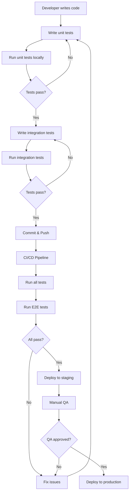

I have created the following plan after thorough exploration and analysis of the codebase. Follow the below plan verbatim. Trust the files and references. Do not re-verify what's written in the plan. Explore only when absolutely necessary. First implement all the proposed file changes and then I'll review all the changes together at the end.

# Implementation Plan: Comprehensive Testing & Documentation untuk HR Module

## 📋 Observasi Kode

Sistem sudah memiliki foundation testing yang baik dengan Jest dan beberapa unit/integration tests untuk backend. Swagger documentation sudah dikonfigurasi dengan baik. Namun, masih ada gap signifikan: tidak ada E2E testing, frontend belum memiliki testing framework, logging masih menggunakan console.log/error yang tersebar, dan belum ada user documentation dalam Bahasa Indonesia. Coverage threshold sudah diset 70% namun belum semua endpoint ter-cover.

## 🎯 Pendekatan

Pendekatan bertahap dimulai dari melengkapi backend testing (unit + integration tests untuk semua endpoints), kemudian setup E2E testing dengan Playwright untuk critical user flows, setup frontend testing dengan Vitest + React Testing Library, implementasi structured logging dengan Winston, dan terakhir membuat comprehensive documentation dalam Bahasa Indonesia. Fokus pada quality assurance dan maintainability untuk production readiness.

---

## 📝 Implementation Steps

### 1. Backend Testing - Complete Unit & Integration Tests

**Tujuan:** Mencapai 70%+ coverage untuk semua API endpoints

#### 1.1 Lengkapi Unit Tests untuk Controllers yang Belum Ter-cover

Buat unit tests untuk controllers yang belum memiliki test coverage:
- `file:backend/src/controllers/auth.controller.ts` - Login, logout, profile
- `file:backend/src/controllers/import.controller.ts` - Upload preview, confirm import, download template
- `file:backend/src/controllers/resignation.controller.ts` - CRUD resignation
- `file:backend/src/controllers/role.controller.ts` - Role management
- `file:backend/src/controllers/user.controller.ts` - User management
- `file:backend/src/controllers/permission.controller.ts` - Permission management

Lokasi: `file:backend/src/__tests__/controllers/`

Pattern yang sudah ada di `file:backend/src/__tests__/controllers/hr-master.controller.test.ts`:
- Mock services dengan `jest.mock()`
- Test happy path dan error cases
- Verify response status dan structure
- Test validation errors

#### 1.2 Lengkapi Integration Tests untuk Routes

Buat integration tests untuk routes yang belum ter-cover:
- `file:backend/src/routes/auth.routes.ts`
- `file:backend/src/routes/import.routes.ts`
- `file:backend/src/routes/resignation.routes.ts`
- `file:backend/src/routes/role.routes.ts`
- `file:backend/src/routes/user.routes.ts`
- `file:backend/src/routes/permission.routes.ts`

Lokasi: `file:backend/src/__tests__/routes/`

Pattern dari `file:backend/src/__tests__/routes/employee.routes.test.ts`:
- Gunakan supertest untuk HTTP testing
- Mock authentication middleware
- Test semua HTTP methods (GET, POST, PUT, DELETE)
- Test query parameters dan request body validation
- Test file upload endpoints

#### 1.3 Service Layer Tests

Buat unit tests untuk service layer:
- `file:backend/src/services/hr-master.service.ts`
- `file:backend/src/services/employee.service.ts`
- `file:backend/src/services/import.service.ts`
- `file:backend/src/services/resignation.service.ts`

Lokasi: `file:backend/src/__tests__/services/`

Mock Prisma client menggunakan `file:backend/src/__mocks__/prisma.ts` yang sudah ada.

#### 1.4 Utility & Middleware Tests

Test utilities dan middleware:
- `file:backend/src/utils/excel-parser.ts` - Excel parsing logic
- `file:backend/src/utils/import-validator.ts` - Import validation
- `file:backend/src/utils/qrcode.ts` - QR code generation
- `file:backend/src/utils/csv-export.ts` - CSV export
- `file:backend/src/middleware/auth.middleware.ts` - JWT verification
- `file:backend/src/middleware/validation.middleware.ts` - Zod validation

Lokasi: `file:backend/src/__tests__/utils/` dan `file:backend/src/__tests__/middleware/`

#### 1.5 Jalankan Coverage Report

```bash
cd backend
npm run test:coverage
```

Review coverage report di `file:backend/coverage/index.html` dan identifikasi area yang masih kurang coverage.

---

### 2. End-to-End Testing Setup

**Tujuan:** Test critical user flows dari perspektif end-user

#### 2.1 Install Playwright

```bash
cd frontend
npm install -D @playwright/test
npx playwright install
```

Buat konfigurasi `file:frontend/playwright.config.ts`:
- Base URL: http://localhost:5173
- Test directory: `file:frontend/e2e/`
- Browsers: chromium, firefox, webkit
- Screenshot on failure
- Video on first retry

#### 2.2 Buat E2E Tests untuk Critical Flows

**Flow 1: Login & Authentication**
- File: `file:frontend/e2e/auth.spec.ts`
- Test login dengan NIK dan password
- Test invalid credentials
- Test logout
- Test protected route redirect

**Flow 2: Create Employee**
- File: `file:frontend/e2e/employee-create.spec.ts`
- Navigate ke employee list
- Click "Tambah Karyawan"
- Fill Personal Information tab
- Fill HR Information tab
- Fill Family Information tab
- Submit dan verify success

**Flow 3: Edit Employee**
- File: `file:frontend/e2e/employee-edit.spec.ts`
- Search employee by NIK
- Open employee profile
- Edit data di setiap tab
- Save dan verify changes

**Flow 4: Import Excel**
- File: `file:frontend/e2e/employee-import.spec.ts`
- Navigate ke import page
- Upload Excel file (gunakan `file:planning/BMI-kosong.xlsx` sebagai template)
- Preview import results
- Confirm import
- Verify imported data di employee list

**Flow 5: Master Data Management**
- File: `file:frontend/e2e/master-data.spec.ts`
- Test CRUD untuk Divisi
- Test CRUD untuk Department
- Test CRUD untuk Posisi Jabatan
- Verify relationships (Department harus punya Divisi)

#### 2.3 Setup E2E Test Scripts

Tambahkan di `file:frontend/package.json`:
```json
{
  "scripts": {
    "test:e2e": "playwright test",
    "test:e2e:ui": "playwright test --ui",
    "test:e2e:headed": "playwright test --headed"
  }
}
```

#### 2.4 CI/CD Integration

Buat GitHub Actions workflow `file:.github/workflows/e2e-tests.yml`:
- Run backend dan frontend servers
- Run Playwright tests
- Upload test results dan screenshots
- Fail pipeline jika tests gagal

---

### 3. Frontend Testing Setup

**Tujuan:** Unit dan component testing untuk React components

#### 3.1 Install Vitest & Testing Library

```bash
cd frontend
npm install -D vitest @vitest/ui @testing-library/react @testing-library/jest-dom @testing-library/user-event jsdom
```

#### 3.2 Konfigurasi Vitest

Buat `file:frontend/vitest.config.ts`:
- Environment: jsdom
- Setup files: `file:frontend/src/test/setup.ts`
- Coverage provider: v8
- Coverage threshold: 70%

Buat setup file `file:frontend/src/test/setup.ts`:
- Import @testing-library/jest-dom
- Mock window.matchMedia
- Mock IntersectionObserver

#### 3.3 Component Tests

**Common Components:**
- `file:frontend/src/components/common/__tests__/DataTable.test.tsx`
- `file:frontend/src/components/common/__tests__/Modal.test.tsx`
- `file:frontend/src/components/common/__tests__/Pagination.test.tsx`
- `file:frontend/src/components/common/__tests__/SearchFilter.test.tsx`
- `file:frontend/src/components/common/form/__tests__/TextInput.test.tsx`
- `file:frontend/src/components/common/form/__tests__/Select.test.tsx`
- `file:frontend/src/components/common/form/__tests__/DatePicker.test.tsx`

**Employee Components:**
- `file:frontend/src/components/employee/__tests__/EmployeeProfileHeader.test.tsx`
- `file:frontend/src/components/employee/__tests__/EmployeeProfileTabs.test.tsx`
- `file:frontend/src/components/employee/__tests__/QRCodeDisplay.test.tsx`

**Layout Components:**
- `file:frontend/src/components/layout/__tests__/Sidebar.test.tsx`
- `file:frontend/src/components/layout/__tests__/TopNavBar.test.tsx`

#### 3.4 Hook Tests

Test custom hooks:
- `file:frontend/src/hooks/__tests__/useEmployee.test.ts`
- `file:frontend/src/hooks/__tests__/useHRMasterData.test.ts`
- `file:frontend/src/hooks/__tests__/useDebounce.test.ts`

#### 3.5 Service Tests

Mock axios dan test services:
- `file:frontend/src/services/__tests__/employee.service.test.ts`
- `file:frontend/src/services/__tests__/hr-master.service.test.ts`
- `file:frontend/src/services/__tests__/import.service.test.ts`

#### 3.6 Context Tests

Test React contexts:
- `file:frontend/src/contexts/__tests__/AuthContext.test.tsx`
- `file:frontend/src/contexts/__tests__/ThemeContext.test.tsx`

#### 3.7 Setup Test Scripts

Tambahkan di `file:frontend/package.json`:
```json
{
  "scripts": {
    "test": "vitest",
    "test:ui": "vitest --ui",
    "test:coverage": "vitest --coverage"
  }
}
```

---

### 4. Structured Logging & Monitoring

**Tujuan:** Replace console.log dengan structured logging system

#### 4.1 Install Winston

```bash
cd backend
npm install winston winston-daily-rotate-file
npm install -D @types/winston
```

#### 4.2 Setup Logger Configuration

Buat `file:backend/src/config/logger.ts`:
- Winston logger dengan multiple transports
- Console transport untuk development (colorized)
- File transport untuk production (JSON format)
- Daily rotate file untuk error logs
- Log levels: error, warn, info, http, debug
- Include timestamp, request ID, user ID dalam metadata

#### 4.3 Replace Console Logs

Replace semua `console.log`, `console.error`, `console.warn` dengan Winston logger:
- `file:backend/src/index.ts`
- `file:backend/src/middleware/errorHandler.ts`
- `file:backend/src/services/import.service.ts`
- `file:backend/src/controllers/import.controller.ts`
- `file:backend/src/controllers/employee.controller.ts`
- `file:backend/src/utils/cleanup.ts`
- `file:backend/src/config/database.ts`
- `file:backend/prisma/seed.ts`

Pattern:
```typescript
import { logger } from '../config/logger';

// Before: console.log('Server started')
// After: logger.info('Server started', { port: PORT });

// Before: console.error('Error:', error)
// After: logger.error('Error occurred', { error: error.message, stack: error.stack });
```

#### 4.4 Request ID Middleware

Buat `file:backend/src/middleware/requestId.middleware.ts`:
- Generate unique request ID untuk setiap request
- Attach ke `req.id`
- Include dalam response headers
- Log request ID di semua log entries

#### 4.5 HTTP Request Logging

Update `file:backend/src/middleware/logger.ts`:
- Integrate Winston dengan Morgan
- Log semua HTTP requests dengan request ID
- Include user ID jika authenticated
- Log response time dan status code

#### 4.6 Error Tracking

Update `file:backend/src/middleware/errorHandler.ts`:
- Log semua errors dengan Winston
- Include request context (method, path, user, request ID)
- Separate operational errors dari programming errors
- Send error notifications untuk critical errors (optional: integrate dengan Sentry)

#### 4.7 Log Rotation & Retention

Konfigurasi daily rotate file:
- Error logs: `file:backend/logs/error-%DATE%.log` (retain 30 days)
- Combined logs: `file:backend/logs/combined-%DATE%.log` (retain 14 days)
- Max file size: 20MB
- Compress old logs

---

### 5. Performance Optimization

**Tujuan:** Optimize database queries dan API performance

#### 5.1 Database Query Analysis

Review dan optimize queries di services:
- Add indexes untuk frequently queried fields (NIK, email, divisiId, departmentId)
- Use `select` untuk limit returned fields
- Use `include` dengan selective fields untuk relations
- Implement pagination untuk semua list endpoints
- Add database query logging untuk slow queries (>100ms)

#### 5.2 API Response Optimization

- Implement response compression (sudah ada `compression` di package.json)
- Add ETag headers untuk cacheable resources
- Implement HTTP caching headers
- Optimize JSON serialization untuk large datasets

#### 5.3 Frontend Performance

- Implement React.memo untuk expensive components
- Use useMemo dan useCallback untuk optimization
- Implement virtual scrolling untuk large lists (react-window)
- Add loading skeletons untuk better UX
- Optimize bundle size dengan code splitting

#### 5.4 Performance Monitoring

Setup basic performance monitoring:
- Log API response times
- Track slow database queries
- Monitor memory usage
- Track error rates

---

### 6. API Documentation Enhancement

**Tujuan:** Complete dan improve API documentation

#### 6.1 Complete Swagger Annotations

Add JSDoc comments dengan Swagger annotations di semua route files:
- `file:backend/src/routes/auth.routes.ts`
- `file:backend/src/routes/employee.routes.ts`
- `file:backend/src/routes/hr-master.routes.ts`
- `file:backend/src/routes/import.routes.ts`
- `file:backend/src/routes/resignation.routes.ts`
- `file:backend/src/routes/role.routes.ts`
- `file:backend/src/routes/user.routes.ts`
- `file:backend/src/routes/permission.routes.ts`

Pattern dari Swagger config di `file:backend/src/config/swagger.ts`:
```typescript
/**
 * @swagger
 * /api/hr/employees:
 *   get:
 *     summary: Get all employees
 *     tags: [Employee Management]
 *     security:
 *       - bearerAuth: []
 *     parameters:
 *       - in: query
 *         name: search
 *         schema:
 *           type: string
 *     responses:
 *       200:
 *         description: Success
 *         content:
 *           application/json:
 *             schema:
 *               $ref: '#/components/schemas/PaginatedResponse'
 */
```

#### 6.2 Update Existing API Docs

Update dan lengkapi markdown documentation:
- `file:backend/docs/AUTH.md` - Add refresh token flow (jika diimplementasi)
- `file:backend/docs/EMPLOYEE_API.md` - Add bulk operations documentation
- `file:backend/docs/HR_MASTER_API.md` - Add filtering examples

#### 6.3 Create New API Docs

Buat documentation untuk endpoints yang belum terdokumentasi:
- `file:backend/docs/IMPORT_API.md` - Excel import/export endpoints
- `file:backend/docs/RESIGNATION_API.md` - Resignation management
- `file:backend/docs/RBAC_API.md` - Role & permission management
- `file:backend/docs/USER_API.md` - User management

#### 6.4 API Examples Collection

Buat Postman/Insomnia collection:
- `file:backend/docs/postman-collection.json`
- Include semua endpoints dengan example requests
- Include environment variables
- Add pre-request scripts untuk authentication

---

### 7. User Documentation (Bahasa Indonesia)

**Tujuan:** Comprehensive user guide dalam Bahasa Indonesia

#### 7.1 Panduan Instalasi

Buat `file:docs/INSTALASI.md`:
- Persyaratan sistem (Node.js, PostgreSQL)
- Langkah instalasi backend
- Langkah instalasi frontend
- Konfigurasi database
- Konfigurasi environment variables
- Troubleshooting common issues

#### 7.2 Panduan Pengguna - Modul HR

Buat `file:docs/PANDUAN_PENGGUNA_HR.md`:

**Struktur:**
1. **Pengenalan Sistem**
   - Overview aplikasi
   - Login dan logout
   - Navigasi dashboard

2. **Manajemen Data Master**
   - Divisi (tambah, edit, hapus)
   - Department (tambah, edit, hapus)
   - Posisi Jabatan
   - Kategori Pangkat, Golongan, Sub Golongan
   - Jenis Hubungan Kerja
   - Tag
   - Lokasi Kerja
   - Status Karyawan

3. **Manajemen Karyawan**
   - Tambah karyawan baru
   - Edit data karyawan
   - Personal Information tab
   - HR Information tab
   - Family Information tab
   - Upload foto karyawan
   - Upload dokumen karyawan

4. **Import Data Karyawan**
   - Download template Excel
   - Isi template Excel (dengan contoh)
   - Upload dan preview import
   - Konfirmasi import
   - Handling errors

5. **QR Code & ID Card**
   - Generate QR code single employee
   - Generate QR code bulk
   - Print ID card karyawan

6. **Pencarian & Filter**
   - Search karyawan by nama/NIK
   - Filter by divisi, department, status
   - Advanced filtering

7. **Export Data**
   - Export employee list ke CSV
   - Export employee details ke PDF

Include screenshots untuk setiap fitur (ambil dari `file:desain-ui-ux/` atau buat screenshot dari aplikasi yang sudah jadi).

#### 7.3 Panduan Administrator

Buat `file:docs/PANDUAN_ADMINISTRATOR.md`:
- User management
- Role & permission management
- System configuration
- Database backup & restore
- Log monitoring
- Performance tuning

#### 7.4 FAQ & Troubleshooting

Buat `file:docs/FAQ.md`:
- Common questions
- Error messages dan solusinya
- Best practices
- Tips & tricks

#### 7.5 Video Tutorial (Optional)

Buat video tutorial untuk:
- Login dan navigasi dasar
- Tambah karyawan baru
- Import data dari Excel
- Generate QR code dan print ID card

---

### 8. Code Quality & Refactoring

**Tujuan:** Improve code quality dan maintainability

#### 8.1 ESLint & Prettier Setup

Backend:
```bash
cd backend
npm install -D eslint @typescript-eslint/parser @typescript-eslint/eslint-plugin prettier eslint-config-prettier
```

Buat `file:backend/.eslintrc.json` dan `file:backend/.prettierrc`

Frontend sudah ada ESLint config di `file:frontend/eslint.config.js`, review dan update jika perlu.

#### 8.2 Code Review Checklist

Buat `file:docs/CODE_REVIEW_CHECKLIST.md`:
- TypeScript types (no `any`)
- Error handling
- Input validation
- Security checks
- Performance considerations
- Test coverage
- Documentation

#### 8.3 Refactoring Opportunities

Review dan refactor:
- Extract magic numbers ke constants
- Extract repeated logic ke utility functions
- Improve error messages (user-friendly)
- Add JSDoc comments untuk complex functions
- Remove dead code
- Consolidate duplicate code

---

### 9. Testing Documentation

**Tujuan:** Document testing strategy dan guidelines

#### 9.1 Testing Strategy Document

Buat `file:docs/TESTING_STRATEGY.md`:
- Testing pyramid (unit, integration, E2E)
- Coverage requirements (70% minimum)
- When to write unit vs integration tests
- Mocking strategy
- Test data management
- CI/CD integration

#### 9.2 Testing Guidelines

Buat `file:docs/TESTING_GUIDELINES.md`:
- How to write good tests
- Naming conventions
- Test structure (Arrange-Act-Assert)
- Common testing patterns
- Testing async code
- Testing React components
- Testing hooks
- Snapshot testing guidelines

#### 9.3 Running Tests

Update `file:README.md` dengan testing instructions:
```markdown
## Testing

### Backend Tests
```bash
cd backend
npm test                 # Run all tests
npm run test:watch      # Watch mode
npm run test:coverage   # With coverage
npm run test:verbose    # Verbose output
```

### Frontend Tests
```bash
cd frontend
npm test                # Run all tests
npm run test:ui         # Vitest UI
npm run test:coverage   # With coverage
```

### E2E Tests
```bash
cd frontend
npm run test:e2e        # Run E2E tests
npm run test:e2e:ui     # Playwright UI
```
```

---

### 10. Deployment & Production Readiness

**Tujuan:** Prepare untuk production deployment

#### 10.1 Environment Configuration

Buat `file:backend/.env.example` dan `file:frontend/.env.example`:
- Document semua environment variables
- Provide example values
- Mark required vs optional
- Security notes

#### 10.2 Production Build

Test production builds:
```bash
# Backend
cd backend
npm run build
npm start

# Frontend
cd frontend
npm run build
npm run preview
```

#### 10.3 Docker Setup (Optional)

Buat `file:Dockerfile` untuk backend dan frontend:
- Multi-stage builds
- Optimize image size
- Health checks

Buat `file:docker-compose.yml`:
- Backend service
- Frontend service
- PostgreSQL service
- Nginx reverse proxy

#### 10.4 Deployment Guide

Buat `file:docs/DEPLOYMENT.md`:
- Server requirements
- Database setup
- Environment configuration
- Build process
- Deployment steps
- Post-deployment checks
- Rollback procedure

---

## 📊 Testing Coverage Matrix

| Component | Unit Tests | Integration Tests | E2E Tests |
|-----------|-----------|-------------------|-----------|
| Authentication | ✅ | ✅ | ✅ |
| Employee CRUD | ✅ | ✅ | ✅ |
| Master Data | ✅ | ✅ | ✅ |
| Excel Import | ✅ | ✅ | ✅ |
| QR Code | ✅ | ✅ | ❌ |
| RBAC | ✅ | ✅ | ❌ |
| File Upload | ✅ | ✅ | ❌ |

---

## 🔄 Testing Workflow



---

## 📈 Success Metrics

1. **Test Coverage:** ≥70% untuk backend dan frontend
2. **E2E Tests:** 5 critical flows ter-cover
3. **Documentation:** 100% API endpoints terdokumentasi
4. **User Guide:** Complete dalam Bahasa Indonesia
5. **Logging:** Zero console.log di production code
6. **Performance:** API response time <200ms (p95)
7. **Error Rate:** <1% di production

---

## 🚀 Execution Order

1. **Week 1:** Backend unit tests completion + Service tests
2. **Week 2:** Backend integration tests + Swagger documentation
3. **Week 3:** E2E testing setup + Critical flow tests
4. **Week 4:** Frontend testing setup + Component tests
5. **Week 5:** Structured logging + Performance optimization
6. **Week 6:** User documentation + Admin guide
7. **Week 7:** Code review + Refactoring + Bug fixes
8. **Week 8:** Final testing + Production deployment preparation