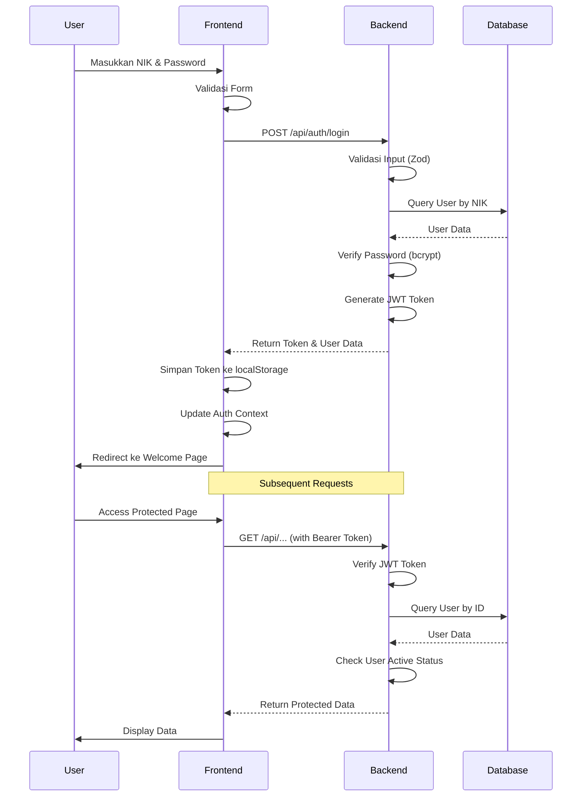

I have created the following plan after thorough exploration and analysis of the codebase. Follow the below plan verbatim. Trust the files and references. Do not re-verify what's written in the plan. Explore only when absolutely necessary. First implement all the proposed file changes and then I'll review all the changes together at the end.

## Observasi Kode

Project sudah memiliki struktur dasar yang solid dengan **Express + Prisma** di backend dan **React + Vite** di frontend. Model `User` sudah ada dengan field `nik` dan `password` (hashed dengan bcrypt). Seed data development sudah tersedia (`DEV_ADMIN` dan `DEV_USER`). Frontend sudah memiliki halaman Login dengan React Hook Form, namun belum terhubung ke backend (masih TODO). Axios interceptor sudah dikonfigurasi untuk menangani JWT token. Desain UI menggunakan Tailwind CSS dengan design system yang konsisten.

## Pendekatan

Implementasi autentikasi akan menggunakan **JWT (JSON Web Token)** untuk stateless authentication. Backend akan menyediakan endpoint `/api/auth/login` yang memvalidasi NIK dan password, kemudian mengembalikan JWT token. Frontend akan menyimpan token di localStorage dan menggunakannya untuk setiap request ke protected routes. Middleware `authMiddleware` akan memvalidasi token pada setiap protected endpoint. Login page akan diperbarui sesuai desain file:desain-ui-ux/login_page_-_bebang_sistem_informasi/code.html dengan split layout profesional.

## Implementasi

### 1. Backend - Install JWT Dependencies

Tambahkan library JWT ke file:backend/package.json:
```bash
npm install jsonwebtoken
npm install --save-dev @types/jsonwebtoken
```

### 2. Backend - Environment Variables

Update file:backend/.env.example dan file `.env` dengan variabel JWT:
- `JWT_SECRET` - Secret key untuk signing JWT (gunakan string random yang kuat)
- `JWT_EXPIRES_IN` - Durasi token (contoh: "24h", "7d")
- `CORS_ORIGIN` - Sudah ada, pastikan sesuai dengan frontend URL

### 3. Backend - Auth Types & Utilities

Buat file:backend/src/types/auth.ts untuk mendefinisikan:
- Interface `LoginRequest` dengan field `nik` dan `password`
- Interface `LoginResponse` dengan field `token`, `user` (tanpa password)
- Interface `JwtPayload` dengan field `userId`, `nik`, `role`
- Type `AuthenticatedRequest` yang extends Express Request dengan property `user`

Buat file:backend/src/utils/jwt.ts untuk utility functions:
- `generateToken(payload: JwtPayload): string` - Generate JWT token menggunakan `jsonwebtoken.sign()`
- `verifyToken(token: string): JwtPayload` - Verify dan decode JWT token menggunakan `jsonwebtoken.verify()`
- Gunakan `JWT_SECRET` dan `JWT_EXPIRES_IN` dari environment variables

### 4. Backend - Auth Controller

Buat file:backend/src/controllers/auth.controller.ts dengan function:

**`login` handler:**
- Terima `nik` dan `password` dari request body
- Validasi input menggunakan Zod schema (nik required, password required)
- Query user dari database menggunakan `prisma.user.findUnique({ where: { nik } })`
- Jika user tidak ditemukan, throw `ApiError` dengan status 401 dan message "NIK atau password salah"
- Jika user `isActive = false`, throw `ApiError` dengan status 403 dan message "Akun tidak aktif"
- Verifikasi password menggunakan `bcrypt.compare(password, user.password)`
- Jika password salah, throw `ApiError` dengan status 401 dan message "NIK atau password salah"
- Generate JWT token dengan payload `{ userId: user.id, nik: user.nik, role: user.role }`
- Return response dengan `successResponse()` berisi `{ token, user }` (exclude password dari user object)

**`getProfile` handler:**
- Ambil user dari `req.user` (sudah di-inject oleh auth middleware)
- Query user lengkap dari database berdasarkan `userId`
- Return user data (exclude password)

### 5. Backend - Auth Middleware

Buat file:backend/src/middleware/auth.middleware.ts dengan function:

**`authenticate` middleware:**
- Extract token dari header `Authorization: Bearer <token>`
- Jika token tidak ada, throw `ApiError` dengan status 401 dan message "Token tidak ditemukan"
- Verify token menggunakan `verifyToken()` utility
- Jika token invalid/expired, throw `ApiError` dengan status 401 dan message "Token tidak valid atau sudah kadaluarsa"
- Query user dari database berdasarkan `userId` dari token payload
- Jika user tidak ditemukan atau `isActive = false`, throw `ApiError` dengan status 401
- Attach user data ke `req.user`
- Call `next()`

**`authorize(...roles: Role[])` middleware factory:**
- Return middleware function yang check apakah `req.user.role` ada dalam array `roles`
- Jika tidak, throw `ApiError` dengan status 403 dan message "Akses ditolak"

### 6. Backend - Auth Routes

Buat file:backend/src/routes/auth.routes.ts:
- Setup Express Router
- `POST /login` - Route untuk login (public, tidak perlu auth middleware)
- `GET /profile` - Route untuk get user profile (protected dengan `authenticate` middleware)
- `POST /logout` - Route untuk logout (optional, bisa hanya clear token di frontend)
- Export router

### 7. Backend - Register Auth Routes

Update file:backend/src/index.ts:
- Import auth routes dari file:backend/src/routes/auth.routes.ts
- Register routes dengan `app.use('/api/auth', authRoutes)`
- Pastikan routes di-register sebelum `notFoundHandler` dan `errorHandler`

### 8. Backend - Update Seed Data

Update file:backend/prisma/seed.ts:
- Pastikan NIK menggunakan format yang realistis (contoh: "2024001", "2024002")
- Tambahkan lebih banyak test users dengan berbagai roles jika diperlukan
- Dokumentasikan credentials dengan jelas untuk development

### 9. Frontend - Auth Service

Buat file:frontend/src/services/auth.service.ts dengan functions:

**`login(nik: string, password: string)`:**
- Call `POST /api/auth/login` dengan axios
- Simpan token ke `localStorage.setItem('token', response.data.token)`
- Simpan user data ke `localStorage.setItem('user', JSON.stringify(response.data.user))`
- Return response data

**`logout()`:**
- Remove token dari localStorage: `localStorage.removeItem('token')`
- Remove user data: `localStorage.removeItem('user')`
- Redirect ke `/login`

**`getProfile()`:**
- Call `GET /api/auth/profile` dengan axios (token otomatis di-attach oleh interceptor)
- Return user data

**`getCurrentUser()`:**
- Get user dari localStorage
- Parse dan return user object

**`isAuthenticated()`:**
- Check apakah token ada di localStorage
- Return boolean

### 10. Frontend - Auth Context

Buat file:frontend/src/contexts/AuthContext.tsx:
- Create React Context untuk auth state
- State: `user`, `isAuthenticated`, `isLoading`
- Functions: `login`, `logout`, `checkAuth`
- `checkAuth()` dipanggil saat app mount untuk verify token masih valid
- Jika token invalid, auto logout
- Wrap children dengan Context Provider

Update file:frontend/src/main.tsx:
- Wrap `<App />` dengan `<AuthProvider>`

### 11. Frontend - Protected Route Component

Buat file:frontend/src/components/ProtectedRoute.tsx:
- Component yang check `isAuthenticated` dari AuthContext
- Jika tidak authenticated, redirect ke `/login` menggunakan `<Navigate to="/login" replace />`
- Jika authenticated, render `children` atau `<Outlet />`

### 12. Frontend - Update Login Page

Update file:frontend/src/pages/Login.tsx sesuai desain file:desain-ui-ux/login_page_-_bebang_sistem_informasi/code.html:

**Layout:**
- Gunakan flex container dengan 2 kolom (3/5 untuk hero, 2/5 untuk form)
- Hero section (hidden di mobile, visible di lg+):
  - Background image industrial dengan overlay primary color
  - Logo dan title "Bebang Sistem Informasi"
  - Heading "Layanan Data Terpadu PT Prima Sarana Gemilang"
  - Description text
  - Badge "Secure Access" dan "Real-time Data"
  - Footer copyright
- Form section:
  - Logo dan title (visible di mobile, hidden di lg+)
  - Heading "Login ke Akun Anda"
  - NIK input dengan icon `badge`
  - Password input dengan icon `lock` dan toggle visibility button
  - Link "Lupa Kata Sandi?" (optional, bisa disabled untuk sekarang)
  - Submit button "Masuk ke Dashboard"
  - Help link "Hubungi IT Support"

**Functionality:**
- Gunakan `useAuth()` hook untuk access `login` function dari AuthContext
- Pada submit, call `login(nik, password)`
- Handle loading state dengan spinner di button
- Handle error dengan error message display
- Jika login sukses, redirect ke `/` (Welcome page)
- Validasi form dengan React Hook Form (NIK required, password required)

**Styling:**
- Gunakan Tailwind classes sesuai design system
- Primary color: `#135bec`
- Background light: `#f6f6f8`
- Font: Inter
- Material Symbols Outlined icons
- Responsive design (mobile-first)

### 13. Frontend - Update App Routes

Update file:frontend/src/App.tsx:
- Wrap route `/` (Welcome) dengan `<ProtectedRoute>`
- Route `/login` tetap public
- Tambahkan logic: jika sudah authenticated dan akses `/login`, redirect ke `/`
- Gunakan `useAuth()` untuk check authentication status

### 14. Frontend - Update API Service

Update file:frontend/src/services/api.ts:
- Pastikan interceptor sudah handle 401 response dengan logout
- Tambahkan error handling yang lebih baik
- Tambahkan retry logic untuk network errors (optional)

### 15. Frontend - Environment Variables

Buat file:frontend/.env dan file:frontend/.env.example:
- `VITE_API_BASE_URL` - Backend API URL (default: http://localhost:3001/api)
- `VITE_APP_NAME` - Application name (Bebang Sistem Informasi)

### 16. Testing & Verification

**Backend Testing:**
- Test login endpoint dengan Postman/Thunder Client:
  - Valid credentials → return token dan user data
  - Invalid NIK → return 401 error
  - Invalid password → return 401 error
  - Inactive user → return 403 error
- Test protected endpoint `/api/auth/profile`:
  - Dengan valid token → return user data
  - Tanpa token → return 401 error
  - Dengan invalid token → return 401 error

**Frontend Testing:**
- Test login flow:
  - Login dengan credentials valid → redirect ke Welcome page
  - Login dengan credentials invalid → show error message
  - Access Welcome page tanpa login → redirect ke Login page
  - Logout → clear token dan redirect ke Login page
- Test token persistence:
  - Login → refresh page → tetap authenticated
  - Token expired → auto logout

**Integration Testing:**
- Test full authentication flow dari login sampai access protected page
- Test token expiration handling
- Test concurrent requests dengan same token

### 17. Documentation

Buat file:backend/docs/AUTH.md untuk dokumentasi:
- API endpoints authentication
- Request/response examples
- Error codes dan messages
- JWT token structure
- Development credentials

Update file:README.md dengan:
- Cara setup authentication
- Development credentials
- Environment variables yang diperlukan

## Diagram Alur Autentikasi



## Struktur File yang Dibuat

**Backend:**
- file:backend/src/types/auth.ts
- file:backend/src/utils/jwt.ts
- file:backend/src/controllers/auth.controller.ts
- file:backend/src/middleware/auth.middleware.ts
- file:backend/src/routes/auth.routes.ts
- file:backend/docs/AUTH.md

**Frontend:**
- file:frontend/src/services/auth.service.ts
- file:frontend/src/contexts/AuthContext.tsx
- file:frontend/src/components/ProtectedRoute.tsx
- file:frontend/.env
- file:frontend/.env.example

**Updated Files:**
- file:backend/src/index.ts
- file:backend/package.json
- file:backend/.env.example
- file:backend/prisma/seed.ts
- file:frontend/src/pages/Login.tsx
- file:frontend/src/App.tsx
- file:frontend/src/main.tsx
- file:frontend/src/services/api.ts
- file:README.md