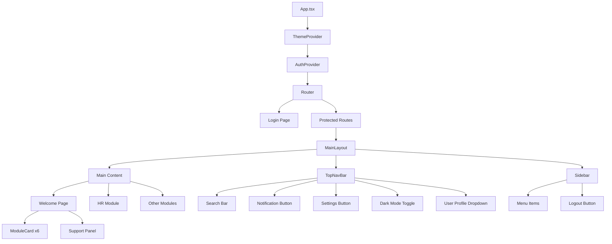

I have created the following plan after thorough exploration and analysis of the codebase. Follow the below plan verbatim. Trust the files and references. Do not re-verify what's written in the plan. Explore only when absolutely necessary. First implement all the proposed file changes and then I'll review all the changes together at the end.

## Observasi Kode

Aplikasi sudah memiliki foundation yang solid dengan React + TypeScript, Tailwind CSS, dan sistem autentikasi JWT. Welcome page saat ini masih sederhana dan perlu diupgrade sesuai desain UI/UX yang lebih profesional. Struktur folder sudah terorganisir dengan baik (contexts, components, pages, services). Tailwind config sudah dikonfigurasi dengan color palette yang sesuai desain (#135bec untuk primary, dark mode support).

## Pendekatan Implementasi

Implementasi akan fokus pada pembuatan navigation framework yang reusable dan scalable untuk mendukung multi-module architecture. Pendekatan dimulai dengan membuat Dark Mode Context untuk state management, kemudian membangun layout components (Sidebar + TopNavBar) yang akan digunakan di semua module. Welcome page akan diredesign sepenuhnya mengikuti desain HTML reference dengan module cards yang interaktif. Routing structure akan disiapkan untuk module HR dan module lainnya yang akan dikembangkan bertahap.

---

## Implementasi Step-by-Step

### 1. Setup Dark Mode Context & Toggle

**File: `file:frontend/src/contexts/ThemeContext.tsx`** (Buat baru)

Buat context untuk mengelola dark mode state:
- Export `ThemeProvider` component dengan state management untuk dark/light mode
- Gunakan `localStorage` untuk persist theme preference dengan key `'theme'`
- Implement `useEffect` untuk apply/remove class `'dark'` pada `document.documentElement`
- Export custom hook `useTheme()` yang return `{ isDarkMode, toggleTheme }`
- Default theme: check localStorage, fallback ke system preference via `window.matchMedia('(prefers-color-scheme: dark)')`

**File: `file:frontend/src/main.tsx`** (Update)

Wrap aplikasi dengan `ThemeProvider`:
- Import `ThemeProvider` dari `'./contexts/ThemeContext'`
- Wrap `<AuthProvider>` dengan `<ThemeProvider>` sebagai parent
- Struktur: `ThemeProvider > AuthProvider > RouterProvider > App`

---

### 2. Buat Reusable Layout Components

#### 2.1 TopNavBar Component

**File: `file:frontend/src/components/layout/TopNavBar.tsx`** (Buat baru)

Implementasi top navigation bar sesuai desain:
- **Logo Section**: Icon star dalam box primary + text "Bebang Sistem Informasi" + subtitle "PT Prima Sarana Gemilang"
- **Search Bar**: Input dengan icon search di kiri, placeholder "Cari modul...", hidden pada mobile (md:flex)
- **Action Buttons**:
  - Notification button dengan icon `notifications`
  - Settings button dengan icon `settings`
  - Dark mode toggle button dengan icon `light_mode` / `dark_mode` (conditional)
- **User Profile Section**: 
  - User info (nama, jabatan) dari `useAuth().user`
  - Avatar circle dengan border primary
  - Gunakan flex layout dengan gap dan divider
- Styling: `h-16`, border-bottom, bg-white dark:bg-gray-900, px-6

Props interface:
```typescript
interface TopNavBarProps {
  onSearchChange?: (query: string) => void;
}
```

#### 2.2 Sidebar Component

**File: `file:frontend/src/components/layout/Sidebar.tsx`** (Buat baru)

Implementasi sidebar navigation sesuai desain:
- **Width**: `w-64`, border-right, bg-white dark:bg-gray-900, p-4
- **Menu Items**:
  - Dashboard (active state dengan bg-primary/10 dan text-primary)
  - Recent Activities (icon: history)
  - My Profile (icon: person)
  - Messages (icon: chat_bubble)
- **Bottom Section** (mt-auto dengan border-top):
  - Help Desk (icon: help_center)
  - Sign Out (icon: logout, text-red-500, onClick logout dari useAuth)
- Gunakan `useLocation()` untuk highlight active menu
- Setiap menu item: flex items-center gap-3, px-3 py-3, rounded-lg, hover effect

Props interface:
```typescript
interface SidebarProps {
  isOpen?: boolean;
  onClose?: () => void;
}
```

Tambahkan mobile responsive:
- Hidden pada mobile, show dengan overlay saat `isOpen={true}`
- Gunakan transition untuk smooth animation

#### 2.3 MainLayout Component

**File: `file:frontend/src/components/layout/MainLayout.tsx`** (Buat baru)

Wrapper layout dengan sidebar + topnav:
- Structure: `<div className="flex h-screen w-full flex-col overflow-hidden">`
  - `<TopNavBar />` - Fixed top
  - `<div className="flex flex-1 overflow-hidden">`
    - `<Sidebar />` - Fixed left
    - `<main className="flex-1 overflow-y-auto bg-background-light dark:bg-background-dark p-8">`
      - `{children}` - Dynamic content
- State untuk mobile sidebar toggle
- Responsive: Sidebar hidden pada mobile, show via hamburger menu

Props interface:
```typescript
interface MainLayoutProps {
  children: React.ReactNode;
}
```

---

### 3. Buat Reusable Module Card Component

**File: `file:frontend/src/components/ModuleCard.tsx`** (Buat baru)

Component untuk module shortcuts:
- Props: `{ id, name, description, icon, isHighlighted, comingSoon, onClick }`
- **Highlighted variant** (untuk HR module):
  - `bg-primary`, `text-white`, `border-primary`
  - Icon container: `bg-white/20`
  - Footer: "Buka Modul" + arrow_forward icon
- **Normal variant**:
  - `bg-white dark:bg-gray-900`, `border-gray-200 dark:border-gray-800`
  - Icon container: `bg-background-light dark:bg-gray-800 text-primary`
  - Footer: "Buka Modul" + arrow_forward icon dengan `text-primary`
- **Coming Soon badge**: Absolute positioned, top-right, amber colors
- Hover effects: `hover:shadow-md hover:-translate-y-1`, transition-all
- Cursor: `cursor-pointer` jika tidak comingSoon, `opacity-60` jika comingSoon

Props interface:
```typescript
interface ModuleCardProps {
  id: string;
  name: string;
  description: string;
  icon: string;
  isHighlighted?: boolean;
  comingSoon?: boolean;
  onClick?: () => void;
}
```

---

### 4. Redesign Welcome Page

**File: `file:frontend/src/pages/Welcome.tsx`** (Update sepenuhnya)

Redesign mengikuti desain HTML reference:

**Struktur:**
- Gunakan `<MainLayout>` sebagai wrapper
- **Page Heading**:
  - `<h1>` dengan text "Selamat Datang Kembali, {user.fullName}!" (text-4xl font-black)
  - `<p>` subtitle "Pilih modul untuk mengelola layanan data enterprise Anda hari ini." (text-lg text-gray-600)
- **Module Grid**:
  - Grid: `grid-cols-1 md:grid-cols-2 lg:grid-cols-3 gap-6`
  - 5 module cards + 1 "Request New Module" card
  - Modules array:
    1. Human Resources (highlighted, icon: groups, path: /hr)
    2. Inventory (icon: inventory_2, comingSoon: true)
    3. Mess Management (icon: restaurant, comingSoon: true)
    4. Building Management (icon: domain, comingSoon: true)
    5. Access Rights (icon: admin_panel_settings, comingSoon: true)
    6. Request New Module (dashed border, icon: add_circle, opacity-60)
- **Support Panel**:
  - Card dengan flex layout (sm:flex-row)
  - Icon support_agent dalam circle bg-primary/10
  - Heading "Butuh Bantuan?" + description
  - 2 buttons: "Hubungi Support" (primary) + "Lihat Dokumentasi" (outline)

**Navigation:**
- Gunakan `useNavigate()` untuk routing ke module
- onClick handler: `() => !module.comingSoon && navigate(module.path)`

**Hapus:**
- Header section (sudah ada di TopNavBar)
- Footer section (tidak ada di desain)
- Quick Stats section (tidak ada di desain)

---

### 5. Setup Routing untuk Module Navigation

**File: `file:frontend/src/App.tsx`** (Update)

Tambahkan routes untuk module:
- Route `/` - Welcome page (dengan ProtectedRoute)
- Route `/hr/*` - HR Module (placeholder, dengan ProtectedRoute)
- Route `/inventory/*` - Inventory Module (placeholder, dengan ProtectedRoute)
- Route `/mess/*` - Mess Management Module (placeholder, dengan ProtectedRoute)
- Route `/building/*` - Building Management Module (placeholder, dengan ProtectedRoute)
- Route `/access-rights/*` - Access Rights Module (placeholder, dengan ProtectedRoute)
- Route `/login` - Login page
- Route `*` - Redirect ke `/`

**File: `file:frontend/src/pages/modules/HRModule.tsx`** (Buat baru)

Placeholder untuk HR module:
- Gunakan `<MainLayout>`
- Content: "HR Module - Under Development"
- Breadcrumb: Home > Human Resources
- Temporary navigation menu untuk HR sub-features (akan dikembangkan di fase berikutnya)

Buat placeholder serupa untuk module lainnya di folder `file:frontend/src/pages/modules/`:
- `InventoryModule.tsx`
- `MessModule.tsx`
- `BuildingModule.tsx`
- `AccessRightsModule.tsx`

---

### 6. Implementasi Search Functionality (Basic)

**File: `file:frontend/src/components/layout/TopNavBar.tsx`** (Update)

Tambahkan search state dan handler:
- State: `const [searchQuery, setSearchQuery] = useState('')`
- Input onChange: `setSearchQuery(e.target.value)`
- Debounce search dengan `useEffect` + `setTimeout` (300ms delay)
- Call `onSearchChange` prop callback dengan debounced value
- Placeholder: "Cari modul, karyawan, atau data..."

**File: `file:frontend/src/pages/Welcome.tsx`** (Update)

Implementasi search filtering:
- State untuk filtered modules
- Filter modules berdasarkan search query (name atau description)
- Pass `onSearchChange` handler ke `<TopNavBar>`
- Display filtered modules di grid

---

### 7. Implementasi Notification & Settings Buttons (Placeholder)

**File: `file:frontend/src/components/layout/TopNavBar.tsx`** (Update)

Tambahkan onClick handlers:
- **Notification button**: 
  - State untuk notification panel visibility
  - onClick toggle panel (dropdown dari top-right)
  - Panel content: "Tidak ada notifikasi baru" (placeholder)
- **Settings button**:
  - onClick navigate ke `/settings` (placeholder page)
  - Atau buka modal settings (future implementation)

**File: `file:frontend/src/components/NotificationPanel.tsx`** (Buat baru)

Dropdown panel untuk notifications:
- Absolute positioned dari TopNavBar
- Width: `w-80`, max-height dengan scroll
- Empty state: Icon + "Tidak ada notifikasi baru"
- Close on outside click (useRef + useEffect)

---

### 8. Implementasi User Profile Dropdown

**File: `file:frontend/src/components/layout/TopNavBar.tsx`** (Update)

Tambahkan user profile dropdown:
- State: `const [isProfileOpen, setIsProfileOpen] = useState(false)`
- onClick avatar: toggle dropdown
- Dropdown menu items:
  - My Profile (navigate to `/profile`)
  - Settings (navigate to `/settings`)
  - Divider
  - Sign Out (call logout dari useAuth)
- Position: absolute, top-full, right-0
- Close on outside click

---

### 9. Responsive Design & Mobile Navigation

**File: `file:frontend/src/components/layout/MainLayout.tsx`** (Update)

Implementasi mobile responsive:
- **Hamburger Menu Button** (visible pada mobile):
  - Position: TopNavBar kiri (sebelum logo)
  - Icon: `menu` (Material Symbols)
  - onClick: toggle sidebar visibility
- **Mobile Sidebar**:
  - Fixed position dengan overlay backdrop
  - Slide-in animation dari kiri
  - Close button di dalam sidebar
  - Backdrop onClick: close sidebar
- **Breakpoints**:
  - Mobile: < 768px (sidebar hidden, show via hamburger)
  - Tablet/Desktop: >= 768px (sidebar always visible)

---

### 10. Polish & Final Touches

**File: `file:frontend/src/index.css`** (Update)

Tambahkan utility classes:
- `.fill-icon` untuk Material Symbols filled variant
- Smooth transitions untuk dark mode
- Custom scrollbar styling untuk sidebar

**File: `file:frontend/src/components/layout/Sidebar.tsx`** (Update)

Tambahkan active state logic:
- Gunakan `useLocation()` dari react-router-dom
- Match current path dengan menu items
- Apply active styling: `bg-primary/10 text-primary` + filled icon

**Testing Checklist:**
- Dark mode toggle berfungsi dan persist di localStorage
- Sidebar navigation active state sesuai current route
- Module cards navigate ke route yang benar
- Search filtering berfungsi di Welcome page
- Mobile responsive: hamburger menu, sidebar overlay
- User profile dropdown berfungsi
- Logout functionality berfungsi dari sidebar dan profile dropdown

---

## Diagram Struktur Komponen



---

## File Structure Summary

```
frontend/src/
├── components/
│   ├── layout/
│   │   ├── MainLayout.tsx          (Buat baru)
│   │   ├── TopNavBar.tsx           (Buat baru)
│   │   └── Sidebar.tsx             (Buat baru)
│   ├── ModuleCard.tsx              (Buat baru)
│   ├── NotificationPanel.tsx       (Buat baru)
│   └── ProtectedRoute.tsx          (Sudah ada)
├── contexts/
│   ├── AuthContext.tsx             (Sudah ada)
│   └── ThemeContext.tsx            (Buat baru)
├── pages/
│   ├── modules/
│   │   ├── HRModule.tsx            (Buat baru)
│   │   ├── InventoryModule.tsx     (Buat baru)
│   │   ├── MessModule.tsx          (Buat baru)
│   │   ├── BuildingModule.tsx      (Buat baru)
│   │   └── AccessRightsModule.tsx  (Buat baru)
│   ├── Login.tsx                   (Sudah ada)
│   └── Welcome.tsx                 (Update)
├── App.tsx                         (Update)
├── main.tsx                        (Update)
└── index.css                       (Update)
```