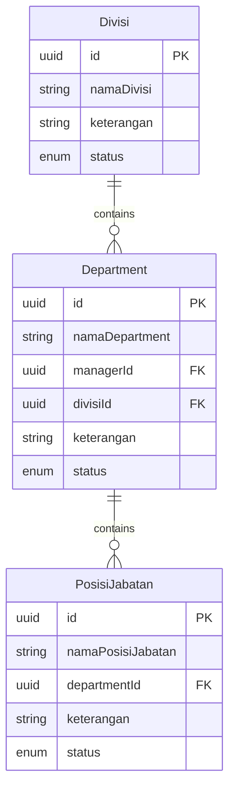
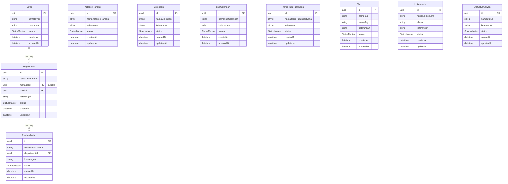

I have created the following plan after thorough exploration and analysis of the codebase. Follow the below plan verbatim. Trust the files and references. Do not re-verify what's written in the plan. Explore only when absolutely necessary. First implement all the proposed file changes and then I'll review all the changes together at the end.

## Observasi Kunci

Proyek menggunakan **Prisma ORM** dengan PostgreSQL, TypeScript, dan Express. Struktur backend sudah established dengan pattern: Prisma schema → migrations → models → controllers → routes. Semua master data HR memiliki struktur serupa dengan field `nama`, `keterangan`, dan `status` (Aktif/Tidak Aktif). Beberapa tabel memiliki relasi foreign key (department → divisi, posisi_jabatan → department). Tag memiliki field tambahan `warna_tag`. Department memiliki relasi ke karyawan untuk field `manager`.

## Pendekatan

Implementasi akan mengikuti pattern Prisma yang sudah ada: definisikan semua master data models di `schema.prisma`, buat migration untuk generate SQL, tambahkan seed data untuk development, dan setup validation schemas dengan Zod. Semua tabel akan menggunakan UUID sebagai primary key, timestamps (createdAt/updatedAt), dan soft delete pattern dengan field `status`. Relasi antar tabel akan didefinisikan dengan foreign keys dan Prisma relations untuk memudahkan query.

## Langkah Implementasi

### 1. Definisi Prisma Schema untuk Master Data HR

**File**: `file:backend/prisma/schema.prisma`

Tambahkan 10 models untuk master data HR setelah model `User` yang sudah ada:

**Model Divisi**:
- `id`: String (UUID, primary key)
- `namaDivisi`: String (required)
- `keterangan`: String (optional)
- `status`: Enum StatusMaster (AKTIF/TIDAK_AKTIF, default AKTIF)
- `createdAt`, `updatedAt`: DateTime
- Relasi: `departments` (one-to-many ke Department)
- Table mapping: `"divisi"`

**Model Department**:
- `id`: String (UUID, primary key)
- `namaDepartment`: String (required)
- `managerId`: String (optional, foreign key ke User/Karyawan)
- `divisiId`: String (required, foreign key ke Divisi)
- `keterangan`: String (optional)
- `status`: Enum StatusMaster
- `createdAt`, `updatedAt`: DateTime
- Relasi: `divisi` (many-to-one), `manager` (many-to-one), `posisiJabatan` (one-to-many)
- Table mapping: `"department"`

**Model PosisiJabatan**:
- `id`: String (UUID, primary key)
- `namaPosisiJabatan`: String (required)
- `departmentId`: String (required, foreign key ke Department)
- `keterangan`: String (optional)
- `status`: Enum StatusMaster
- `createdAt`, `updatedAt`: DateTime
- Relasi: `department` (many-to-one)
- Table mapping: `"posisi_jabatan"`

**Model KategoriPangkat**:
- `id`: String (UUID, primary key)
- `namaKategoriPangkat`: String (required)
- `keterangan`: String (optional)
- `status`: Enum StatusMaster
- `createdAt`, `updatedAt`: DateTime
- Table mapping: `"kategori_pangkat"`

**Model Golongan**:
- `id`: String (UUID, primary key)
- `namaGolongan`: String (required)
- `keterangan`: String (optional)
- `status`: Enum StatusMaster
- `createdAt`, `updatedAt`: DateTime
- Table mapping: `"golongan"`

**Model SubGolongan**:
- `id`: String (UUID, primary key)
- `namaSubGolongan`: String (required)
- `keterangan`: String (optional)
- `status`: Enum StatusMaster
- `createdAt`, `updatedAt`: DateTime
- Table mapping: `"sub_golongan"`

**Model JenisHubunganKerja**:
- `id`: String (UUID, primary key)
- `namaJenisHubunganKerja`: String (required)
- `keterangan`: String (optional)
- `status`: Enum StatusMaster
- `createdAt`, `updatedAt`: DateTime
- Table mapping: `"jenis_hubungan_kerja"`

**Model Tag**:
- `id`: String (UUID, primary key)
- `namaTag`: String (required)
- `warnaTag`: String (required, hex color code)
- `keterangan`: String (optional)
- `status`: Enum StatusMaster
- `createdAt`, `updatedAt`: DateTime
- Table mapping: `"tag"`

**Model LokasiKerja**:
- `id`: String (UUID, primary key)
- `namaLokasiKerja`: String (required)
- `alamat`: String (optional)
- `keterangan`: String (optional)
- `status`: Enum StatusMaster
- `createdAt`, `updatedAt`: DateTime
- Table mapping: `"lokasi_kerja"`

**Model StatusKaryawan**:
- `id`: String (UUID, primary key)
- `namaStatus`: String (required)
- `keterangan`: String (optional)
- `status`: Enum StatusMaster
- `createdAt`, `updatedAt`: DateTime
- Table mapping: `"status_karyawan"`

**Enum StatusMaster**:
```
enum StatusMaster {
  AKTIF
  TIDAK_AKTIF
}
```

**Catatan**: Field `managerId` di Department akan di-set nullable dan akan di-populate setelah tabel karyawan dibuat di fase berikutnya.

### 2. Generate dan Jalankan Prisma Migration

**Command**:
```bash
cd backend
npm run prisma:migrate
```

Beri nama migration: `add_hr_master_data_tables`

Prisma akan:
- Generate file migration SQL di `file:backend/prisma/migrations/[timestamp]_add_hr_master_data_tables/migration.sql`
- Membuat semua tabel di database PostgreSQL
- Membuat indexes untuk foreign keys
- Generate Prisma Client types

**Verifikasi**: Jalankan `npm run prisma:studio` untuk membuka Prisma Studio dan verifikasi semua tabel sudah terbuat.

### 3. Update Seed File dengan Master Data Development

**File**: `file:backend/prisma/seed.ts`

Tambahkan seed data setelah user seeding:

**Divisi** (3 sample):
- Divisi Operasional (Aktif)
- Divisi Keuangan (Aktif)
- Divisi IT (Aktif)

**Department** (5 sample, terhubung ke divisi):
- HR Department → Divisi Operasional
- Finance Department → Divisi Keuangan
- IT Support → Divisi IT
- Accounting → Divisi Keuangan
- Operations → Divisi Operasional

**Posisi Jabatan** (6 sample, terhubung ke department):
- HR Manager → HR Department
- Finance Manager → Finance Department
- IT Support Staff → IT Support
- Accountant → Accounting
- Operations Manager → Operations
- HR Staff → HR Department

**Kategori Pangkat** (3 sample):
- Staff
- Supervisor
- Manager

**Golongan** (4 sample):
- Golongan I
- Golongan II
- Golongan III
- Golongan IV

**Sub Golongan** (4 sample):
- Sub Golongan A
- Sub Golongan B
- Sub Golongan C
- Sub Golongan D

**Jenis Hubungan Kerja** (3 sample):
- Karyawan Tetap
- Karyawan Kontrak
- Karyawan Magang

**Tag** (5 sample dengan warna):
- Prioritas Tinggi (#FF0000 - merah)
- Karyawan Baru (#00FF00 - hijau)
- Training (#0000FF - biru)
- Remote Worker (#FFA500 - orange)
- Part Time (#800080 - ungu)

**Lokasi Kerja** (3 sample):
- Kantor Pusat Jakarta (Jl. Sudirman No. 123, Jakarta)
- Kantor Cabang Surabaya (Jl. Tunjungan No. 45, Surabaya)
- Kantor Cabang Bandung (Jl. Asia Afrika No. 67, Bandung)

**Status Karyawan** (4 sample):
- Aktif
- Cuti
- Resign
- Pensiun

Gunakan `upsert` untuk idempotent seeding (bisa dijalankan berulang kali).

**Command untuk run seed**:
```bash
npm run prisma:seed
```

### 4. Buat TypeScript Types untuk Master Data

**File**: `file:backend/src/types/hr-master.ts` (buat baru)

Export types untuk semua master data:

```typescript
// Import dari Prisma Client
import { Divisi, Department, PosisiJabatan, ... } from '@prisma/client';

// Export types
export type { Divisi, Department, PosisiJabatan, ... };

// DTOs untuk Create/Update (tanpa id, timestamps)
export type CreateDivisiDTO = Omit<Divisi, 'id' | 'createdAt' | 'updatedAt'>;
export type UpdateDivisiDTO = Partial<CreateDivisiDTO>;

// Ulangi untuk semua master data
```

### 5. Setup Zod Validation Schemas

**File**: `file:backend/src/validators/hr-master.validator.ts` (buat baru)

Buat validation schemas dengan Zod untuk setiap master data:

**Divisi Schema**:
```typescript
export const createDivisiSchema = z.object({
  namaDivisi: z.string().min(1, 'Nama divisi wajib diisi'),
  keterangan: z.string().optional(),
  status: z.enum(['AKTIF', 'TIDAK_AKTIF']).default('AKTIF'),
});

export const updateDivisiSchema = createDivisiSchema.partial();
```

**Department Schema**:
```typescript
export const createDepartmentSchema = z.object({
  namaDepartment: z.string().min(1, 'Nama department wajib diisi'),
  managerId: z.string().uuid().optional().nullable(),
  divisiId: z.string().uuid('Divisi ID harus valid UUID'),
  keterangan: z.string().optional(),
  status: z.enum(['AKTIF', 'TIDAK_AKTIF']).default('AKTIF'),
});

export const updateDepartmentSchema = createDepartmentSchema.partial();
```

**PosisiJabatan Schema**:
```typescript
export const createPosisiJabatanSchema = z.object({
  namaPosisiJabatan: z.string().min(1, 'Nama posisi jabatan wajib diisi'),
  departmentId: z.string().uuid('Department ID harus valid UUID'),
  keterangan: z.string().optional(),
  status: z.enum(['AKTIF', 'TIDAK_AKTIF']).default('AKTIF'),
});

export const updatePosisiJabatanSchema = createPosisiJabatanSchema.partial();
```

**Tag Schema** (dengan validasi warna hex):
```typescript
export const createTagSchema = z.object({
  namaTag: z.string().min(1, 'Nama tag wajib diisi'),
  warnaTag: z.string().regex(/^#[0-9A-Fa-f]{6}$/, 'Warna tag harus format hex (#RRGGBB)'),
  keterangan: z.string().optional(),
  status: z.enum(['AKTIF', 'TIDAK_AKTIF']).default('AKTIF'),
});

export const updateTagSchema = createTagSchema.partial();
```

Ulangi pattern yang sama untuk: KategoriPangkat, Golongan, SubGolongan, JenisHubunganKerja, LokasiKerja, StatusKaryawan.

**Query Parameter Schema** (untuk filtering):
```typescript
export const masterDataQuerySchema = z.object({
  status: z.enum(['AKTIF', 'TIDAK_AKTIF']).optional(),
  search: z.string().optional(),
  page: z.coerce.number().int().positive().default(1),
  limit: z.coerce.number().int().positive().max(100).default(10),
});
```

### 6. Buat Prisma Service Helper Functions

**File**: `file:backend/src/services/hr-master.service.ts` (buat baru)

Buat reusable service functions untuk operasi database:

**Generic Find All dengan Filtering**:
```typescript
export async function findAllMasterData<T>(
  model: any, // Prisma model
  filters: { status?: string; search?: string },
  pagination: { page: number; limit: number },
  searchFields: string[] // fields untuk search
) {
  const where = {
    ...(filters.status && { status: filters.status }),
    ...(filters.search && {
      OR: searchFields.map(field => ({
        [field]: { contains: filters.search, mode: 'insensitive' }
      }))
    })
  };

  const [data, total] = await Promise.all([
    model.findMany({
      where,
      skip: (pagination.page - 1) * pagination.limit,
      take: pagination.limit,
      orderBy: { createdAt: 'desc' }
    }),
    model.count({ where })
  ]);

  return { data, total, page: pagination.page, limit: pagination.limit };
}
```

**Generic CRUD Operations**:
- `createMasterData(model, data)`
- `updateMasterData(model, id, data)`
- `deleteMasterData(model, id)` (soft delete dengan update status)
- `findMasterDataById(model, id)`

### 7. Generate Prisma Client

**Command**:
```bash
npm run prisma:generate
```

Ini akan regenerate Prisma Client dengan semua types baru untuk master data models.

### 8. Verifikasi Database Schema

**Checklist**:
- [ ] Jalankan `npm run prisma:studio` dan verifikasi semua 10 tabel master data ada
- [ ] Verifikasi foreign key constraints (department.divisiId → divisi.id, posisi_jabatan.departmentId → department.id)
- [ ] Verifikasi enum StatusMaster terbuat
- [ ] Verifikasi indexes terbuat untuk foreign keys
- [ ] Test seed data dengan `npm run prisma:seed` dan cek data masuk ke database
- [ ] Verifikasi timestamps (createdAt, updatedAt) auto-populate

### 9. Dokumentasi Schema

**File**: `file:modules/hr/docs/database-schema.md` (buat baru)

Dokumentasikan:
- ERD diagram (gunakan Mermaid) untuk visualisasi relasi antar tabel
- Deskripsi setiap tabel dan field
- Business rules (contoh: Department harus memiliki Divisi yang aktif)
- Indexes yang dibuat
- Contoh queries untuk common operations

**Mermaid ERD**:


### 10. Testing Database Operations

**File**: `file:backend/src/tests/hr-master.test.ts` (optional, untuk manual testing)

Buat script sederhana untuk test CRUD operations:

```typescript
// Test create divisi
const divisi = await prisma.divisi.create({
  data: { namaDivisi: 'Test Divisi', status: 'AKTIF' }
});

// Test create department dengan relasi
const dept = await prisma.department.create({
  data: {
    namaDepartment: 'Test Dept',
    divisiId: divisi.id,
    status: 'AKTIF'
  },
  include: { divisi: true }
});

// Test query dengan relasi
const deptWithRelations = await prisma.department.findMany({
  include: {
    divisi: true,
    posisiJabatan: true
  }
});
```

Run dengan: `ts-node src/tests/hr-master.test.ts`

## Diagram Relasi Database



## Checklist Akhir

- [ ] Semua 10 models master data terdefinisi di `schema.prisma`
- [ ] Enum `StatusMaster` terbuat
- [ ] Migration berhasil dijalankan dan tabel terbuat di database
- [ ] Seed data berhasil di-populate
- [ ] Prisma Client di-generate dengan types baru
- [ ] TypeScript types di-export di `types/hr-master.ts`
- [ ] Zod validation schemas terbuat di `validators/hr-master.validator.ts`
- [ ] Service helper functions terbuat di `services/hr-master.service.ts`
- [ ] Dokumentasi database schema terbuat
- [ ] Foreign key relationships berfungsi dengan baik
- [ ] Timestamps auto-populate
- [ ] Status default ke AKTIF