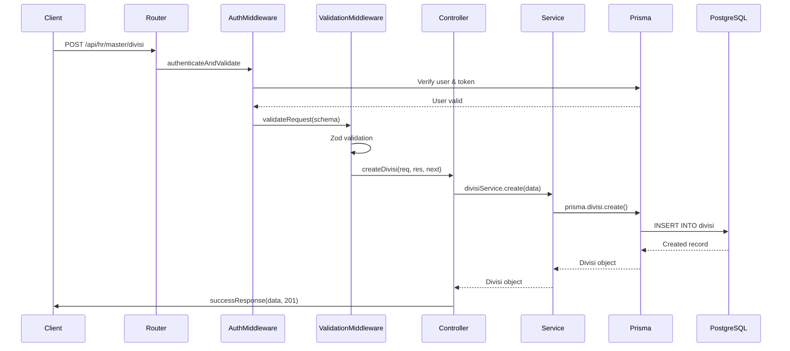

I have created the following plan after thorough exploration and analysis of the codebase. Follow the below plan verbatim. Trust the files and references. Do not re-verify what's written in the plan. Explore only when absolutely necessary. First implement all the proposed file changes and then I'll review all the changes together at the end.

## Observasi Kode

Backend sudah memiliki fondasi yang solid dengan Express.js, TypeScript, dan Prisma ORM. Service layer untuk semua 10 master data HR sudah lengkap dengan fungsi CRUD, filtering, searching, dan pagination. Validator Zod juga sudah siap. Yang tersisa adalah membuat controller layer, routing, validation middleware, API documentation, dan testing setup. Pattern yang digunakan mengikuti arsitektur MVC dengan service layer, menggunakan standardized response format, dan centralized error handling.

## Pendekatan Implementasi

Implementasi akan mengikuti pattern yang sudah ada di `file:backend/src/controllers/auth.controller.ts` dan `file:backend/src/routes/auth.routes.ts`. Akan dibuat satu controller dan route file untuk semua master data HR dengan endpoint yang konsisten. Validation middleware akan dibuat untuk menangani Zod validation secara reusable. Swagger/OpenAPI akan disetup untuk dokumentasi API. Testing menggunakan Jest untuk unit tests pada controller dan service layer.

## Langkah Implementasi

### 1. Buat Validation Middleware Helper

**File**: `file:backend/src/middleware/validation.middleware.ts`

Buat reusable middleware untuk validasi Zod schema:
- Function `validateRequest` yang menerima Zod schema sebagai parameter
- Validasi `req.body` untuk POST/PUT requests
- Validasi `req.query` untuk GET requests dengan query parameters
- Return error 400 dengan pesan validasi jika gagal
- Gunakan `next()` jika validasi berhasil

### 2. Buat HR Master Data Controller

**File**: `file:backend/src/controllers/hr-master.controller.ts`

Implementasi controller functions untuk semua 10 master data entities. Setiap entity memiliki 5 endpoints:

**Pattern untuk setiap entity** (contoh: Divisi):

- **`getAllDivisi`**: GET handler
  - Parse query params menggunakan `masterDataQuerySchema`
  - Call `divisiService.findAll()` dengan filters dan pagination
  - Return `paginatedResponse()` dengan data dan metadata
  - Handle errors dengan `next(error)`

- **`getDivisiById`**: GET by ID handler
  - Extract `id` dari `req.params`
  - Call `divisiService.findById(id)`
  - Throw `ApiError` 404 jika tidak ditemukan
  - Return `successResponse()` dengan data
  
- **`createDivisi`**: POST handler
  - Validate body sudah dilakukan di middleware
  - Call `divisiService.create(req.body)`
  - Return `successResponse()` dengan status 201
  - Handle Prisma unique constraint errors

- **`updateDivisi`**: PUT handler
  - Extract `id` dari `req.params`
  - Check existence dengan `findById`
  - Call `divisiService.update(id, req.body)`
  - Return `successResponse()` dengan data updated

- **`deleteDivisi`**: DELETE handler (soft delete)
  - Extract `id` dari `req.params`
  - Check existence dengan `findById`
  - Call `divisiService.softDelete(id)` untuk set status TIDAK_AKTIF
  - Return `successResponse()` dengan message

**Ulangi pattern yang sama untuk**:
- Department (dengan include divisi dan manager)
- PosisiJabatan (dengan include department)
- KategoriPangkat
- Golongan
- SubGolongan
- JenisHubunganKerja
- Tag
- LokasiKerja
- StatusKaryawan

**Error Handling**:
- Prisma `P2002` (unique constraint) → 409 Conflict
- Prisma `P2025` (record not found) → 404 Not Found
- Prisma `P2003` (foreign key constraint) → 400 Bad Request

### 3. Buat HR Master Data Routes

**File**: `file:backend/src/routes/hr-master.routes.ts`

Setup routing untuk semua master data endpoints dengan struktur RESTful:

**Base path**: `/api/hr/master`

**Route structure untuk setiap entity**:

```
GET    /divisi              → getAllDivisi
GET    /divisi/:id          → getDivisiById
POST   /divisi              → createDivisi
PUT    /divisi/:id          → updateDivisi
DELETE /divisi/:id          → deleteDivisi
```

**Middleware chain**:
- Semua routes: `authenticateAndValidate` (require login)
- POST routes: `validateRequest(createXxxSchema)`
- PUT routes: `validateRequest(updateXxxSchema)`
- GET list routes: `validateRequest(masterDataQuerySchema)` untuk query params

**Ulangi untuk semua entities**:
- `/divisi`
- `/department`
- `/posisi-jabatan`
- `/kategori-pangkat`
- `/golongan`
- `/sub-golongan`
- `/jenis-hubungan-kerja`
- `/tag`
- `/lokasi-kerja`
- `/status-karyawan`

Export router sebagai default export.

### 4. Register Routes di Main App

**File**: `file:backend/src/index.ts`

Tambahkan setelah auth routes (line 57):
- Import `hrMasterRoutes` dari `./routes/hr-master.routes`
- Register dengan `app.use('/api/hr/master', hrMasterRoutes)`

### 5. Setup Swagger/OpenAPI Documentation

**Install dependencies**:
- `swagger-ui-express`
- `@types/swagger-ui-express`
- `swagger-jsdoc`
- `@types/swagger-jsdoc`

**File**: `file:backend/src/config/swagger.ts`

Setup Swagger configuration:
- Define OpenAPI 3.0 specification
- Server: `http://localhost:3001`
- Info: title, version, description
- Security: Bearer JWT authentication
- Components: schemas untuk semua master data entities
- Tags: Auth, HR Master Data

**File**: `file:backend/src/docs/swagger.json` atau inline JSDoc comments

Dokumentasi untuk setiap endpoint:
- Path, method, summary, description
- Request body schema (untuk POST/PUT)
- Query parameters (untuk GET list)
- Response schemas (success dan error)
- Security requirements
- Tags untuk grouping

**Update**: `file:backend/src/index.ts`
- Import swagger setup
- Add route `/api-docs` untuk Swagger UI
- Serve Swagger JSON di `/api-docs.json`

### 6. Setup Testing Framework

**Install dependencies**:
- `jest`
- `@types/jest`
- `ts-jest`
- `supertest`
- `@types/supertest`

**File**: `file:backend/jest.config.js`

Configure Jest:
- Preset: `ts-jest`
- Test environment: `node`
- Test match: `**/*.test.ts`
- Coverage directory: `coverage`
- Setup files: untuk mock Prisma

**File**: `file:backend/src/__mocks__/prisma.ts`

Mock Prisma client untuk testing:
- Mock semua Prisma methods (findMany, findUnique, create, update, etc.)
- Return mock data sesuai schema

### 7. Buat Unit Tests untuk Controllers

**File**: `file:backend/src/controllers/__tests__/hr-master.controller.test.ts`

Test suite untuk setiap entity controller:

**Test cases untuk Divisi** (contoh):

- **GET /divisi**:
  - ✓ Should return paginated list of divisi
  - ✓ Should filter by status AKTIF
  - ✓ Should search by namaDivisi
  - ✓ Should handle pagination correctly
  - ✓ Should return empty array when no data

- **GET /divisi/:id**:
  - ✓ Should return divisi by id
  - ✓ Should return 404 when divisi not found
  - ✓ Should return 400 for invalid UUID

- **POST /divisi**:
  - ✓ Should create new divisi
  - ✓ Should return 400 for validation errors
  - ✓ Should return 409 for duplicate namaDivisi
  - ✓ Should set default status to AKTIF

- **PUT /divisi/:id**:
  - ✓ Should update divisi
  - ✓ Should return 404 when divisi not found
  - ✓ Should handle partial updates

- **DELETE /divisi/:id**:
  - ✓ Should soft delete divisi (set status TIDAK_AKTIF)
  - ✓ Should return 404 when divisi not found

**Ulangi test suite untuk entities lainnya** dengan fokus pada:
- Department: test foreign key ke divisi dan manager
- PosisiJabatan: test foreign key ke department
- Tag: test validasi hex color format

### 8. Buat Integration Tests untuk Routes

**File**: `file:backend/src/routes/__tests__/hr-master.routes.test.ts`

Test suite untuk routing dan middleware:

- ✓ Should require authentication for all endpoints
- ✓ Should validate request body for POST/PUT
- ✓ Should validate query params for GET list
- ✓ Should return 404 for non-existent routes
- ✓ Should handle CORS correctly
- ✓ Should return proper error format

### 9. Update Package.json Scripts

**File**: `file:backend/package.json`

Tambahkan test scripts:
- `"test"`: `"jest"`
- `"test:watch"`: `"jest --watch"`
- `"test:coverage"`: `"jest --coverage"`
- `"test:verbose"`: `"jest --verbose"`

### 10. Buat API Documentation README

**File**: `file:backend/docs/HR_MASTER_API.md`

Dokumentasi lengkap untuk HR Master Data API:

**Struktur dokumentasi**:
- Overview dan base URL
- Authentication (Bearer token)
- Common response format
- Error codes dan messages
- Pagination format

**Untuk setiap entity**:
- Endpoint list dengan method dan path
- Request/response examples (JSON)
- Query parameters untuk filtering
- Validation rules
- Business rules (e.g., soft delete)

**Examples**:
```json
// GET /api/hr/master/divisi?status=AKTIF&page=1&limit=10
// POST /api/hr/master/divisi
// PUT /api/hr/master/divisi/:id
// DELETE /api/hr/master/divisi/:id
```

### 11. Testing dan Validation

**Manual testing checklist**:
- Test semua endpoints dengan Postman/Thunder Client
- Verify authentication middleware berfungsi
- Test validation errors return proper messages
- Test pagination dengan berbagai limit values
- Test search functionality case-insensitive
- Test foreign key constraints (department → divisi)
- Test soft delete tidak menghapus data dari database
- Verify Swagger UI accessible di `/api-docs`

**Automated testing**:
- Run `npm test` untuk semua unit tests
- Verify coverage minimal 80% untuk controllers
- Run integration tests untuk routes
- Check no TypeScript errors dengan `npm run build`

## Diagram Arsitektur API



## Struktur Endpoint API

| Entity | Base Path | Endpoints |
|--------|-----------|-----------|
| Divisi | `/api/hr/master/divisi` | GET, GET/:id, POST, PUT/:id, DELETE/:id |
| Department | `/api/hr/master/department` | GET, GET/:id, POST, PUT/:id, DELETE/:id |
| Posisi Jabatan | `/api/hr/master/posisi-jabatan` | GET, GET/:id, POST, PUT/:id, DELETE/:id |
| Kategori Pangkat | `/api/hr/master/kategori-pangkat` | GET, GET/:id, POST, PUT/:id, DELETE/:id |
| Golongan | `/api/hr/master/golongan` | GET, GET/:id, POST, PUT/:id, DELETE/:id |
| Sub Golongan | `/api/hr/master/sub-golongan` | GET, GET/:id, POST, PUT/:id, DELETE/:id |
| Jenis Hubungan Kerja | `/api/hr/master/jenis-hubungan-kerja` | GET, GET/:id, POST, PUT/:id, DELETE/:id |
| Tag | `/api/hr/master/tag` | GET, GET/:id, POST, PUT/:id, DELETE/:id |
| Lokasi Kerja | `/api/hr/master/lokasi-kerja` | GET, GET/:id, POST, PUT/:id, DELETE/:id |
| Status Karyawan | `/api/hr/master/status-karyawan` | GET, GET/:id, POST, PUT/:id, DELETE/:id |

## Response Format Standard

**Success Response**:
```json
{
  "success": true,
  "data": { ... },
  "message": "Optional success message"
}
```

**Paginated Response**:
```json
{
  "success": true,
  "data": [...],
  "meta": {
    "page": 1,
    "limit": 10,
    "total": 50,
    "totalPages": 5
  }
}
```

**Error Response**:
```json
{
  "success": false,
  "error": {
    "message": "Error message",
    "stack": "Stack trace (dev only)"
  }
}
```