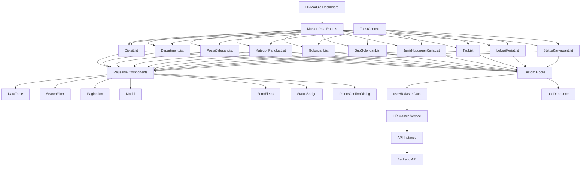

I have created the following plan after thorough exploration and analysis of the codebase. Follow the below plan verbatim. Trust the files and references. Do not re-verify what's written in the plan. Explore only when absolutely necessary. First implement all the proposed file changes and then I'll review all the changes together at the end.

## Observasi Kode

Backend sudah lengkap dengan 10 CRUD API endpoints untuk master data HR (Divisi, Department, Posisi Jabatan, Kategori Pangkat, Golongan, Sub Golongan, Jenis Hubungan Kerja, Tag, Lokasi Kerja, Status Karyawan). Frontend menggunakan React + TypeScript + Tailwind CSS dengan struktur modular yang baik. Desain UI menunjukkan pola konsisten: tabel dengan search/filter, modal untuk form, pagination, dan status badges. HRModule saat ini hanya placeholder yang perlu dikembangkan menjadi sistem master data lengkap.

## Pendekatan Implementasi

Implementasi akan menggunakan pendekatan **component-driven development** dengan membuat komponen reusable terlebih dahulu (Table, Modal, Form, Pagination) untuk menghindari duplikasi kode. Setiap master data akan memiliki struktur yang sama namun dengan konfigurasi berbeda. Routing akan menggunakan nested routes di dalam `/hr/*` untuk navigasi antar master data. State management menggunakan React hooks dengan custom hooks untuk data fetching. Integrasi dengan backend API yang sudah ada menggunakan axios instance yang sudah dikonfigurasi.

## Langkah Implementasi

### 1. Setup Struktur Folder dan Routing HR Module

Buat struktur folder untuk HR module di `frontend/src/pages/hr/`:
- `frontend/src/pages/hr/master-data/` - untuk semua halaman master data
- `frontend/src/pages/hr/components/` - untuk komponen khusus HR
- `frontend/src/services/hr-master.service.ts` - untuk API calls

Update `file:frontend/src/pages/modules/HRModule.tsx` untuk menggunakan nested routing dengan React Router:
- Route `/hr/master-data/divisi` untuk Divisi List
- Route `/hr/master-data/department` untuk Department List
- Route `/hr/master-data/posisi-jabatan` untuk Posisi Jabatan List
- Route `/hr/master-data/kategori-pangkat` untuk Kategori Pangkat List
- Route `/hr/master-data/golongan` untuk Golongan List
- Route `/hr/master-data/sub-golongan` untuk Sub Golongan List
- Route `/hr/master-data/jenis-hubungan-kerja` untuk Jenis Hubungan Kerja List
- Route `/hr/master-data/tag` untuk Tag Management
- Route `/hr/master-data/lokasi-kerja` untuk Lokasi Kerja List
- Route `/hr/master-data/status-karyawan` untuk Status Karyawan List

Buat dashboard/landing page untuk HR module dengan card shortcuts ke setiap master data.

### 2. Buat Reusable Components untuk Master Data

#### 2.1 DataTable Component (`frontend/src/components/common/DataTable.tsx`)

Buat komponen tabel generik dengan props:
- `columns`: array definisi kolom (header, accessor, render function)
- `data`: array data yang akan ditampilkan
- `loading`: boolean untuk loading state
- `onEdit`: callback untuk edit action
- `onDelete`: callback untuk delete action
- `sortable`: boolean untuk enable sorting
- `onSort`: callback untuk sorting

Fitur:
- Hover effect pada row
- Action buttons (edit, delete) di kolom terakhir
- Empty state ketika tidak ada data
- Loading skeleton saat fetching data
- Responsive design

#### 2.2 SearchFilter Component (`frontend/src/components/common/SearchFilter.tsx`)

Buat komponen search dan filter dengan props:
- `onSearch`: callback untuk search
- `onFilterStatus`: callback untuk filter status
- `placeholder`: text placeholder untuk search input
- `showStatusFilter`: boolean untuk show/hide status filter

Fitur:
- Search input dengan icon search
- Dropdown filter status (Semua Status, Aktif, Tidak Aktif)
- Debounce pada search input (300ms)
- Clear search button

#### 2.3 Pagination Component (`frontend/src/components/common/Pagination.tsx`)

Buat komponen pagination dengan props:
- `currentPage`: halaman saat ini
- `totalPages`: total halaman
- `totalItems`: total items
- `itemsPerPage`: jumlah items per halaman
- `onPageChange`: callback untuk change page
- `onLimitChange`: callback untuk change limit

Fitur:
- Previous/Next buttons
- Page number buttons (max 5 visible)
- Info text "Showing X to Y of Z entries"
- Dropdown untuk change items per page (10, 25, 50, 100)

#### 2.4 Modal Component (`frontend/src/components/common/Modal.tsx`)

Buat komponen modal generik dengan props:
- `isOpen`: boolean untuk show/hide modal
- `onClose`: callback untuk close modal
- `title`: judul modal
- `children`: konten modal
- `size`: ukuran modal (sm, md, lg, xl)
- `footer`: custom footer content

Fitur:
- Backdrop dengan blur effect
- Close button di header
- Close on backdrop click
- Close on ESC key
- Animation fade in/out
- Prevent body scroll saat modal open

#### 2.5 FormField Components

Buat komponen form field reusable:
- `TextInput.tsx`: input text dengan label, error message, validation
- `TextArea.tsx`: textarea dengan label, error message
- `Select.tsx`: dropdown select dengan label, search functionality
- `ColorPicker.tsx`: color picker dengan preview (khusus untuk Tag)
- `StatusToggle.tsx`: toggle untuk status Aktif/Tidak Aktif

Semua menggunakan React Hook Form untuk validation dan state management.

#### 2.6 StatusBadge Component (`frontend/src/components/common/StatusBadge.tsx`)

Buat komponen badge untuk status dengan props:
- `status`: 'AKTIF' | 'TIDAK_AKTIF'
- `size`: 'sm' | 'md' | 'lg'

Styling:
- Aktif: green background dengan green text
- Tidak Aktif: gray background dengan gray text
- Support dark mode

#### 2.7 DeleteConfirmDialog Component (`frontend/src/components/common/DeleteConfirmDialog.tsx`)

Buat komponen dialog konfirmasi delete dengan props:
- `isOpen`: boolean
- `onClose`: callback
- `onConfirm`: callback
- `itemName`: nama item yang akan dihapus
- `loading`: boolean untuk loading state saat delete

Fitur:
- Warning icon
- Pesan konfirmasi yang jelas
- Cancel dan Delete buttons
- Loading state pada Delete button

### 3. Buat Custom Hooks untuk Data Management

#### 3.1 useHRMasterData Hook (`frontend/src/hooks/useHRMasterData.ts`)

Buat custom hook generik untuk CRUD operations:
- `useHRMasterData(entityType)` - entityType: 'divisi' | 'department' | dll

Return values:
- `data`: array data
- `loading`: boolean
- `error`: error object
- `meta`: pagination metadata
- `fetchData(params)`: function untuk fetch dengan filter/search/pagination
- `createItem(data)`: function untuk create
- `updateItem(id, data)`: function untuk update
- `deleteItem(id)`: function untuk delete
- `refetch()`: function untuk refresh data

Implementasi:
- Menggunakan useState untuk state management
- Menggunakan useEffect untuk initial fetch
- Error handling dengan try-catch
- Toast notification untuk success/error messages

#### 3.2 useDebounce Hook (`frontend/src/hooks/useDebounce.ts`)

Buat hook untuk debounce search input dengan delay 300ms.

### 4. Buat Service Layer untuk API Calls

#### 4.1 HR Master Service (`frontend/src/services/hr-master.service.ts`)

Buat service functions untuk semua master data entities:

```typescript
// Generic CRUD functions
getAll(entity, params) // GET /api/hr-master/{entity}?search=&status=&page=&limit=
getById(entity, id) // GET /api/hr-master/{entity}/:id
create(entity, data) // POST /api/hr-master/{entity}
update(entity, id, data) // PUT /api/hr-master/{entity}/:id
delete(entity, id) // DELETE /api/hr-master/{entity}/:id

// Specific functions untuk entities dengan relasi
getDepartmentsByDivisi(divisiId) // untuk dropdown department berdasarkan divisi
getPosisiJabatanByDepartment(departmentId) // untuk dropdown posisi jabatan
```

Semua menggunakan axios instance dari `file:frontend/src/services/api.ts` yang sudah ada.

### 5. Implementasi Halaman Master Data

Untuk setiap master data, buat 3 komponen utama:

#### 5.1 Divisi Management

**File: `frontend/src/pages/hr/master-data/DivisiList.tsx`**

Komponen utama:
- Breadcrumb: Master Data > Divisi
- Page header dengan title "Divisi List" dan button "Tambah Divisi"
- SearchFilter component
- DataTable component dengan kolom: Nama Divisi, Keterangan, Status, Aksi
- Pagination component
- DivisiFormModal component (create/edit)
- DeleteConfirmDialog component

State management:
- `divisiList`: array data divisi
- `loading`: loading state
- `searchTerm`: search keyword
- `statusFilter`: filter status
- `currentPage`: current page number
- `limit`: items per page
- `isModalOpen`: modal visibility
- `selectedDivisi`: divisi yang sedang diedit (null untuk create)
- `isDeleteDialogOpen`: delete dialog visibility

Integrasi:
- Fetch data menggunakan `useHRMasterData('divisi')`
- Search dan filter trigger refetch dengan debounce
- Pagination trigger refetch dengan page/limit params
- Create/Edit submit call API dan refetch data
- Delete confirm call API dan refetch data

**File: `frontend/src/pages/hr/master-data/components/DivisiFormModal.tsx`**

Form fields:
- Nama Divisi (required, text input)
- Keterangan (optional, textarea)
- Status (required, select: Aktif/Tidak Aktif, default: Aktif)

Validation menggunakan React Hook Form + Zod schema:
- Nama Divisi: min 3 characters, max 100 characters
- Keterangan: max 500 characters

#### 5.2 Department Management

**File: `frontend/src/pages/hr/master-data/DepartmentList.tsx`**

Similar dengan DivisiList, dengan kolom tambahan:
- Nama Department, Nama Manager, Divisi, Keterangan, Status, Aksi

**File: `frontend/src/pages/hr/master-data/components/DepartmentFormModal.tsx`**

Form fields:
- Nama Department (required)
- Nama Manager (optional, searchable select dari karyawan aktif)
- Divisi (required, select dari divisi aktif)
- Keterangan (optional)
- Status (required, default: Aktif)

Fitur khusus:
- Dropdown Divisi fetch dari API divisi dengan status aktif
- Dropdown Manager fetch dari API karyawan dengan status aktif (akan diimplementasi di fase berikutnya, untuk saat ini bisa dikosongkan atau hardcode dummy data)

#### 5.3 Posisi Jabatan Management

**File: `frontend/src/pages/hr/master-data/PosisiJabatanList.tsx`**

Kolom: Nama Posisi Jabatan, Department, Keterangan, Status, Aksi

**File: `frontend/src/pages/hr/master-data/components/PosisiJabatanFormModal.tsx`**

Form fields:
- Nama Posisi Jabatan (required)
- Department (required, select dari department aktif)
- Keterangan (optional)
- Status (required)

#### 5.4 Kategori Pangkat Management

**File: `frontend/src/pages/hr/master-data/KategoriPangkatList.tsx`**

Kolom: Nama Kategori Pangkat, Keterangan, Status, Aksi

**File: `frontend/src/pages/hr/master-data/components/KategoriPangkatFormModal.tsx`**

Form fields:
- Nama Kategori Pangkat (required)
- Keterangan (optional)
- Status (required)

#### 5.5 Golongan Management

**File: `frontend/src/pages/hr/master-data/GolonganList.tsx`**

Kolom: Nama Golongan, Keterangan, Status, Aksi

**File: `frontend/src/pages/hr/master-data/components/GolonganFormModal.tsx`**

Form fields:
- Nama Golongan (required)
- Keterangan (optional)
- Status (required)

#### 5.6 Sub Golongan Management

**File: `frontend/src/pages/hr/master-data/SubGolonganList.tsx`**

Kolom: Nama Sub Golongan, Keterangan, Status, Aksi

**File: `frontend/src/pages/hr/master-data/components/SubGolonganFormModal.tsx`**

Form fields:
- Nama Sub Golongan (required)
- Keterangan (optional)
- Status (required)

#### 5.7 Jenis Hubungan Kerja Management

**File: `frontend/src/pages/hr/master-data/JenisHubunganKerjaList.tsx`**

Kolom: Nama Jenis Hubungan Kerja, Keterangan, Status, Aksi

**File: `frontend/src/pages/hr/master-data/components/JenisHubunganKerjaFormModal.tsx`**

Form fields:
- Nama Jenis Hubungan Kerja (required)
- Keterangan (optional)
- Status (required)

#### 5.8 Tag Management

**File: `frontend/src/pages/hr/master-data/TagList.tsx`**

Kolom: Nama Tag, Warna Tag (dengan color preview), Keterangan, Status, Aksi

Fitur khusus:
- Kolom Warna Tag menampilkan color badge dengan preview warna dan hex code
- Sesuai desain `file:desain-ui-ux/hr_master_data_-_tag_management/code.html`

**File: `frontend/src/pages/hr/master-data/components/TagFormModal.tsx`**

Form fields:
- Nama Tag (required)
- Warna Tag (required, color picker dengan preview)
- Keterangan (optional)
- Status (required)

Fitur khusus:
- Color picker dengan input hex code
- Live preview tag dengan warna yang dipilih
- Validasi hex color format

#### 5.9 Lokasi Kerja Management

**File: `frontend/src/pages/hr/master-data/LokasiKerjaList.tsx`**

Kolom: Nama Lokasi Kerja, Alamat, Keterangan, Status, Aksi

**File: `frontend/src/pages/hr/master-data/components/LokasiKerjaFormModal.tsx`**

Form fields:
- Nama Lokasi Kerja (required)
- Alamat (required, textarea)
- Keterangan (optional)
- Status (required)

#### 5.10 Status Karyawan Management

**File: `frontend/src/pages/hr/master-data/StatusKaryawanList.tsx`**

Kolom: Nama Status, Keterangan, Status, Aksi

**File: `frontend/src/pages/hr/master-data/components/StatusKaryawanFormModal.tsx`**

Form fields:
- Nama Status (required)
- Keterangan (optional)
- Status (required)

### 6. Update HR Module Dashboard

**File: `frontend/src/pages/modules/HRModule.tsx`**

Update dari placeholder menjadi dashboard dengan:
- Breadcrumb navigation
- Page header "Human Resources Module"
- Grid cards untuk quick access ke master data (3-4 kolom):
  - Divisi
  - Department
  - Posisi Jabatan
  - Kategori Pangkat
  - Golongan
  - Sub Golongan
  - Jenis Hubungan Kerja
  - Tag
  - Lokasi Kerja
  - Status Karyawan

Setiap card:
- Icon yang sesuai (Material Symbols)
- Nama master data
- Jumlah total records (fetch dari API)
- Link ke halaman list

### 7. Implementasi Toast Notification System

**File: `frontend/src/components/common/Toast.tsx`**

Buat toast notification component dengan:
- Success, Error, Warning, Info variants
- Auto dismiss setelah 3 detik
- Close button
- Animation slide in from right
- Support multiple toasts (stack)

**File: `frontend/src/contexts/ToastContext.tsx`**

Buat context untuk global toast management:
- `showToast(message, type)` function
- Toast queue management
- Auto dismiss timer

### 8. Error Handling dan Loading States

Implementasi di semua halaman master data:

**Loading States:**
- Skeleton loader untuk table saat fetching data
- Loading spinner pada buttons saat submit
- Disabled state pada form saat loading

**Error Handling:**
- Try-catch pada semua API calls
- Display error message menggunakan toast
- Fallback UI untuk error state
- Retry button untuk failed requests

**Empty States:**
- Custom empty state component saat tidak ada data
- Ilustrasi atau icon
- Message yang informatif
- Call-to-action button (Tambah Data)

### 9. Responsive Design

Pastikan semua halaman responsive:
- Mobile: stack layout, hamburger menu
- Tablet: 2 kolom grid untuk cards
- Desktop: 3-4 kolom grid untuk cards
- Table: horizontal scroll pada mobile
- Modal: full screen pada mobile

### 10. Testing dan Refinement

**Manual Testing:**
- Test semua CRUD operations untuk setiap master data
- Test search dan filter functionality
- Test pagination
- Test form validation
- Test error scenarios (network error, validation error)
- Test responsive design di berbagai device
- Test dark mode compatibility

**Performance Optimization:**
- Implement React.memo untuk komponen yang sering re-render
- Debounce search input
- Lazy load modal components
- Optimize re-renders dengan useCallback dan useMemo

**Accessibility:**
- Keyboard navigation support
- ARIA labels untuk screen readers
- Focus management pada modal
- Proper form labels

### 11. Documentation

Buat dokumentasi untuk developer:
- README untuk HR module structure
- Component usage examples
- API integration guide
- Styling guidelines (Tailwind classes yang digunakan)

## Diagram Arsitektur



## Struktur File Akhir

```
frontend/src/
├── components/
│   ├── common/
│   │   ├── DataTable.tsx
│   │   ├── SearchFilter.tsx
│   │   ├── Pagination.tsx
│   │   ├── Modal.tsx
│   │   ├── StatusBadge.tsx
│   │   ├── DeleteConfirmDialog.tsx
│   │   ├── Toast.tsx
│   │   └── form/
│   │       ├── TextInput.tsx
│   │       ├── TextArea.tsx
│   │       ├── Select.tsx
│   │       ├── ColorPicker.tsx
│   │       └── StatusToggle.tsx
│   └── layout/ (existing)
├── contexts/
│   ├── ToastContext.tsx
│   ├── AuthContext.tsx (existing)
│   └── ThemeContext.tsx (existing)
├── hooks/
│   ├── useHRMasterData.ts
│   └── useDebounce.ts
├── pages/
│   ├── hr/
│   │   ├── master-data/
│   │   │   ├── DivisiList.tsx
│   │   │   ├── DepartmentList.tsx
│   │   │   ├── PosisiJabatanList.tsx
│   │   │   ├── KategoriPangkatList.tsx
│   │   │   ├── GolonganList.tsx
│   │   │   ├── SubGolonganList.tsx
│   │   │   ├── JenisHubunganKerjaList.tsx
│   │   │   ├── TagList.tsx
│   │   │   ├── LokasiKerjaList.tsx
│   │   │   ├── StatusKaryawanList.tsx
│   │   │   └── components/
│   │   │       ├── DivisiFormModal.tsx
│   │   │       ├── DepartmentFormModal.tsx
│   │   │       ├── PosisiJabatanFormModal.tsx
│   │   │       ├── KategoriPangkatFormModal.tsx
│   │   │       ├── GolonganFormModal.tsx
│   │   │       ├── SubGolonganFormModal.tsx
│   │   │       ├── JenisHubunganKerjaFormModal.tsx
│   │   │       ├── TagFormModal.tsx
│   │   │       ├── LokasiKerjaFormModal.tsx
│   │   │       └── StatusKaryawanFormModal.tsx
│   │   └── HRDashboard.tsx
│   └── modules/
│       └── HRModule.tsx (updated)
├── services/
│   ├── hr-master.service.ts
│   ├── api.ts (existing)
│   └── auth.service.ts (existing)
└── types/
    └── hr-master.types.ts
```

## Catatan Penting

1. **Konsistensi UI**: Semua halaman master data menggunakan komponen yang sama untuk konsistensi tampilan dan behavior
2. **Reusability**: Komponen dibuat generik dan reusable untuk menghindari duplikasi kode
3. **Type Safety**: Gunakan TypeScript interfaces untuk semua data types
4. **Error Handling**: Implementasi error handling yang comprehensive di semua API calls
5. **User Feedback**: Gunakan toast notifications untuk semua actions (create, update, delete)
6. **Loading States**: Tampilkan loading indicators untuk semua async operations
7. **Validation**: Client-side validation menggunakan React Hook Form + Zod sebelum submit ke API
8. **Dark Mode**: Pastikan semua komponen support dark mode sesuai ThemeContext yang sudah ada
9. **Accessibility**: Implementasi keyboard navigation dan ARIA labels
10. **Performance**: Optimize dengan React.memo, useCallback, useMemo untuk komponen yang sering re-render