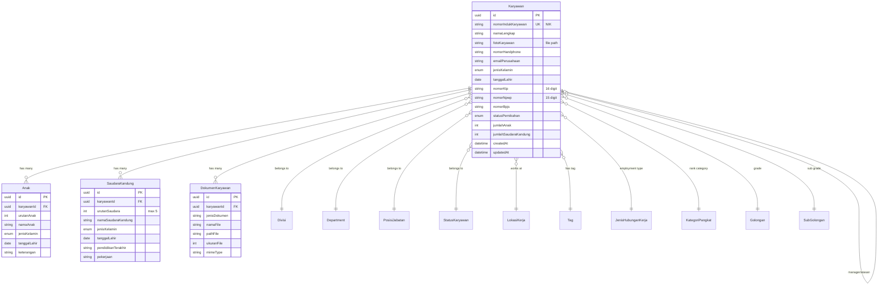

I have created the following plan after thorough exploration and analysis of the codebase. Follow the below plan verbatim. Trust the files and references. Do not re-verify what's written in the plan. Explore only when absolutely necessary. First implement all the proposed file changes and then I'll review all the changes together at the end.

## Observasi Kode

Berdasarkan eksplorasi codebase, sistem menggunakan **Prisma ORM** dengan **PostgreSQL**, **TypeScript**, dan **Zod** untuk validasi. Pattern yang sudah diterapkan:
- UUID sebagai primary key dengan `@default(uuid())`
- Timestamps `createdAt` dan `updatedAt` otomatis
- Enum `StatusMaster` untuk status aktif/tidak aktif
- Foreign keys dengan relasi Prisma
- DTOs terpisah untuk Create/Update operations
- Validation schemas menggunakan Zod dengan pattern regex untuk field kompleks
- Seeding menggunakan `upsert` untuk idempotency
- Master data sudah lengkap (divisi, department, posisi_jabatan, dll)

## Pendekatan

Implementasi database schema karyawan akan mengikuti **normalized database design** dengan memisahkan data repeatable (anak, saudara kandung) ke tabel terpisah untuk menghindari redundansi. File upload akan menggunakan **local file storage** dengan path disimpan di database. Schema akan dirancang dengan **referential integrity** yang ketat menggunakan foreign keys ke master data, dan **validation rules** komprehensif untuk field kompleks (NIK, NPWP, email, phone). Pendekatan ini memastikan data consistency, scalability, dan kemudahan maintenance.

## Langkah Implementasi

### 1. Persiapan Dependencies dan Konfigurasi

**Install dependencies untuk file upload:**
```bash
npm install multer
npm install --save-dev @types/multer
```

**Update file:backend\.env.example dengan konfigurasi file upload:**
```
UPLOAD_DIR=uploads
MAX_FILE_SIZE=5242880
ALLOWED_IMAGE_TYPES=image/jpeg,image/png,image/jpg
ALLOWED_DOCUMENT_TYPES=application/pdf,application/msword,application/vnd.openxmlformats-officedocument.wordprocessingml.document
```

**Buat folder struktur untuk file uploads:**
```
backend/
  uploads/
    employees/
      photos/
      documents/
```

### 2. Definisi Prisma Schema untuk Karyawan

**Update file:backend\prisma\schema.prisma dengan model-model berikut:**

#### A. Enum untuk Karyawan
Tambahkan enums baru setelah `StatusMaster`:
- `JenisKelamin`: LAKI_LAKI, PEREMPUAN
- `Agama`: ISLAM, KRISTEN, KATOLIK, HINDU, BUDDHA, KONGHUCU
- `GolonganDarah`: A, B, AB, O
- `StatusPernikahan`: BELUM_MENIKAH, MENIKAH, CERAI_HIDUP, CERAI_MATI
- `StatusKelulusan`: LULUS, TIDAK_LULUS, SEDANG_BELAJAR
- `TingkatPendidikan`: SD, SMP, SMA, D3, S1, S2, S3

#### B. Model Karyawan (Main Table)
Buat model `Karyawan` dengan struktur:

**Head Section Fields:**
- `id`: String @id @default(uuid())
- `fotoKaryawan`: String? (path to file)
- `namaLengkap`: String
- `nomorIndukKaryawan`: String @unique (NIK karyawan)
- `divisiId`: String? (FK ke Divisi)
- `departmentId`: String? (FK ke Department)
- `managerId`: String? (FK ke Karyawan - self reference)
- `atasanLangsungId`: String? (FK ke Karyawan - self reference)
- `posisiJabatanId`: String? (FK ke PosisiJabatan)
- `emailPerusahaan`: String?
- `nomorHandphone`: String
- `statusKaryawanId`: String? (FK ke StatusKaryawan)
- `lokasiKerjaId`: String? (FK ke LokasiKerja)
- `tagId`: String? (FK ke Tag)

**Personal Information Fields:**
- `jenisKelamin`: JenisKelamin?
- `tempatLahir`: String?
- `tanggalLahir`: DateTime?
- `emailPribadi`: String?
- `agama`: Agama?
- `golonganDarah`: GolonganDarah?
- `nomorKartuKeluarga`: String?
- `nomorKtp`: String?
- `nomorNpwp`: String?
- `nomorBpjs`: String?
- `noNikKk`: String?
- `statusPajak`: String?
- `alamatDomisili`: String?
- `kotaDomisili`: String?
- `provinsiDomisili`: String?
- `alamatKtp`: String?
- `kotaKtp`: String?
- `provinsiKtp`: String?
- `nomorHandphone1`: String? (reference dari head)
- `nomorHandphone2`: String?
- `nomorTeleponRumah1`: String?
- `nomorTeleponRumah2`: String?
- `statusPernikahan`: StatusPernikahan?
- `namaPasangan`: String?
- `tanggalMenikah`: DateTime?
- `tanggalCerai`: DateTime?
- `tanggalWafatPasangan`: DateTime?
- `pekerjaanPasangan`: String?
- `jumlahAnak`: Int? @default(0)
- `nomorRekening`: String?
- `namaPemegangRekening`: String?
- `namaBank`: String?
- `cabangBank`: String?

**HR Information Fields:**
- `jenisHubunganKerjaId`: String? (FK ke JenisHubunganKerja)
- `tanggalMasukGroup`: DateTime?
- `tanggalMasuk`: DateTime?
- `tanggalPermanent`: DateTime?
- `tanggalKontrak`: DateTime?
- `tanggalAkhirKontrak`: DateTime?
- `tanggalBerhenti`: DateTime?
- `tingkatPendidikan`: TingkatPendidikan?
- `bidangStudi`: String?
- `namaSekolah`: String?
- `kotaSekolah`: String?
- `statusKelulusan`: StatusKelulusan?
- `keteranganPendidikan`: String?
- `kategoriPangkatId`: String? (FK ke KategoriPangkat)
- `golonganPangkatId`: String? (FK ke Golongan)
- `subGolonganPangkatId`: String? (FK ke SubGolongan)
- `noDanaPensiun`: String?
- `namaKontakDarurat1`: String?
- `nomorTeleponKontakDarurat1`: String?
- `hubunganKontakDarurat1`: String?
- `alamatKontakDarurat1`: String?
- `namaKontakDarurat2`: String?
- `nomorTeleponKontakDarurat2`: String?
- `hubunganKontakDarurat2`: String?
- `alamatKontakDarurat2`: String?
- `pointOfOriginal`: String?
- `pointOfHire`: String?
- `ukuranSeragamKerja`: String?
- `ukuranSepatuKerja`: String?
- `lokasiSebelumnyaId`: String? (FK ke LokasiKerja)
- `tanggalMutasi`: DateTime?
- `siklusPembayaranGaji`: String?
- `costing`: String?
- `assign`: String?
- `actual`: String?

**Family Information Fields:**
- `tanggalLahirPasangan`: DateTime?
- `pendidikanTerakhirPasangan`: String?
- `keteranganPasangan`: String?
- `anakKe`: Int?
- `jumlahSaudaraKandung`: Int? @default(0)
- `namaAyahMertua`: String?
- `tanggalLahirAyahMertua`: DateTime?
- `pendidikanTerakhirAyahMertua`: String?
- `keteranganAyahMertua`: String?
- `namaIbuMertua`: String?
- `tanggalLahirIbuMertua`: DateTime?
- `pendidikanTerakhirIbuMertua`: String?
- `keteranganIbuMertua`: String?

**Timestamps:**
- `createdAt`: DateTime @default(now())
- `updatedAt`: DateTime @updatedAt

**Relations:**
Definisikan relasi ke:
- `divisi`: Divisi?
- `department`: Department?
- `manager`: Karyawan? (self-reference)
- `atasanLangsung`: Karyawan? (self-reference)
- `posisiJabatan`: PosisiJabatan?
- `statusKaryawan`: StatusKaryawan?
- `lokasiKerja`: LokasiKerja?
- `tag`: Tag?
- `jenisHubunganKerja`: JenisHubunganKerja?
- `kategoriPangkat`: KategoriPangkat?
- `golonganPangkat`: Golongan?
- `subGolonganPangkat`: SubGolongan?
- `lokasiSebelumnya`: LokasiKerja?
- `anak`: Anak[] (one-to-many)
- `saudaraKandung`: SaudaraKandung[] (one-to-many)
- `dokumen`: DokumenKaryawan[] (one-to-many)
- `bawahanAsManager`: Karyawan[] (reverse relation)
- `bawahanAsAtasan`: Karyawan[] (reverse relation)

**Mapping:**
```prisma
@@map("karyawan")
```

#### C. Model Anak (Repeatable Data)
```prisma
model Anak {
  id                String       @id @default(uuid())
  karyawanId        String
  urutanAnak        Int          // 1, 2, 3, dst
  namaAnak          String
  jenisKelamin      JenisKelamin
  tanggalLahir      DateTime
  keterangan        String?
  createdAt         DateTime     @default(now())
  updatedAt         DateTime     @updatedAt
  
  // Relations
  karyawan          Karyawan     @relation(fields: [karyawanId], references: [id], onDelete: Cascade)
  
  @@unique([karyawanId, urutanAnak])
  @@map("anak")
}
```

#### D. Model SaudaraKandung (Repeatable Data, Max 5)
```prisma
model SaudaraKandung {
  id                      String       @id @default(uuid())
  karyawanId              String
  urutanSaudara           Int          // 1-5
  namaSaudaraKandung      String
  jenisKelamin            JenisKelamin
  tanggalLahir            DateTime?
  pendidikanTerakhir      String?
  pekerjaan               String?
  keterangan              String?
  createdAt               DateTime     @default(now())
  updatedAt               DateTime     @updatedAt
  
  // Relations
  karyawan                Karyawan     @relation(fields: [karyawanId], references: [id], onDelete: Cascade)
  
  @@unique([karyawanId, urutanSaudara])
  @@map("saudara_kandung")
}
```

#### E. Model DokumenKaryawan (File Upload Tracking)
```prisma
model DokumenKaryawan {
  id                String       @id @default(uuid())
  karyawanId        String
  jenisDokumen      String       // "KTP", "NPWP", "BPJS", "Ijazah", "Sertifikat", dll
  namaFile          String
  pathFile          String       // relative path dari upload directory
  ukuranFile        Int          // dalam bytes
  mimeType          String
  keterangan        String?
  createdAt         DateTime     @default(now())
  updatedAt         DateTime     @updatedAt
  
  // Relations
  karyawan          Karyawan     @relation(fields: [karyawanId], references: [id], onDelete: Cascade)
  
  @@map("dokumen_karyawan")
}
```

### 3. Generate dan Run Migration

**Generate migration:**
```bash
npx prisma migrate dev --name add_employee_management_schema
```

Prisma akan otomatis:
- Membuat file migration SQL di `file:backend\prisma\migrations\`
- Generate Prisma Client dengan types baru
- Apply migration ke database

**Verifikasi migration:**
```bash
npx prisma studio
```

### 4. Buat TypeScript Types dan DTOs

**Buat file:backend\src\types\employee.ts:**

#### A. Re-export Prisma Types
```typescript
export type {
  Karyawan,
  Anak,
  SaudaraKandung,
  DokumenKaryawan,
  JenisKelamin,
  Agama,
  GolonganDarah,
  StatusPernikahan,
  StatusKelulusan,
  TingkatPendidikan,
} from '@prisma/client';
```

#### B. DTOs untuk Create Operations
Buat interfaces:
- `CreateKaryawanDTO`: Semua field karyawan (tanpa id, timestamps)
- `CreateAnakDTO`: Field untuk anak (tanpa id, timestamps, karyawanId)
- `CreateSaudaraKandungDTO`: Field untuk saudara kandung
- `CreateDokumenKaryawanDTO`: Field untuk dokumen

#### C. DTOs untuk Update Operations
```typescript
export type UpdateKaryawanDTO = Partial<CreateKaryawanDTO>;
export type UpdateAnakDTO = Partial<CreateAnakDTO>;
export type UpdateSaudaraKandungDTO = Partial<CreateSaudaraKandungDTO>;
```

#### D. Response DTOs
```typescript
export interface KaryawanDetailResponse extends Karyawan {
  divisi?: Divisi;
  department?: Department;
  posisiJabatan?: PosisiJabatan;
  statusKaryawan?: StatusKaryawan;
  lokasiKerja?: LokasiKerja;
  tag?: Tag;
  anak?: Anak[];
  saudaraKandung?: SaudaraKandung[];
  dokumen?: DokumenKaryawan[];
  manager?: Karyawan;
  atasanLangsung?: Karyawan;
}
```

#### E. Query/Filter Types
```typescript
export interface KaryawanQueryParams {
  search?: string;
  divisiId?: string;
  departmentId?: string;
  statusKaryawanId?: string;
  lokasiKerjaId?: string;
  tagId?: string;
  page?: number;
  limit?: number;
  sortBy?: 'namaLengkap' | 'nomorIndukKaryawan' | 'createdAt';
  sortOrder?: 'asc' | 'desc';
}
```

### 5. Buat Validation Schemas dengan Zod

**Buat file:backend\src\validators\employee.validator.ts:**

#### A. Common Patterns
```typescript
const nikPattern = /^\d{16}$/; // 16 digit
const npwpPattern = /^\d{15}$/; // 15 digit
const phonePattern = /^(\+62|62|0)[0-9]{9,12}$/;
const emailPattern = /^[^\s@]+@[^\s@]+\.[^\s@]+$/;
const hexColorPattern = /^#[0-9A-Fa-f]{6}$/;
```

#### B. Enum Schemas
Buat Zod enums untuk:
- `jenisKelaminEnum`: z.enum(['LAKI_LAKI', 'PEREMPUAN'])
- `agamaEnum`: z.enum(['ISLAM', 'KRISTEN', 'KATOLIK', 'HINDU', 'BUDDHA', 'KONGHUCU'])
- `golonganDarahEnum`: z.enum(['A', 'B', 'AB', 'O'])
- `statusPernikahanEnum`: z.enum(['BELUM_MENIKAH', 'MENIKAH', 'CERAI_HIDUP', 'CERAI_MATI'])
- `statusKelulusanEnum`: z.enum(['LULUS', 'TIDAK_LULUS', 'SEDANG_BELAJAR'])
- `tingkatPendidikanEnum`: z.enum(['SD', 'SMP', 'SMA', 'D3', 'S1', 'S2', 'S3'])

#### C. Karyawan Schema
```typescript
export const createKaryawanSchema = z.object({
  // Head Section - Required fields
  namaLengkap: z.string().min(1, 'Nama lengkap wajib diisi').max(200),
  nomorIndukKaryawan: z.string().min(1, 'NIK wajib diisi').max(50),
  nomorHandphone: z.string().regex(phonePattern, 'Format nomor handphone tidak valid'),
  
  // Head Section - Optional fields
  fotoKaryawan: z.string().optional(),
  divisiId: z.string().uuid().optional(),
  departmentId: z.string().uuid().optional(),
  managerId: z.string().uuid().optional(),
  atasanLangsungId: z.string().uuid().optional(),
  posisiJabatanId: z.string().uuid().optional(),
  emailPerusahaan: z.string().email('Format email tidak valid').optional(),
  statusKaryawanId: z.string().uuid().optional(),
  lokasiKerjaId: z.string().uuid().optional(),
  tagId: z.string().uuid().optional(),
  
  // Personal Information
  jenisKelamin: jenisKelaminEnum.optional(),
  tempatLahir: z.string().max(100).optional(),
  tanggalLahir: z.coerce.date().optional(),
  emailPribadi: z.string().email('Format email tidak valid').optional(),
  agama: agamaEnum.optional(),
  golonganDarah: golonganDarahEnum.optional(),
  nomorKartuKeluarga: z.string().max(16).optional(),
  nomorKtp: z.string().regex(nikPattern, 'NIK harus 16 digit').optional(),
  nomorNpwp: z.string().regex(npwpPattern, 'NPWP harus 15 digit').optional(),
  nomorBpjs: z.string().max(20).optional(),
  // ... (lanjutkan untuk semua field dengan validasi sesuai)
  
  // HR Information
  jenisHubunganKerjaId: z.string().uuid().optional(),
  tanggalMasukGroup: z.coerce.date().optional(),
  tanggalMasuk: z.coerce.date().optional(),
  // ... (lanjutkan untuk semua field HR)
  
  // Family Information
  statusPernikahan: statusPernikahanEnum.optional(),
  namaPasangan: z.string().max(200).optional(),
  jumlahAnak: z.number().int().min(0).max(20).optional(),
  jumlahSaudaraKandung: z.number().int().min(0).max(5).optional(),
  // ... (lanjutkan untuk semua field family)
});

export const updateKaryawanSchema = createKaryawanSchema.partial();
```

#### D. Anak Schema
```typescript
export const createAnakSchema = z.object({
  urutanAnak: z.number().int().min(1),
  namaAnak: z.string().min(1, 'Nama anak wajib diisi').max(200),
  jenisKelamin: jenisKelaminEnum,
  tanggalLahir: z.coerce.date(),
  keterangan: z.string().max(500).optional(),
});

export const updateAnakSchema = createAnakSchema.partial();
```

#### E. Saudara Kandung Schema
```typescript
export const createSaudaraKandungSchema = z.object({
  urutanSaudara: z.number().int().min(1).max(5),
  namaSaudaraKandung: z.string().min(1, 'Nama saudara kandung wajib diisi').max(200),
  jenisKelamin: jenisKelaminEnum,
  tanggalLahir: z.coerce.date().optional(),
  pendidikanTerakhir: z.string().max(100).optional(),
  pekerjaan: z.string().max(100).optional(),
  keterangan: z.string().max(500).optional(),
});

export const updateSaudaraKandungSchema = createSaudaraKandungSchema.partial();
```

#### F. Dokumen Schema
```typescript
export const createDokumenKaryawanSchema = z.object({
  jenisDokumen: z.string().min(1, 'Jenis dokumen wajib diisi').max(50),
  namaFile: z.string().min(1, 'Nama file wajib diisi').max(255),
  pathFile: z.string().min(1, 'Path file wajib diisi').max(500),
  ukuranFile: z.number().int().positive(),
  mimeType: z.string().min(1, 'MIME type wajib diisi').max(100),
  keterangan: z.string().max(500).optional(),
});
```

#### G. Query Parameter Schema
```typescript
export const karyawanQuerySchema = z.object({
  search: z.string().max(100).optional(),
  divisiId: z.string().uuid().optional(),
  departmentId: z.string().uuid().optional(),
  statusKaryawanId: z.string().uuid().optional(),
  lokasiKerjaId: z.string().uuid().optional(),
  tagId: z.string().uuid().optional(),
  page: z.coerce.number().int().positive().default(1),
  limit: z.coerce.number().int().positive().max(100).default(10),
  sortBy: z.enum(['namaLengkap', 'nomorIndukKaryawan', 'createdAt']).default('namaLengkap'),
  sortOrder: z.enum(['asc', 'desc']).default('asc'),
});
```

#### H. Type Inference Exports
```typescript
export type CreateKaryawanInput = z.infer<typeof createKaryawanSchema>;
export type UpdateKaryawanInput = z.infer<typeof updateKaryawanSchema>;
export type CreateAnakInput = z.infer<typeof createAnakSchema>;
export type UpdateAnakInput = z.infer<typeof updateAnakSchema>;
export type CreateSaudaraKandungInput = z.infer<typeof createSaudaraKandungSchema>;
export type UpdateSaudaraKandungInput = z.infer<typeof updateSaudaraKandungSchema>;
export type CreateDokumenKaryawanInput = z.infer<typeof createDokumenKaryawanSchema>;
export type KaryawanQueryInput = z.infer<typeof karyawanQuerySchema>;
```

### 6. Update Seed Data

**Update file:backend\prisma\seed.ts:**

Tambahkan setelah seeding master data HR:

```typescript
// ==========================================
// EMPLOYEE DATA SEEDING (Development Only)
// ==========================================

console.log('');
console.log('👤 Seeding Employee Data...');

const KARYAWAN_IDS = {
  manager1: 'd1e2f3g4-1111-4ddd-eeee-111111111111',
  staff1: 'd1e2f3g4-2222-4ddd-eeee-222222222222',
  staff2: 'd1e2f3g4-3333-4ddd-eeee-333333333333',
};

// Seed 3 sample employees
const karyawanData = [
  {
    id: KARYAWAN_IDS.manager1,
    nomorIndukKaryawan: 'EMP001',
    namaLengkap: 'Budi Santoso',
    jenisKelamin: 'LAKI_LAKI',
    nomorHandphone: '081234567890',
    emailPerusahaan: 'budi.santoso@bebang.local',
    divisiId: DIVISI_IDS.operasional,
    departmentId: DEPT_IDS.hr,
    posisiJabatanId: POSISI_IDS.hrManager,
    tempatLahir: 'Jakarta',
    tanggalLahir: new Date('1985-05-15'),
    agama: 'ISLAM',
    golonganDarah: 'A',
    nomorKtp: '3174051505850001',
    alamatDomisili: 'Jl. Sudirman No. 123, Jakarta',
    kotaDomisili: 'Jakarta',
    provinsiDomisili: 'DKI Jakarta',
    statusPernikahan: 'MENIKAH',
    jumlahAnak: 2,
    tanggalMasuk: new Date('2020-01-15'),
  },
  {
    id: KARYAWAN_IDS.staff1,
    nomorIndukKaryawan: 'EMP002',
    namaLengkap: 'Siti Nurhaliza',
    jenisKelamin: 'PEREMPUAN',
    nomorHandphone: '081234567891',
    emailPerusahaan: 'siti.nurhaliza@bebang.local',
    divisiId: DIVISI_IDS.operasional,
    departmentId: DEPT_IDS.hr,
    posisiJabatanId: POSISI_IDS.hrStaff,
    managerId: KARYAWAN_IDS.manager1,
    atasanLangsungId: KARYAWAN_IDS.manager1,
    tempatLahir: 'Bandung',
    tanggalLahir: new Date('1990-08-20'),
    agama: 'ISLAM',
    golonganDarah: 'B',
    nomorKtp: '3273082008900002',
    alamatDomisili: 'Jl. Asia Afrika No. 45, Bandung',
    kotaDomisili: 'Bandung',
    provinsiDomisili: 'Jawa Barat',
    statusPernikahan: 'BELUM_MENIKAH',
    jumlahAnak: 0,
    tanggalMasuk: new Date('2021-03-10'),
  },
  {
    id: KARYAWAN_IDS.staff2,
    nomorIndukKaryawan: 'EMP003',
    namaLengkap: 'Ahmad Hidayat',
    jenisKelamin: 'LAKI_LAKI',
    nomorHandphone: '081234567892',
    emailPerusahaan: 'ahmad.hidayat@bebang.local',
    divisiId: DIVISI_IDS.it,
    departmentId: DEPT_IDS.itSupport,
    posisiJabatanId: POSISI_IDS.itStaff,
    tempatLahir: 'Surabaya',
    tanggalLahir: new Date('1992-12-10'),
    agama: 'ISLAM',
    golonganDarah: 'O',
    nomorKtp: '3578101012920003',
    alamatDomisili: 'Jl. Tunjungan No. 67, Surabaya',
    kotaDomisili: 'Surabaya',
    provinsiDomisili: 'Jawa Timur',
    statusPernikahan: 'MENIKAH',
    jumlahAnak: 1,
    tanggalMasuk: new Date('2022-06-01'),
  },
];

for (const karyawan of karyawanData) {
  await prisma.karyawan.upsert({
    where: { id: karyawan.id },
    update: karyawan,
    create: karyawan,
  });
}
console.log('  ✅ Karyawan: 3 records');

// Seed Anak untuk karyawan yang punya anak
const anakData = [
  {
    id: randomUUID(),
    karyawanId: KARYAWAN_IDS.manager1,
    urutanAnak: 1,
    namaAnak: 'Andi Santoso',
    jenisKelamin: 'LAKI_LAKI',
    tanggalLahir: new Date('2010-03-15'),
  },
  {
    id: randomUUID(),
    karyawanId: KARYAWAN_IDS.manager1,
    urutanAnak: 2,
    namaAnak: 'Ani Santoso',
    jenisKelamin: 'PEREMPUAN',
    tanggalLahir: new Date('2012-07-20'),
  },
  {
    id: randomUUID(),
    karyawanId: KARYAWAN_IDS.staff2,
    urutanAnak: 1,
    namaAnak: 'Fatimah Hidayat',
    jenisKelamin: 'PEREMPUAN',
    tanggalLahir: new Date('2020-01-10'),
  },
];

for (const anak of anakData) {
  const existing = await prisma.anak.findFirst({
    where: {
      karyawanId: anak.karyawanId,
      urutanAnak: anak.urutanAnak,
    },
  });
  if (!existing) {
    await prisma.anak.create({ data: anak });
  }
}
console.log('  ✅ Anak: 3 records');

// Seed Saudara Kandung (sample)
const saudaraKandungData = [
  {
    id: randomUUID(),
    karyawanId: KARYAWAN_IDS.manager1,
    urutanSaudara: 1,
    namaSaudaraKandung: 'Bambang Santoso',
    jenisKelamin: 'LAKI_LAKI',
    tanggalLahir: new Date('1983-02-10'),
    pendidikanTerakhir: 'S1',
    pekerjaan: 'Dokter',
  },
  {
    id: randomUUID(),
    karyawanId: KARYAWAN_IDS.manager1,
    urutanSaudara: 2,
    namaSaudaraKandung: 'Citra Santoso',
    jenisKelamin: 'PEREMPUAN',
    tanggalLahir: new Date('1987-09-25'),
    pendidikanTerakhir: 'S2',
    pekerjaan: 'Dosen',
  },
];

for (const saudara of saudaraKandungData) {
  const existing = await prisma.saudaraKandung.findFirst({
    where: {
      karyawanId: saudara.karyawanId,
      urutanSaudara: saudara.urutanSaudara,
    },
  });
  if (!existing) {
    await prisma.saudaraKandung.create({ data: saudara });
  }
}
console.log('  ✅ Saudara Kandung: 2 records');
```

### 7. Buat File Upload Configuration

**Buat file:backend\src\config\upload.ts:**

```typescript
import multer from 'multer';
import path from 'path';
import fs from 'fs';

// Ensure upload directories exist
const UPLOAD_BASE_DIR = process.env.UPLOAD_DIR || 'uploads';
const EMPLOYEE_PHOTO_DIR = path.join(UPLOAD_BASE_DIR, 'employees', 'photos');
const EMPLOYEE_DOC_DIR = path.join(UPLOAD_BASE_DIR, 'employees', 'documents');

// Create directories if they don't exist
[EMPLOYEE_PHOTO_DIR, EMPLOYEE_DOC_DIR].forEach(dir => {
  if (!fs.existsSync(dir)) {
    fs.mkdirSync(dir, { recursive: true });
  }
});

// Storage configuration for employee photos
const photoStorage = multer.diskStorage({
  destination: (req, file, cb) => {
    cb(null, EMPLOYEE_PHOTO_DIR);
  },
  filename: (req, file, cb) => {
    const uniqueSuffix = Date.now() + '-' + Math.round(Math.random() * 1E9);
    const ext = path.extname(file.originalname);
    cb(null, `photo-${uniqueSuffix}${ext}`);
  }
});

// Storage configuration for employee documents
const documentStorage = multer.diskStorage({
  destination: (req, file, cb) => {
    cb(null, EMPLOYEE_DOC_DIR);
  },
  filename: (req, file, cb) => {
    const uniqueSuffix = Date.now() + '-' + Math.round(Math.random() * 1E9);
    const ext = path.extname(file.originalname);
    cb(null, `doc-${uniqueSuffix}${ext}`);
  }
});

// File filter for images
const imageFileFilter = (req: any, file: Express.Multer.File, cb: multer.FileFilterCallback) => {
  const allowedTypes = (process.env.ALLOWED_IMAGE_TYPES || 'image/jpeg,image/png,image/jpg').split(',');
  if (allowedTypes.includes(file.mimetype)) {
    cb(null, true);
  } else {
    cb(new Error('Tipe file tidak diizinkan. Hanya JPEG, PNG, JPG yang diperbolehkan.'));
  }
};

// File filter for documents
const documentFileFilter = (req: any, file: Express.Multer.File, cb: multer.FileFilterCallback) => {
  const allowedTypes = (process.env.ALLOWED_DOCUMENT_TYPES || 'application/pdf').split(',');
  if (allowedTypes.includes(file.mimetype)) {
    cb(null, true);
  } else {
    cb(new Error('Tipe file tidak diizinkan. Hanya PDF dan dokumen Word yang diperbolehkan.'));
  }
};

// Multer instances
export const uploadEmployeePhoto = multer({
  storage: photoStorage,
  fileFilter: imageFileFilter,
  limits: {
    fileSize: parseInt(process.env.MAX_FILE_SIZE || '5242880') // 5MB default
  }
});

export const uploadEmployeeDocument = multer({
  storage: documentStorage,
  fileFilter: documentFileFilter,
  limits: {
    fileSize: parseInt(process.env.MAX_FILE_SIZE || '5242880') // 5MB default
  }
});

// Helper function to get file URL
export const getFileUrl = (filePath: string): string => {
  return `/uploads/${filePath.replace(/\\/g, '/')}`;
};

// Helper function to delete file
export const deleteFile = (filePath: string): void => {
  const fullPath = path.join(process.cwd(), filePath);
  if (fs.existsSync(fullPath)) {
    fs.unlinkSync(fullPath);
  }
};
```

**Update file:backend\src\index.ts untuk serve static files:**

```typescript
import express from 'express';
import path from 'path';

// ... existing imports

const app = express();

// ... existing middleware

// Serve static files for uploads
app.use('/uploads', express.static(path.join(__dirname, '../uploads')));

// ... rest of the code
```

### 8. Dokumentasi Database Schema

**Buat file:modules\hr\docs\employee-schema.md:**

Dokumentasi lengkap meliputi:
- ERD diagram untuk Karyawan, Anak, SaudaraKandung, DokumenKaryawan
- Deskripsi setiap tabel dan field
- Business rules (NIK unique, max 5 saudara kandung, cascade delete, dll)
- Validation rules untuk field kompleks
- Index strategy untuk performance
- Common queries examples
- File upload guidelines

### 9. Testing dan Verifikasi

**Verifikasi schema dengan Prisma Studio:**
```bash
npx prisma studio
```

**Cek tables yang terbuat:**
- karyawan
- anak
- saudara_kandung
- dokumen_karyawan

**Verifikasi relationships:**
- Foreign keys ke master data
- Self-referencing untuk manager dan atasan langsung
- One-to-many untuk anak dan saudara kandung
- Cascade delete untuk child tables

**Test seed data:**
```bash
npm run prisma:seed
```

Verifikasi:
- 3 karyawan terseeding
- 3 anak terseeding (2 untuk manager1, 1 untuk staff2)
- 2 saudara kandung terseeding (untuk manager1)
- Relasi terkoneksi dengan benar

## Diagram Database Schema

