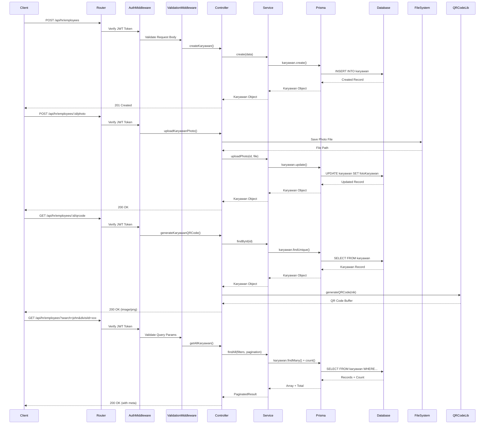

I have created the following plan after thorough exploration and analysis of the codebase. Follow the below plan verbatim. Trust the files and references. Do not re-verify what's written in the plan. Explore only when absolutely necessary. First implement all the proposed file changes and then I'll review all the changes together at the end.

## Observasi Kode

Backend menggunakan **Express.js dengan TypeScript dan Prisma ORM**. Database schema untuk employee (`Karyawan`, `Anak`, `SaudaraKandung`, `DokumenKaryawan`) sudah lengkap dengan semua field dari Personal Information, HR Information, dan Family Information. TypeScript types, DTOs, dan Zod validators sudah tersedia di `file:backend/src/types/employee.ts` dan `file:backend/src/validators/employee.validator.ts`. Multer sudah dikonfigurasi untuk upload foto dan dokumen di `file:backend/src/config/upload.ts`. Pattern yang digunakan konsisten: Controller → Service → Prisma, dengan response helpers dan error handling yang terstandarisasi.

## Pendekatan Implementasi

Implementasi akan mengikuti pattern yang sudah ada di HR Master Data. Buat **Employee Service** untuk business logic dan database operations, **Employee Controller** untuk request handling, dan **Employee Routes** dengan Swagger documentation. Untuk QR code generation, gunakan library `qrcode`. File upload menggunakan Multer middleware yang sudah dikonfigurasi. Advanced search akan menggunakan Prisma's `where` clause dengan multiple filters dan full-text search. Semua endpoints akan dilindungi dengan authentication middleware dan menggunakan Zod validation.

## Langkah Implementasi

### 1. Install Dependencies untuk QR Code Generation

Install package `qrcode` dan type definitions:

```bash
npm install qrcode
npm install --save-dev @types/qrcode
```

### 2. Buat Employee Service (`file:backend/src/services/employee.service.ts`)

Buat service dengan methods berikut mengikuti pattern dari `file:backend/src/services/hr-master.service.ts`:

**Core CRUD Methods:**
- `findAll(filters, pagination)` - Query karyawan dengan filtering (search, divisiId, departmentId, statusKaryawanId, lokasiKerjaId, tagId, jenisHubunganKerjaId), pagination, dan sorting
- `findById(id)` - Get detail karyawan dengan semua relasi (divisi, department, posisiJabatan, statusKaryawan, lokasiKerja, tag, jenisHubunganKerja, kategoriPangkat, golonganPangkat, subGolonganPangkat, lokasiSebelumnya, manager, atasanLangsung, anak, saudaraKandung, dokumen)
- `findByNIK(nik)` - Get karyawan by nomor induk karyawan
- `create(data)` - Create karyawan baru dengan validasi NIK unique
- `update(id, data)` - Update karyawan data
- `delete(id)` - Soft delete (update status menjadi tidak aktif) atau hard delete dengan cascade ke anak, saudaraKandung, dokumen

**Child Data Methods:**
- `createAnak(karyawanId, data)` - Tambah data anak
- `updateAnak(id, data)` - Update data anak
- `deleteAnak(id)` - Hapus data anak
- `createSaudaraKandung(karyawanId, data)` - Tambah saudara kandung (max 5)
- `updateSaudaraKandung(id, data)` - Update saudara kandung
- `deleteSaudaraKandung(id)` - Hapus saudara kandung

**File Management Methods:**
- `uploadPhoto(karyawanId, file)` - Upload dan update foto karyawan, hapus foto lama jika ada
- `uploadDocument(karyawanId, documentData)` - Upload dokumen dan simpan metadata ke `DokumenKaryawan`
- `deleteDocument(id)` - Hapus dokumen dari filesystem dan database

**QR Code Method:**
- `generateQRCode(nik)` - Generate QR code dari NIK menggunakan library `qrcode`, return base64 string atau buffer

**Search Implementation:**
Gunakan Prisma `where` dengan `OR` conditions untuk search di multiple fields (namaLengkap, nomorIndukKaryawan, emailPerusahaan, emailPribadi) dengan `contains` dan `mode: 'insensitive'`. Combine dengan `AND` untuk filters lainnya.

### 3. Buat Employee Controller (`file:backend/src/controllers/employee.controller.ts`)

Buat controller functions mengikuti pattern dari `file:backend/src/controllers/hr-master.controller.ts`:

**Main CRUD Controllers:**
- `getAllKaryawan` - Handle GET request dengan query params (search, filters, pagination, sorting), gunakan `paginatedResponse` helper
- `getKaryawanById` - Handle GET by ID, return 404 jika tidak ditemukan
- `getKaryawanByNIK` - Handle GET by NIK untuk lookup
- `createKaryawan` - Handle POST, validate NIK uniqueness, return 201 dengan `successResponse`
- `updateKaryawan` - Handle PUT, check existence first, return 404 atau 200
- `deleteKaryawan` - Handle DELETE, soft delete dengan status update

**Child Data Controllers:**
- `createAnakKaryawan` - POST `/api/hr/employees/:id/anak`
- `updateAnakKaryawan` - PUT `/api/hr/employees/:id/anak/:anakId`
- `deleteAnakKaryawan` - DELETE `/api/hr/employees/:id/anak/:anakId`
- `createSaudaraKandungKaryawan` - POST `/api/hr/employees/:id/saudara-kandung`
- `updateSaudaraKandungKaryawan` - PUT `/api/hr/employees/:id/saudara-kandung/:saudaraId`
- `deleteSaudaraKandungKaryawan` - DELETE `/api/hr/employees/:id/saudara-kandung/:saudaraId`

**File Upload Controllers:**
- `uploadKaryawanPhoto` - Handle POST multipart/form-data dengan `uploadEmployeePhoto.single('photo')` middleware dari `file:backend/src/config/upload.ts`, update `fotoKaryawan` field
- `uploadKaryawanDocument` - Handle POST multipart/form-data dengan `uploadEmployeeDocument.single('document')` middleware, create `DokumenKaryawan` record
- `deleteKaryawanDocument` - Handle DELETE document by ID

**QR Code Controller:**
- `generateKaryawanQRCode` - Handle GET `/api/hr/employees/:id/qrcode`, return QR code sebagai image (PNG) atau base64 JSON response dengan proper content-type header

**Error Handling:**
Gunakan `handlePrismaError` helper untuk Prisma errors (P2002 unique constraint, P2025 not found, P2003 foreign key). Wrap semua dalam try-catch dengan `next(error)`.

### 4. Buat Employee Routes (`file:backend/src/routes/employee.routes.ts`)

Setup Express Router dengan authentication dan validation middleware:

**Route Structure:**
```
GET    /api/hr/employees              - List all (with filters, search, pagination)
GET    /api/hr/employees/:id          - Get by ID
GET    /api/hr/employees/nik/:nik     - Get by NIK
POST   /api/hr/employees              - Create new
PUT    /api/hr/employees/:id          - Update
DELETE /api/hr/employees/:id          - Delete

POST   /api/hr/employees/:id/anak                    - Add anak
PUT    /api/hr/employees/:id/anak/:anakId            - Update anak
DELETE /api/hr/employees/:id/anak/:anakId            - Delete anak

POST   /api/hr/employees/:id/saudara-kandung         - Add saudara kandung
PUT    /api/hr/employees/:id/saudara-kandung/:saudaraId - Update saudara kandung
DELETE /api/hr/employees/:id/saudara-kandung/:saudaraId - Delete saudara kandung

POST   /api/hr/employees/:id/photo                   - Upload photo
POST   /api/hr/employees/:id/documents               - Upload document
DELETE /api/hr/employees/:id/documents/:documentId   - Delete document

GET    /api/hr/employees/:id/qrcode                  - Generate QR code
```

**Middleware Chain:**
- Semua routes gunakan `authenticate` middleware dari `file:backend/src/middleware/auth.middleware.ts`
- POST/PUT routes gunakan `validateBody` dengan schema dari `file:backend/src/validators/employee.validator.ts`
- GET list route gunakan `validateQuery` dengan `karyawanQuerySchema`
- Upload routes gunakan Multer middleware (`uploadEmployeePhoto.single('photo')` atau `uploadEmployeeDocument.single('document')`)

**Swagger Documentation:**
Tambahkan JSDoc comments untuk setiap route dengan:
- `@swagger` tag
- `@route` method dan path
- `@group` Employee Management
- `@param` untuk path params, query params, body
- `@returns` dengan status codes dan response schema
- `@security` JWT authentication

### 5. Register Employee Routes di Main App (`file:backend/src/index.ts`)

Import dan mount employee routes:

```typescript
import employeeRoutes from './routes/employee.routes';
app.use('/api/hr/employees', employeeRoutes);
```

Tambahkan setelah line 67 (setelah HR Master routes).

### 6. Buat Utility Functions untuk QR Code (`file:backend/src/utils/qrcode.ts`)

Buat helper functions:
- `generateQRCodeBuffer(data: string)` - Generate QR code sebagai PNG buffer
- `generateQRCodeBase64(data: string)` - Generate QR code sebagai base64 string
- `generateQRCodeDataURL(data: string)` - Generate QR code sebagai data URL

Gunakan library `qrcode` dengan options: errorCorrectionLevel 'M', type 'png', width 300.

### 7. Update Swagger Configuration (`file:backend/src/config/swagger.ts`)

Tambahkan tag definition untuk Employee Management di Swagger options:

```typescript
tags: [
  { name: 'Employee Management', description: 'Endpoints untuk manajemen data karyawan' }
]
```

Tambahkan schema definitions untuk `Karyawan`, `Anak`, `SaudaraKandung`, `DokumenKaryawan` response types.

### 8. Buat API Documentation (`file:backend/docs/EMPLOYEE_API.md`)

Dokumentasikan semua endpoints dengan:
- Request/Response examples
- Query parameters untuk filtering dan pagination
- File upload specifications (max size, allowed types)
- Error responses
- QR code generation usage

### 9. Testing

Buat unit tests di `file:backend/src/__tests__/controllers/employee.controller.test.ts` dan `file:backend/src/__tests__/routes/employee.routes.test.ts` mengikuti pattern dari `file:backend/src/__tests__/controllers/hr-master.controller.test.ts`:

**Test Cases:**
- CRUD operations (create, read, update, delete)
- Validation errors (invalid NIK, NPWP, email, phone formats)
- Unique constraint violations (duplicate NIK)
- Foreign key validations (invalid divisiId, departmentId, etc.)
- Pagination dan sorting
- Advanced search dan filtering
- File upload (photo dan document)
- QR code generation
- Child data operations (anak, saudara kandung)
- Authentication dan authorization

Gunakan `jest` dan `supertest` untuk HTTP testing, mock Prisma client dengan `jest-mock-extended`.

### 10. Environment Variables

Pastikan `.env` memiliki konfigurasi:
```
UPLOAD_DIR=uploads
MAX_FILE_SIZE=5242880
ALLOWED_IMAGE_TYPES=image/jpeg,image/png,image/jpg
ALLOWED_DOCUMENT_TYPES=application/pdf,application/msword,application/vnd.openxmlformats-officedocument.wordprocessingml.document
```

## Diagram Arsitektur



## Struktur File yang Akan Dibuat

```
backend/src/
├── services/
│   └── employee.service.ts          (NEW)
├── controllers/
│   └── employee.controller.ts       (NEW)
├── routes/
│   └── employee.routes.ts           (NEW)
├── utils/
│   └── qrcode.ts                    (NEW)
├── __tests__/
│   ├── controllers/
│   │   └── employee.controller.test.ts (NEW)
│   └── routes/
│       └── employee.routes.test.ts  (NEW)
└── index.ts                         (UPDATE - register routes)

backend/docs/
└── EMPLOYEE_API.md                  (NEW)

backend/config/
└── swagger.ts                       (UPDATE - add schemas)
```