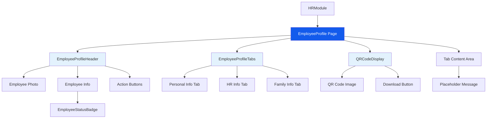

I have created the following plan after thorough exploration and analysis of the codebase. Follow the below plan verbatim. Trust the files and references. Do not re-verify what's written in the plan. Explore only when absolutely necessary. First implement all the proposed file changes and then I'll review all the changes together at the end.

## Observasi Kode

Backend API untuk employee management sudah lengkap dengan endpoints CRUD, file upload, dan QR code generation. Frontend menggunakan React + TypeScript + Tailwind CSS dengan struktur modular yang baik. Komponen layout (MainLayout, Sidebar, TopNavBar) dan common components (StatusBadge, Modal, DataTable, form components) sudah tersedia. Desain UI menunjukkan employee profile dengan head section yang menampilkan foto, informasi dasar, dan tab navigation untuk tiga bagian informasi.

## Pendekatan

Implementasi akan fokus pada pembuatan employee profile page dengan head section dan tab navigation framework. Akan dibuat komponen-komponen reusable untuk header profile, status badge khusus employee, QR code display, dan tab navigation. Routing akan ditambahkan ke HRModule untuk employee profile. Service layer dan types akan dibuat untuk komunikasi dengan backend API. Pendekatan ini memastikan konsistensi dengan pola yang sudah ada dan mempersiapkan foundation untuk tab content yang akan diimplementasikan di fase berikutnya.

## Implementasi

### 1. Buat Employee Types & Interfaces

**File:** `file:frontend/src/types/employee.types.ts`

Buat TypeScript types dan interfaces untuk employee data:
- Import dan re-export enums dari backend (JenisKelamin, Agama, GolonganDarah, StatusPernikahan, dll)
- Interface `Employee` untuk detail employee lengkap dengan relasi (divisi, department, posisiJabatan, statusKaryawan, lokasiKerja, tag, anak, saudaraKandung, dokumen)
- Interface `EmployeeListItem` untuk list view (simplified version)
- Interface `CreateEmployeeDTO` dan `UpdateEmployeeDTO` untuk form data
- Interface `EmployeeQueryParams` untuk filtering dan pagination
- Interface `PaginatedEmployeeResponse` untuk API response

### 2. Buat Employee Service

**File:** `file:frontend/src/services/employee.service.ts`

Implementasi service layer untuk employee API calls:
- Import `api` dari `file:frontend/src/services/api.ts`
- Function `getEmployees(params: EmployeeQueryParams)` - GET list dengan filtering, pagination, sorting
- Function `getEmployeeById(id: string)` - GET detail employee by ID
- Function `getEmployeeByNik(nik: string)` - GET detail employee by NIK
- Function `createEmployee(data: CreateEmployeeDTO)` - POST create employee
- Function `updateEmployee(id: string, data: UpdateEmployeeDTO)` - PUT update employee
- Function `deleteEmployee(id: string)` - DELETE employee
- Function `uploadEmployeePhoto(id: string, file: File)` - POST upload foto
- Function `getEmployeeQRCode(id: string, format?: 'image' | 'base64')` - GET QR code
- Semua functions return typed responses dengan proper error handling

### 3. Buat Employee Status Badge Component

**File:** `file:frontend/src/components/common/EmployeeStatusBadge.tsx`

Komponen badge khusus untuk status employee (Aktif/Tidak Aktif):
- Props: `status: 'AKTIF' | 'TIDAK_AKTIF'`, `size?: 'sm' | 'md' | 'lg'`
- Styling mirip dengan `file:frontend/src/components/common/StatusBadge.tsx` tapi dengan warna hijau untuk Aktif
- Tampilkan dot indicator dan text status
- Support dark mode
- Export dari `file:frontend/src/components/common/index.ts`

### 4. Buat QR Code Display Component

**File:** `file:frontend/src/components/employee/QRCodeDisplay.tsx`

Komponen untuk menampilkan QR code employee:
- Props: `employeeId: string`, `nik: string`, `size?: number`
- State untuk loading dan QR code image (base64)
- useEffect untuk fetch QR code dari API menggunakan `employeeService.getEmployeeQRCode()`
- Tampilkan loading spinner saat fetch
- Tampilkan QR code image dengan border dan shadow
- Tampilkan NIK di bawah QR code
- Button untuk download QR code sebagai PNG
- Error handling jika QR code gagal di-generate

### 5. Buat Employee Profile Header Component

**File:** `file:frontend/src/components/employee/EmployeeProfileHeader.tsx`

Komponen header section employee profile sesuai desain `file:desain-ui-ux/employee_profile_-_personal_info_tab/code.html`:
- Props: `employee: Employee`, `onEdit?: () => void`, `onExportPDF?: () => void`
- Layout: flex container dengan foto di kiri, info di tengah, buttons di kanan
- **Foto Section:**
  - Display foto employee (rounded-xl, size 128x128px)
  - Default avatar jika foto tidak ada
  - Border dan shadow sesuai desain
- **Info Section:**
  - Nama lengkap (text-3xl font-bold)
  - EmployeeStatusBadge di samping nama
  - NIK dengan icon fingerprint
  - Divisi dengan icon hub
  - Department dengan icon corporate_fare
- **Action Buttons:**
  - Button "Edit Profile" (secondary style) dengan icon edit
  - Button "Export PDF" (primary style) dengan icon file_download
  - Responsive: stack vertical di mobile
- Support dark mode untuk semua elements

### 6. Buat Tab Navigation Component

**File:** `file:frontend/src/components/employee/EmployeeProfileTabs.tsx`

Komponen tab navigation untuk employee profile:
- Props: `activeTab: string`, `onTabChange: (tab: string) => void`, `employeeId: string`
- Tabs: "personal-info", "hr-info", "family-info"
- Tab labels: "Personal Information", "HR Information", "Family Information"
- Styling sesuai desain dengan border-bottom indicator untuk active tab
- Active tab: border-primary, text-primary, font-bold
- Inactive tab: text-gray, hover effect
- Responsive: horizontal scroll di mobile
- Gunakan React Router Link untuk navigation ke `/hr/employees/:id/:tab`

### 7. Buat Employee Profile Page

**File:** `file:frontend/src/pages/hr/employees/EmployeeProfile.tsx`

Main page component untuk employee profile:
- Import useParams dan useNavigate dari react-router-dom
- Import useState, useEffect dari react
- Import EmployeeProfileHeader, EmployeeProfileTabs, QRCodeDisplay
- Import employeeService
- **State Management:**
  - `employee: Employee | null` - data employee
  - `loading: boolean` - loading state
  - `error: string | null` - error message
  - `activeTab: string` - current active tab dari URL params
- **Data Fetching:**
  - useEffect untuk fetch employee data by ID dari URL params
  - Handle loading dan error states
- **Layout Structure:**
  - Container dengan max-width-6xl dan padding
  - EmployeeProfileHeader component
  - EmployeeProfileTabs component
  - Tab content area (placeholder untuk sekarang dengan message "Tab content akan diimplementasikan di fase berikutnya")
  - QRCodeDisplay di sidebar kanan (sticky position)
- **Functions:**
  - `handleEdit()` - navigate ke edit page (placeholder untuk sekarang)
  - `handleExportPDF()` - export employee data ke PDF (placeholder untuk sekarang)
  - `handleTabChange(tab)` - update URL dan active tab
- Loading state: tampilkan skeleton loader
- Error state: tampilkan error message dengan retry button

### 8. Buat Employee Folder Structure

**Folder:** `file:frontend/src/pages/hr/employees/`

Buat folder structure untuk employee pages:
- `EmployeeProfile.tsx` - profile page (sudah dibuat di step 7)
- `index.ts` - barrel export untuk employee pages

**Folder:** `file:frontend/src/components/employee/`

Buat folder untuk employee-specific components:
- `EmployeeProfileHeader.tsx` - header component
- `EmployeeProfileTabs.tsx` - tabs component
- `QRCodeDisplay.tsx` - QR code component
- `index.ts` - barrel export

### 9. Update HR Module Routing

**File:** `file:frontend/src/pages/modules/HRModule.tsx`

Tambahkan routing untuk employee profile:
- Import EmployeeProfile dari `file:frontend/src/pages/hr/employees`
- Tambahkan route: `<Route path="employees/:id" element={<EmployeeProfile />} />`
- Tambahkan route dengan tab: `<Route path="employees/:id/:tab" element={<EmployeeProfile />} />`
- Route ini akan handle URL seperti `/hr/employees/uuid` dan `/hr/employees/uuid/personal-info`

### 10. Buat Custom Hook untuk Employee Data

**File:** `file:frontend/src/hooks/useEmployee.ts`

Custom hook untuk fetch dan manage employee data:
- Parameter: `employeeId: string`
- State: `employee`, `loading`, `error`, `refetch`
- useEffect untuk fetch data saat employeeId berubah
- Return: `{ employee, loading, error, refetch }`
- Error handling dan retry logic
- Cache management (optional)

### 11. Update Common Components Export

**File:** `file:frontend/src/components/common/index.ts`

Tambahkan export untuk EmployeeStatusBadge:
```typescript
export { EmployeeStatusBadge } from './EmployeeStatusBadge';
```

### 12. Styling & Responsive Design

Pastikan semua components responsive:
- **Desktop (lg):** Header dengan foto, info, dan buttons dalam satu row; QR code di sidebar kanan
- **Tablet (md):** Header dengan foto dan info dalam row, buttons di bawah; QR code di bawah header
- **Mobile (sm):** Stack semua elements vertical; foto centered; buttons full width

Gunakan Tailwind classes yang konsisten dengan desain:
- Primary color: `#135bec`
- Background light: `#f6f6f8`
- Background dark: `#101622`
- Border radius: `rounded-xl` untuk cards, `rounded-lg` untuk buttons
- Shadows: `shadow-sm` untuk cards, `shadow-md` untuk buttons

### 13. Testing & Integration

Setelah implementasi:
- Test navigation dari HR Dashboard ke Employee Profile
- Test tab switching dengan URL params
- Test QR code generation dan display
- Test responsive layout di berbagai screen sizes
- Test dark mode toggle
- Test loading dan error states
- Test dengan data employee yang berbeda (dengan/tanpa foto, dengan/tanpa divisi, dll)

## Diagram Struktur Komponen



## Catatan Penting

- **Konsistensi:** Gunakan pola yang sama dengan master data pages untuk consistency
- **Reusability:** Komponen header, tabs, dan QR code harus reusable untuk digunakan di tempat lain
- **Type Safety:** Semua data harus fully typed dengan TypeScript
- **Error Handling:** Implementasi proper error handling di semua API calls
- **Loading States:** Tampilkan loading indicators yang jelas untuk UX yang baik
- **Dark Mode:** Semua components harus support dark mode
- **Accessibility:** Gunakan semantic HTML dan ARIA labels untuk accessibility
- **Performance:** Lazy load foto employee dan QR code untuk performance optimization